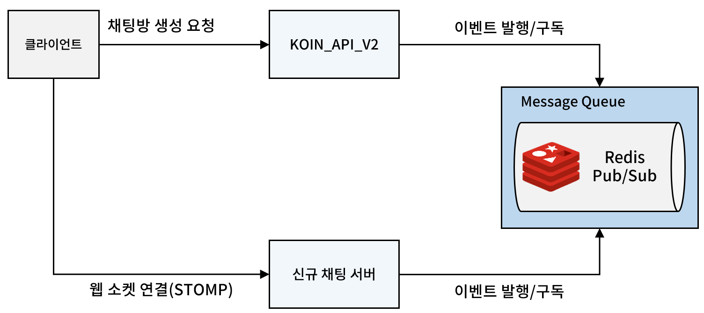

개발 동아리에서 1월부터 시작하는 스프린트의 기획 중 채팅 기능이 제안되었다. 내가 담당을 맡게 되었는데, 이와 관련한 내용을 꾸준하게 정리해보려고 한다.

**기능 요구사항 요약**
- 분실물 게시글별 채팅방 생성
- 사용자(학생)와 학생회 간 1:1 채팅
- 사용자(학생)와 사용자(학생) 간 1:1 채팅
- 하나의 게시글에 여러 개의 채팅방 생성 가능

크게 두가지 결정을 해야 했다. 하나는 **어떤 기술 스택을 사용할 것인가**, 다른 하나는 **새로 서버를 구축할 것인가, 기존 서버에 기능을 추가할 것인가** 이다.

# 어떤 기술 스택을 사용할 것인가 ?

채팅 기능 하면 가장 먼저 떠오르는 기술은 **웹 소켓(web socket)** 이다. 

웹 소켓은 서버와 클라이언트 간의 양방향 통신을 가능하게 하는 프로토콜이다. 기존의 HTTP 통신이 클라이언트의 요청이 있을 때만 서버가 응답하는 단방향 통신이었다면 웹 소켓은 연결이 수립된 후에는 서버가 클라이언트에게 능동적으로 메시지를 보낼 수 있다.

개인적으로 예전에 한 번 사용해 본 적이 있는 기술이라 가장 먼저 떠올랐다. 

그러나 후에 언급할 여러가지 고려 사항 때문에 다른 방법이 없는지 깊이 조사해 보았다.

## 폴링(Polling), 롱 폴링(Long Polling)

**폴링**

폴링은 Http 통신을 사용하는 방법이다. 클라이언트는 주기적으로 서버에 요청을 보내 새로운 채팅 메시지를 요청한다. 서버는 새로운 데이터가 있을 경우 그것을 반환하고, 없을 경우 없다는 사실을 반환한다.

구현이 가장 간단하며 기존 REST API를 그대로 활용할 수 있다는 장점이 있었다. 개발하고 있는 서비스의 사용자 수를 고려해 봤을 때 충분히 선택해볼만한 방식이라고 판단했다

그러나 폴링 방식은 사용자가 늘어날 수록 서버가 처리해야 하는 요청이 기하급수적으로 증가한다. 

또한 대부분의 요청이 새로운 메시지가 없는 빈 응답을 반환하게 되어 서버 자원이 불필요하게 낭비된다. 실시간성을 높이기 위해 폴링 주기를 줄이면 이 문제는 더욱 심각해진다.

동아리 서버는 aws의 t2.micro를 사용하는 것으로 알고 있는데 폴링 방식을 사용할 경우 이를 버틸수 있을지에 대한 확신이 들진 않았다.(부하 테스트를 통해 확인해봐야 할 요소)

**롱 폴링**

롱 폴링은 폴링의 단점을 보완하기 위해 등장한 방식이다. 클라이언트가 HTTP 요청을 보내면 서버는 새로운 메시지가 도착하거나 일정 시간(timeout)이 경과할 때까지 연결을 유지한다. 새 메시지가 있다면 이를 응답으로 전송하고, timeout에 도달하면 빈 응답을 반환한다.

클라이언트는 응답을 받는 즉시 다음 요청을 보내므로 서버와의 연결이 계속 유지되는 효과가 있다. 이는 폴링에 비해 불필요한 요청을 줄이고 실시간성을 높일 수 있다. 하지만 여전히 각 클라이언트마다 연결을 유지해야 하므로 서버 자원을 많이 소모하며, 수많은 동시 접속자를 처리하는 데는 한계가 있다.

## 웹소켓과 그 변형들

**순수 웹소켓 (Native WebSocket)**

웹소켓은 HTTP 핸드셰이크로 시작하여 연결이 수립되면 TCP 기반의 양방향 통신이 가능해진다. 폴링이나 롱 폴링과 달리 계속해서 새로운 HTTP 연결을 만들 필요가 없어 효율적이다.

순수 웹소켓을 사용할 경우 메시지 발신/수신에 대한 모든 로직을 직접 구현해야 한다. 채팅방 입장/퇴장, 메시지 전송, 에러 처리 등을 세세하게 관리해야 하며, 클라이언트 상태나 연결 관리도 직접 해야 한다.

바퀴를 다시 발명할 만큼 시간이 많지 않기 때문에 기각!

**STOMP (Simple Text Oriented Messaging Protocol)**

STOMP는 웹소켓 위에서 동작하는 서브 프로토콜이다. pub/sub(발행/구독) 아키텍처를 제공하여 메시지 라우팅을 쉽게 구현할 수 있다. 예를 들어 특정 채팅방을 하나의 토픽으로 만들고, 해당 방에 입장한 사용자들은 그 토픽을 구독하는 방식으로 구현할 수 있다.

Spring에서는 STOMP를 지원하는 강력한 라이브러리를 제공하여, 채팅방 관리나 메시지 브로드캐스팅 같은 복잡한 기능을 쉽게 구현할 수 있다. 

또한 메시지 형식이 정해져 있어 클라이언트-서버 간 통신 규약을 따로 정의할 필요가 없다.

**Socket.IO**

Socket.IO는 순수 웹 소켓이 가진 불편함을 해결하기 위한 Node 라이브러리다. 이 라이브러리를 활용하면 아주 쉽게 간단한 채팅 서버를 만들 수 있다고 한다.

java에서도 [Netty-socketio](https://github.com/mrniko/netty-socketio) 같은 오픈 소스 라이브러리를 통해 사용할 수 있다. WebSocket을 기본으로 사용하지만, 웹소켓이 지원되지 않는 환경에서는 자동으로 롱 폴링 등의 대체 기술을 사용한다.

실시간 이벤트 기반 통신을 쉽게 구현할 수 있고, 자동 재연결, 패킷 손실 감지 등 많은 기능을 제공한다. 

하지만 Spring 환경에서는 STOMP에 비해 생태계가 부족하고 추가 라이브러리 의존성이 필요하다는 단점이 있다. 개발에 도움이 되는 자료 또한 STOMP에 비해 부족하다.

## 데이터베이스 선택
- **MySQL**: 기존 시스템이 그대로 사용, 실시간성이 중요한 채팅 데이터에는 적합하지 않을 수 있음. 잦은 업데이트 및 조인 연산으로 인한 성능 저하 가능성 존재.
- **MongoDB**: 빠른 읽기/쓰기 성능 제공. 스키마리스 특성으로 유연한 데이터 모델링 가능.
- **Redis**: 인메모리 데이터 스토어로 매우 빠른 속도를 제공. 채팅 메시지 캐싱 또는 실시간 데이터 처리에 유용. 영구적인 데이터 저장이 필요한 경우에는 적합하지 않음. (보조 저장소 필요)
- **AWS DynamoDB**: 완전 관리형 NoSQL 데이터베이스 서비스. 높은 확장성과 가용성을 제공. 서버 관리 부담 감소. 비용 효율성 고려 필요. 당근마켓에서 사용
- **Redis + (MySQL or  MongoDB or DynamoDB)** : 단계별 저장 전략. 최근 데이터는 redis 등의 고성능 데이터베이스에 저장 => 채팅이 종료되거나 더이상 대화가 없는 오래된 데이터 이관

# 주요 고려 사항
1. **개발 난이도** : 개발 기간은 충분하지만 채팅 시스템을 처음 구현해보는 팀원들이 대부분이다. 따라서 학습 자료가 풍부하고 구현 방법이 명확한 기술을 선택해야 한다. 또한 Spring 환경에서 잘 동작하는 검증된 라이브러리나 프레임워크를 사용하는 것이 안전하다.

2. **유지 보수성** : 동아리 특성상 졸업이나 취업으로 인한 팀원 이탈이 빈번하게 발생한다. 현재 팀원 대부분이 Java와 Spring을 사용하고 있어 이 기술 스택을 유지하는 것이 코드 인수인계와 향후 유지보수에 유리하다. 또한 구조가 복잡하지 않고 직관적이어야 새로운 팀원들도 쉽게 이해하고 수정할 수 있다.

3. **서버 자원 효율성** : 현재 AWS t2.micro 인스턴스 한 대로 프로덕션 서비스를 운영 중이다. 메모리가 제한되어 있어 자원 사용에 매우 신중해야 한다. 채팅 기능 추가로 인한 서버 부하를 최소화해야 하므로 필요한 경우 채팅 서버를 분리해야 한다.

4. **기능 요구사항 충족도** : 분실물 게시글별 채팅방 생성, 1:1 채팅, 다중 채팅방 등의 요구사항을 모두 구현할 수 있어야 한다. 특히 채팅방 관리, 메시지 전달의 신뢰성, 실시간성 등이 보장되어야 한다.

| 고려사항 | 폴링 | 롱폴링 | 웹소켓 | STOMP | Socket.IO |
|---------|------|--------|--------|--------|-----------|
| 개발 난이도 | ⭐⭐⭐⭐⭐ (REST API만 사용하므로 매우 쉬움) | ⭐⭐⭐⭐ (구현은 쉽지만 타임아웃 처리 등 고려사항 존재) | ⭐⭐⭐ (연결 관리, 에러 처리 등 직접 구현 필요) | ⭐⭐⭐⭐ (Spring의 강력한 지원으로 구현 용이) | ⭐⭐ (Spring 환경에서 자료 부족) |
| 유지보수성 | ⭐⭐⭐⭐⭐ (기존 REST 구조와 동일하여 유지보수 쉬움) | ⭐⭐⭐⭐ (비교적 단순한 구조) | ⭐⭐ (복잡한 상태 관리 로직 필요) | ⭐⭐⭐⭐ (표준화된 구조로 유지보수 용이) | ⭐⭐ (별도 라이브러리 의존성) |
| 서버 자원 효율성 | ⭐ (불필요한 요청이 많아 서버 부하 큼) | ⭐⭐ (불필요한 요청이 많아 서버 부하 큼) | ⭐⭐⭐⭐ (효율적인 양방향 통신) | ⭐⭐⭐⭐ (효율적인 양방향 통신) | ⭐⭐⭐⭐ (효율적인 양방향 통신) |
| 기능 요구사항 충족도 | ⭐⭐⭐ (구현 가능하나 실시간성 부족) | ⭐⭐⭐ (구현 가능하나 실시간성 부족) | ⭐⭐⭐⭐⭐ (모든 기능 구현 가능) | ⭐⭐⭐⭐⭐ (모든 기능 구현 가능) | ⭐⭐⭐⭐⭐ (모든 기능 구현 가능) |

# 주요 아키택처 후보
## 단일 서버 + REST API + 폴링

- 기존 서버 및 인프라 활용
- 클라이언트의 주기적인 서버 요청을 통한 메시지 수신
- 장점:
   - 구현이 가장 간단하며 기존 코드 및 인프라를 그대로 활용 가능
   - 개발 속도가 상대적으로 빠르고 익숙함
- 단점:
   - 잦은 폴링 으로 인한 서버 부하 증가 (사용자 증가 시)
   - 실시간성이 떨어짐
   - DB 부하 증가 및 성능 저하 우려

## 단일 서버 + 웹 소켓 + STOMP

- 기존 스프링 서버에 Spring WebSocket 의존성 추가
- 웹 소켓 및 STOMP 프로토콜 활용 (Pub/Sub 패턴)
  - https://spring.io/guides/gs/messaging-stomp-websocket
- 장점
     - 실시간 통신 가능
     - 서버 부하 감소 (폴링 방식 대비)
     - STOMP를 통한 효율적인 메시지 관리
     - 단체 채팅방도 쉽게 구현 가능
     - Spring 생태계 활용 가능 
- 단점
   - 기존 서버에 웹 소켓 관련 로직 추가로 인한 복잡도 증가 가능성
   - 서버 자원이 얼마나 필요한지 잘 모르겠음

## 분산 환경 (별도 채팅 서버, Java/Spring) + 웹 소켓 + STOMP

- 별도의 채팅 서버 구축 (Java/Spring)
- 메시지 브로커 (Redis Pub/Sub, RabbitMQ, Kafka 등)를 이용한 서버 간 통신
- 장점:
   - 확장성 향상
   - 기존 서버와 채팅 기능 분리, 웹 소켓 관련 기능 격리
   - 채팅 기능 때문에 기존 서버 오류가 발생할 가능성 없음
   - MSA, 이벤트 기반 아키텍처 체험 가능...
- 단점:
   - 현재 서비스 규모에 비해 과도한 아키텍처 (오버 엔지니어링)
   - 사용자 인증, 채팅 관련 이벤트(사용자 차단, 채팅방 생성&삭제, 디바이스 관련) 등 서버 간 상호 작용 필요
   - 구축 및 운영의 복잡성 증가
   - 개발 및 유지보수 비용 증가

## 분산 환경 (별도 채팅 서버, Node.js) + 웹 소켓
- 별도의 채팅 서버 구축 (Node.js)
- 자바 채팅 서버보다 쉽게 개발 가능하다고 한다. (Socket.io)
- IOS 클라이언트 개발에 용이 (IOS 팀원 의견)
- 장점:
   - JavaScript 기반으로 프론트엔드 개발자와 협업 용이
- 단점:
   - 기존 Java/Spring 서버와의 문제 발생 가능성
   - JS 코드 -> 유지보수 및 운영 측면에서 추가적인 고려 사항 발생

# 최종 결정
여러 아키텍처를 검토한 결과, 다음과 같은 단계적 접근 방식을 채택하기로 결정했다.

## 웹소켓 + 스프링 STOMP 프로토콜 채택
- 폴링 방식은 실시간성과 서버 자원 효율성 측면에서 한계가 명확함
- STOMP를 통해 채팅방 관리와 메시지 브로드캐스팅을 비교적 쉽게 구현할 수 있음. 관련 자료 또한 많은 편.
- Spring 공식 지원으로 Netty-socketio 등에 비해 안정적인 구현과 유지보수가 가능할 듯

## 단계적 서버 아키텍처 전환
- 1단계: 단일 서버에서 프로토타입 개발(향후 서버 분리가 고려해서 멀티 모듈 적용) 및 성능 테스트

- 2단계: 성능 테스트 결과에 따라 아키텍처 결정
    - 안정적일 경우: 단일 서버 유지 (불필요한 복잡도 증가 방지)
    - 성능 이슈 발생 시: 별도 채팅 서버로 분리 (Java/Spring 기반)

## 하이브리드 데이터 저장소 전략
- **Redis**: 실시간 채팅 메시지 및 세션 관리
    - 인메모리 특성을 활용한 빠른 응답 속도 -> 최근 채팅 데이터 저장에 유리

- **RDB**: 오래된 채팅 이력 및 채팅방 정보 영구 저장
    - 채팅 및 도메인 특성 상 시간이 지난 채팅은 자주 조회 되지 않음.
    - 이를 고려하여 오래된 채팅 데이터를 관계형 DB에 이관하는 배치 프로세스 작성 필요 (비즈니스 규칙 정하기)
    - 기존 서비스에서 사용하던 MySQL 사용하여 데이터 정합성 유지