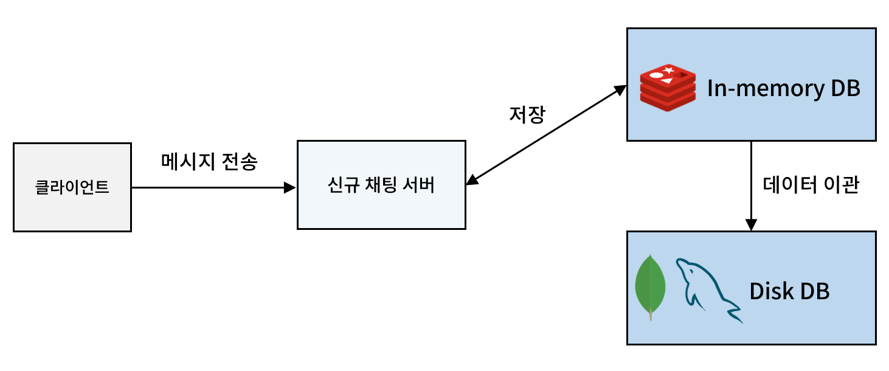
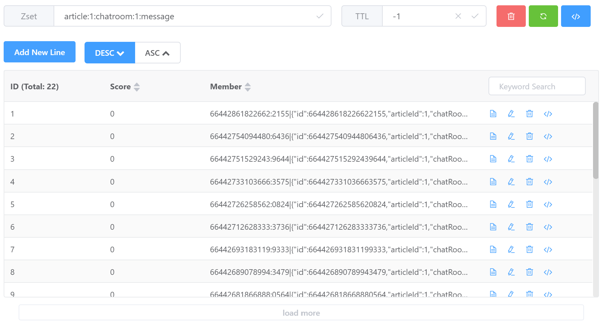

실제 스프린트 개발에 앞서 채팅 기능의 프로토타입을 구현해보려 한다.

저번 포스트에서 채팅 데이터의 DB 저장 전략을 다음과 같이 결정했다.


- 최근 게시글의 채팅 데이터와 현재 진행 중인 대화는 빈번한 조회가 예상되므로 인메모리 데이터베이스에 저장한다.

- 분실물 찾기가 종료되어 더 이상 대화가 발생하지 않는 채팅 데이터는 디스크 데이터베이스로 이관한다.

인메모리 데이터베이스는 데이터 유실 가능성이 있어 지속성 보장을 위해 디스크 기반 데이터베이스로의 이관이 필요하다.

하지만 우리 서비스의 특성을 다시 생각해보니, 몇 가지 의문이 들었다. 우선 사용자가 우리 학교 학생들로 한정되어 있어 증가 가능한 사용자 수가 한정되어 있다. 또한 이번 스프린트의 핵심 기능인 분실물 찾기에서 채팅은 단순히 습득자와 분실자 간의 연락 수단으로만 사용된다. 일상적인 대화가 목적이 아니기에 채팅량도 많지 않을 것으로 예상된다.

채팅 데이터 조회 API는 사용자가 채팅방에 접속할 때만 호출되며, 인메모리 데이터베이스 사용의 주된 목적은 Disk I/O를 줄여 응답 시간을 단축하는 것이다. 

이러한 구조가 실제로 얼마나 효과가 있을지 검증이 필요해 보였다. 먼저 redis에 데이터를 저장하는 것 부터 구현했다.


## redis에 채팅 데이터 저장 구현
### module-domain
먼저 module-domain에 채팅 엔티티에 대한 POJO 를 정의한다.

```java
@Getter
@Builder
public class ChatMessageEntity {

    private Long id;

    private Long articleId;

    private Long chatRoomId;

    private Long userId;

    private Boolean isRead;

    private Boolean isDeleted;

    private String nickName;

    private String contents;

    private LocalDateTime createdAt;
}
```

module-domain은 repository에 대한 명세를 제공하는 책임을 추가적으로 가진다. 이를 위해 불가피하기 spring-context 의존성이 필요하다.

```java
@Component
public interface ChatMessageRepository {

    ChatMessageEntity save(ChatMessageEntity message);

    List<ChatMessageEntity> findByArticleIdAndChatRoomId(Long articleId, Long chatRoomId, int limit);
}
```
### module-storage-redis
`module-storage-redis`는 데이터베이스 인터페이스 책임을 가진 모듈이다. gradle 세팅은 다음과 같다.

- 멀티 모듈 프로젝트의 서브 모듈이므로 `bootJar=false` 로 설정한다.
- `spring-boot-stater-redis` 의존성을 가진다.
- `module-domain`을 compileOnly로 의존한다. 

```gradle
bootJar {
    enabled = false
}

jar {
    enabled = true
}

dependencies {
    implementation("org.springframework.boot:spring-boot-starter-web")
    implementation('org.springframework.boot:spring-boot-starter-data-redis')

    compileOnly(project(":module-domain"))
}
```

이 모듈에선 도메인 모듈에서 정의한 리포지토리 명세에 대한 구현체를 작성해야 한다. 먼저 영속성 엔티티 객체를 정의한다.

- 도메인 객체와 영속성 객체를 구분하는 전략이다.
- 도메인 객체를 엔티티로 변환하는 책임은 엔티티가 갖게 하였다.

```java
@Getter
@Builder
@AllArgsConstructor
@RedisHash(value = "ChatMessage")
public class ChatMessageRedisEntity {

    @Id
    private Long id;

    @Indexed
    private Long articleId;

    @Indexed
    private Long chatRoomId;

    private Long userId;

    private Boolean isRead;

    private Boolean isDeleted;

    private String nickName;

    private String contents;

    private LocalDateTime createdAt;

    public static ChatMessageRedisEntity toRedisEntity(ChatMessageEntity message) {
        return ChatMessageRedisEntity.builder()
            .id(message.getId())
            .articleId(message.getArticleId())
            .chatRoomId(message.getChatRoomId())
            .userId(message.getUserId())
            .isRead(message.getIsRead())
            .isDeleted(message.getIsDeleted())
            .nickName(message.getNickName())
            .contents(message.getContents())
            .createdAt(message.getCreatedAt())
            .build();
    }
}
```

리포지토리를 작성한다.

```java
@Repository("redis")
@RequiredArgsConstructor
public class ChatMessageRepositoryRedisImpl implements ChatMessageRepository {

    private static final int COUNTER_DIGITS = 4;
    private static final String SEPARATOR = "|";
    private final RedisTemplate<String, String> redisTemplate;
    private final ObjectMapper objectMapper;

    @Override
    public ChatMessageEntity save(ChatMessageEntity message) {
        try {
            ChatMessageRedisEntity messageEntity = ChatMessageRedisEntity.toRedisEntity(message);
            String messageJson = objectMapper.writeValueAsString(messageEntity);
            String chatRoomKey = getChatRoomKey(messageEntity.getArticleId(), messageEntity.getChatRoomId());

            String tsidKey = formatTSIDKey(messageEntity.getId());

            redisTemplate.opsForZSet().add(chatRoomKey, tsidKey + SEPARATOR + messageJson, 0);
        } catch (JsonProcessingException e) {
            throw new RuntimeException("메시지 저장 실패", e);
        }
        return message;
    }

    @Override
    public List<ChatMessageEntity> findByArticleIdAndChatRoomId(Long articleId, Long chatRoomId) {
        String key = getChatRoomKey(articleId, chatRoomId);

        Set<String> messageJsonSet = redisTemplate.opsForZSet().reverseRange(key, 0, -1);

        return convertToMessages(messageJsonSet);
    }

    private String getChatRoomKey(Long articleId, Long roomId) {
        return "article:" + articleId +":chatroom:" + roomId + ":message";
    }

    private String formatTSIDKey(long tsid) {
        String tsidStr = String.valueOf(tsid);

        String timestamp = tsidStr.substring(0, tsidStr.length() - COUNTER_DIGITS);
        String counter = tsidStr.substring(tsidStr.length() - COUNTER_DIGITS);

        return timestamp + ":" + counter;
    }

    private List<ChatMessageEntity> convertToMessages(Set<String> messageJsonSet) {
        if (messageJsonSet == null || messageJsonSet.isEmpty()) {
            return Collections.emptyList();
        }

        return messageJsonSet.stream()
            .map(value -> {
                try {
                    String json = value.substring(value.indexOf(SEPARATOR) + 1);
                    return objectMapper.readValue(json, ChatMessageEntity.class);
                } catch (JsonProcessingException e) {
                    return null;
                }
            .filter(Objects::nonNull)
            .toList();
    }
}
```

save 메서드부터 차례로 살펴보자. 

채팅 메시지가 redis에 저장될 때 엔티티의 멤버 하나하나가 key:value 형태로 저장되는 것은 부적절하다고 판단했다.

엔티티를 살펴보면 저장해야 할 컬럼이 상당히 많다. 이를 key:value로 나눠 저장한다면 하나의 채팅 메시지가 10개 이상의 key:value 쌍으로 저장된다. 저장되는 메시지의 양에 따라 Redis의 키 공간이 감당할 수 없을 정도로 증가할 수 있다. 이는 메모리 사용량을 급격히 늘리고 조회 시에도 성능 저하를 초래한다. 

따라서 채팅 메시지 엔티티 전체를 하나의 JSON 문자열로 직렬화하여 저장하는 방식을 택했다. 이렇게 하면 저장 및 조회 과정에서 Redis가 관리해야 할 키의 수를 최소화할 수 있다.

또한, 채팅의 저장 순서는 시간 순서로 보장되어야 한다. 이를 위해 TSID(Time-Sorted Identifier)라는 식별자를 사용했다. TSID는 시간 기반으로 정렬 가능한 고유 ID를 생성한다. TSID는 고정된 길이를 가지며 상위 비트에는 타임스탬프, 하위 비트에는 고유성을 보장하는 카운터 값이 포함된다. 이를 사용하면 메시지를 생성하는 즉시 시간 순서대로 정렬할 수 있다.

TSID를 생성은 [외부 라이브러리](https://github.com/f4b6a3/tsid-creator)를 사용했다. 

레디스 저장 자료구조는 Sorted Set을 사용하기로 했다. 일반적으로 Set 자료구조는 저장된 value들을 unique하게 관리하기 위해 사용된다. 그러나 저장된 데이터들 사이의 순서는 관리되지 않는다.

Sorted Set은 Score라는 정렬 기준을 기반으로 데이터를 관리한다. Set의 특성을 그대로 가지면서 추가적으로 저장된 value들의 순서를 관리할 수 있는 것이다.

```java
    @Override
    public ChatMessageEntity save(ChatMessageEntity message) {
        try {
            ChatMessageRedisEntity messageEntity = ChatMessageRedisEntity.toRedisEntity(message);
            String messageJson = objectMapper.writeValueAsString(messageEntity);
            String chatRoomKey = getChatRoomKey(messageEntity.getArticleId(), messageEntity.getChatRoomId());

            String tsidKey = formatTSIDKey(messageEntity.getId());

            redisTemplate.opsForZSet().add(chatRoomKey, tsidKey + SEPARATOR + messageJson, 0);
        } catch (JsonProcessingException e) {
            throw new RuntimeException("메시지 저장 실패", e);
        }
        return message;
    }
```

TSID를 Sorted Set의 Score로 직접 사용하지 않고 tsidKey + SEPARATOR + messageJson 형태로 저장한 이유는 데이터 관리의 효율성과 유연성을 위해서다. Score는 정렬 용도로만 사용되기 때문에 TSID를 데이터 안에 포함시키면 조회 시 TSID를 그대로 활용할 수 있고, 정렬 기준과 메시지 데이터를 분리해 관리할 수 있다.

```java
    private String getChatRoomKey(Long articleId, Long roomId) {
        return "article:" + articleId +":chatroom:" + roomId + ":message";
    }
```
getChatRoomKey 메서드는 Redis에 저장될 메시지가 속한 채팅방을 식별하기 위한 고유한 키를 생성하는 역할을 한다. 이 메서드는 articleId와 roomId를 조합해 "article:{articleId}:chatroom:{roomId}:message" 형태의 문자열을 반환한다.

이렇게 생성된 키는 Sorted Set 구조의 식별자로 사용되어 같은 채팅방에 속한 메시지들이 하나의 그룹으로 저장되고, 정렬된 상태로 관리될 수 있도록 한다.



### module-service

`module-service`는 채팅 메시지를 저장하는 비즈니스 로직에 대한 책임을 가진다.

```gradle
dependencies {
    implementation("org.springframework.boot:spring-boot-starter-web")

    //tsid 생성 라이브러리
    implementation('com.github.f4b6a3:tsid-creator:5.2.6')

    compileOnly(project(":module-domain"))
    runtimeOnly(project(":module-storage-redis"))
    runtimeOnly(project(":module-storage-rdb"))
}
```

`module-storage-redis`를 runtimeOnly로 참조하여 실행 시간에만 의존성을 가지도록 한다. 이를 위해 `module-domain`에 리포지토리 명세를 작성하는 것이다.

```java
@Service
@RequiredArgsConstructor
public class ChatService {

    private final MessageHelper messageHelper;
    private final MessageAppender messageAppender;
    private final MessageReader messageReader;

    public void saveMessage(Long articleId, Long chatRoomId, ChatMessageCommand message) {
        ChatMessageEntity newMessage = ChatMessageEntity.create(articleId, chatRoomId, message);

        messageHelper.generateMessageId(newMessage);

        messageAppender.append(newMessage, "redis");
        //messageAppender.append(newMessage, "rdb");
    }

    public List<ChatMessageCommand> readMessages(Long articleId, Long chatRoomId) {
        return messageReader.recentMessage(articleId, chatRoomId);
    }
}
```

비즈니스 레이어와 구현 계층을 분리해서 작성했다. 간단한 비즈니스 로직이라 필요성이 크진 않지만 ...

```java
@Component
@RequiredArgsConstructor
public class MessageAppender {

    private final Map<String, ChatMessageRepository> repositoryMap;

    public void append(ChatMessageEntity message, String storageType) {
        ChatMessageRepository chatMessageRepository = repositoryMap.get(storageType);
        chatMessageRepository.save(message);
    }
}
```

### module-external-api

웹 소켓 엔드포인트를 정의한다.

```java
@Controller
@RequiredArgsConstructor
@Slf4j
public class ChatController {

    private final ChatService chatService;
    private final SimpMessageSendingOperations simpMessageSendingOperations;

    @MessageMapping("/chat/{articleId}/{chatRoomId}")
    @SendTo("/topic/chat/{articleId}/{chatRoomId}")
    public void handleChatMessage(
        @DestinationVariable Long articleId,
        @DestinationVariable Long chatRoomId,
        ChatMessageCommand message
    ) {
        chatService.saveMessage(articleId, chatRoomId, message);
        simpMessageSendingOperations.convertAndSend("/topic/chat/" + articleId + "/" + chatRoomId, message);
    }
}
```

```java
@Configuration
@EnableWebSocketMessageBroker
public class WebSocketConfig implements WebSocketMessageBrokerConfigurer {

    @Override
    public void configureMessageBroker(MessageBrokerRegistry config) {
        config.enableSimpleBroker("/topic");
        config.setApplicationDestinationPrefixes("/app");
    }

    @Override
    public void registerStompEndpoints(StompEndpointRegistry registry) {
        registry.addEndpoint("/ws-stomp")
            .setAllowedOriginPatterns("*")
            .withSockJS();
    }
}
```
