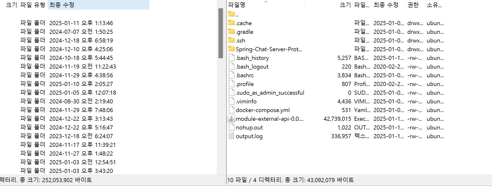

AWS는 국내에서 가장 많이 사용되는 클라우드 컴퓨팅 서비스다. AWS는 처음 가입한 사용자에게 프리티어 자격을 제공하는데, 1년이라는 제한된 기간동안 사용할 수 있는 일정 금액의 무료 크래딧을 제공한다.

오라클 클라우드의 경우 후발주자 답게 좀 더 파격적인 조건을 제공한다. 프리티어 계정에 기간 제한이 없으며 가장 저렴한 컴퓨팅 인스턴스(1core OCPU, 1GB memory)를 2개 까지 무료로 사용할 수 있다.

물론 낮은 스펙 때문에 실제 사용자 트래픽을 받는 서비스를 배포하는 것은 어렵겠지만, 토이 프로젝트의 배포, CI/CD, 모니터링 시스템을 구축하는 실습은 충분히 진행할 수 있다.

## 인스턴스 생성


인스턴스 탭에서 인스턴스 생성 버튼을 누른다.


원하는 리눅스 OS를 선택할 수 있다.


인스턴스를 처음 생성하면 VNIC가 자동으로 생성될 것이다. VNIC는 AWS의 Virtual Private Cloud (VPC)와 동일한 기능을 제공하는 서비스다. [참고](https://velog.io/@devtab/unispace-%ED%94%84%EB%A1%9C%EC%A0%9D%ED%8A%B8-%EB%B0%B0%ED%8F%AC-%EC%98%A4%EB%9D%BC%ED%81%B4-%ED%81%B4%EB%9D%BC%EC%9A%B0%EB%93%9C1)


ssh 접속을 위한 암호 키를 다운로드 받아야 한다.

그 후 생성 버튼을 눌러 인스턴스를 생성한다.

## 인스턴스 접속
인스턴스가 생성되면 퍼블릭 IP 주소를 기억해두자!

ssh 접속을 할 수 있는 프로그램은 여러가지가 있는데 난 Termius를 사용했다.


termius에서 아까 인스턴스 생성할 때 다운 받은 키를 등록해준다.


인스턴스의 public IP와 ssh 포트(기본 22)를 입력한다.


우분투로 인스턴스를 생성했다면 기본 사용자 이름은 ubuntu다.
key를 클릭해서 등록한 키를 적용한다.


문제 없이 접속된다.

**접속이 되지 않는다면 ?**
- 현재 연결된 네트워크가 ssh 포트 통신을 차단하는지 확인해봐야 한다. 간혹 일부 공공기관이나 공용 와이파이에서 22번 포트 통신을 차단하는 경우가 있다. 핫스팟을 연결에서 다른 네트워크 환경에서 시도해보는게 적절하다.
- 인스턴스를 생성할 때 다운받은 키가 맞는지 확인해야 한다. 키를 pem 형식으로 변경하거나 할 필요는 없다.

## 우분투 인스턴스 기본 설정 과정

1. 패키지 매니저 업데이트 및 기본 의존성 설치

우선 시스템 패키지를 최신 상태로 업데이트하고 필요한 기본 의존성들을 설치한다.

```bash
sudo apt update -y
sudo apt-get install apt-transport-https ca-certificates curl gnupg lsb-release
```

2. Docker 설치 준비

Docker를 설치하기 위해 공식 GPG 키를 추가하고 시스템 아키텍처를 확인한다. 그 후 Docker 저장소를 시스템에 추가한다.

```bash
curl -fsSL https://download.docker.com/linux/ubuntu/gpg | sudo gpg --dearmor -o /usr/share/keyrings/docker-archive-keyring.gpg
dpkg -s libc6 | grep Arch
echo "deb [arch=amd64 signed-by=/usr/share/keyrings/docker-archive-keyring.gpg] https://download.docker.com/linux/ubuntu $(lsb_release -cs) stable" | sudo tee /etc/apt/sources.list.d/docker.list > /dev/null
```

3. Docker 설치

저장소를 추가했다면 실제 Docker를 설치한다.

```bash
sudo apt-get update
sudo apt-get install docker-ce docker-ce-cli containerd.io
sudo apt-get update
sudo apt-get install
```

4. Docker 권한 설정

sudo 없이도 Docker 명령어를 실행할 수 있도록 현재 사용자에게 권한을 부여한다.

```bash
getent group docker
sudo usermod -aG docker $USER
newgrp docker
```

5. 데이터베이스 컨테이너 실행

프로젝트에 필요한 PostgreSQL, Redis, MongoDB 컨테이너를 실행한다.

```bash
docker run -p 5432:5432 -e POSTGRES_PASSWORD=postgres --name pophub-postgres postgres:16
docker run -p 6379:6379 -e --name chattest-redis redis
docker run --name chattest-mongo -d -p 27017:27017 mongo:latest
```

6. Java 17 설치

스프링 부트 애플리케이션 실행을 위해 OpenJDK 17을 설치한다.

```bash
sudo wget https://download.java.net/java/GA/jdk17.0.2/dfd4a8d0985749f896bed50d7138ee7f/8/GPL/openjdk-17.0.2_linux-x64_bin.tar.gz
tar xvf openjdk-17.0.2_linux-x64_bin.tar.gz
sudo mv jdk-17.0.2/ /opt/jdk-17/
```

7. Java 환경변수 설정

Java가 시스템 전역에서 사용될 수 있도록 환경변수를 설정한다.

```bash
vi ~/.bashrc
source ~/.bashrc
java --version
```

## 빌드 파일 옮기기
`git clone` 명령어로 프로젝트 파일을 불러온 뒤 `gradle build`로 인스턴스 내에서 빌드하는 것이 가능하다. 그러나 제한된 자원 때문에 빌드 시간이 매우 오래 걸리고, 도커 컨테이너가 같이 띄워져 있는 상태에선 더 어려웠다.

다른 인스턴스를 빌드 서버로 이용하여 배포 파이프라인을 구축해 보는건 다음에 하고, 일단 지금은 FTP 프로그램을 이용해서 내 컴퓨터에서 서버로 직접 파일을 옮기려고 한다.

FTP 접속 프로그램은 오픈소스 프로그램 중 하나인 [filezilla](https://filezilla-project.org/)를 사용했다.


호스트에 인스턴스 퍼블릭 IP를 입력하고 사용자, 키 파일을 등록하면 된다. termius와 마찬가지로 인스턴스 생성시 내려받은 키파일을 그대로 사용하면 접속된다.



빌드가 완료된 JAR 파일을 오른쪽 서버로 전송하면 된다.


멀티모듈 프로젝트의 경우 `@SpringBootAplication` 이 포함된 모듈의 빌드 jar를 사용해야 한다.

## 스왑 메모리 설정
인스턴스 기본 할당 메모리가 1GB로 매우 작기 때문에 스왑 메모리 설정을 해주는 것이 좋다.

```bash
sudo fallocate -l 2G /swapfile
sudo chmod 600 /swapfile
sudo mkswap /swapfile
sudo swapon /swapfile
```

기본 메모리 1GB의 2배인 2GB 용량의 스왑 메모리를 설정해준다.


`free -h` 명령어로 메모리 사용량 확인이 가능하다. 정상적으로 스왑 메모리가 잡힌 것을 확인할 수 있다.

재부팅이 되도 스왑 메모리 설정이 유지되도록 추가 설정을 해줘야 한다.

```bash
sudo vi /etc/fstab
```

파일 내부에 다음 문구를 추가한다.
`/swapfile swap swap defaults 0 0`


## 우분투 방화벽 설정

iptables는 Linux 시스템에서 네트워크 패킷을 필터링하고 전달하는 규칙을 설정하고 관리하는 데 사용된다.

```bash
sudo iptables -L --line
```


iptables에서 'Chain INPUT'란에 REJECT된 부분을 삭제해서 비활성화를 제거한 뒤, 포트를 추가해서 열어줘야 한다.

```bash
sudo iptables -D INPUT 6
```

80(http), 443(https), 8080(spring), 5432(postgres), 27017(mongodb), 6379(redis) 등 사용하는 포트를 방화벽에 추가한다.

```bash
sudo iptables -A INPUT -m state --state NEW -p tcp --dport 80 -j ACCEPT 
sudo iptables -A INPUT -m state --state NEW -p tcp --dport 443 -j ACCEPT
sudo iptables -A INPUT -m state --state NEW -p tcp --dport 5432 -j ACCEPT 
sudo iptables -A INPUT -m state --state NEW -p tcp --dport 8080 -j ACCEPT
sudo iptables -A INPUT -m state --state NEW -p tcp --dport 27017 -j ACCEPT 
sudo iptables -A INPUT -m state --state NEW -p tcp --dport 6379 -j ACCEPT
```

서버가 재시작 되면 방화벽 설정이 초기화 될 수 있으므로 변경 사항을 iptables 구성 파일에 저장한다.

```bash
sudo netfilter-persistent save
```

## 오라클 클라우드 방화벽 설정


인스턴스-서브넷-보안목록-수신규칙 추가 에서 사용해야 하는 포트를 추가해주자. 

일단 모든 경로의 접근을 허용해놓긴 했지만 보안상 부적절 하므로 실제 외부 사용자가 사용하는 서비스를 배포할 때에는 신중해야 한다.

## 스프링 빌드 파일 실행

빌드 파일이 있는 위치에서 아래 명령어로 실행이 가능하다.

```bash
java -jar JAR파일이름.jar
```

이렇게 실행하면 콘솔에서 `ctrl + c`를 누르거나 콘솔 연결이 끊기면 실행이 종료되므로 백그라운드 프로세스로 실행하기 위해 nohup을 사용한다.

```bash
nohup java -jar JAR파일이름.jar > output.log 2>&1 &
```

`output.log` 파일에 실행 로그가 저장된다.

```bash
tail -f output.log
```

`tail` 명령어로 실시간 로그 확인이 가능하다.

```bash
ps -ef | grep java 
```


