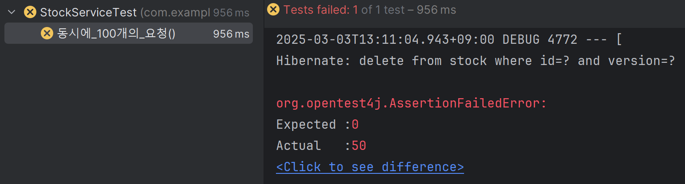

# Synchronized를 이용한 방법

자바의 synchronized는 메서드 실행을 직렬화한다. decrease 메소드를 synchronized로 선언하면 동시성 문제를 해결할 수 있을까?

```java
@Service  
public class StockService {  
  
    private final StockRepository stockRepository;  
  
    public StockService(StockRepository stockRepository) {  
        this.stockRepository = stockRepository;  
    }  
  
    @Transactional  
    public synchronized void decrease(Long id, Long quantity) {  
        Stock stock = stockRepository.findById(id).orElseThrow();  
        stock.decrease(quantity);  
  
        stockRepository.saveAndFlush(stock);  
    }  
}
```

```java
@Test  
public void 동시에_100개의_요청() throws InterruptedException {  
    int threadCount = 100;  
    ExecutorService executorService = Executors.newFixedThreadPool(32);  
    CountDownLatch latch = new CountDownLatch(threadCount);  
  
    for (int i = 0; i < threadCount; i++) {  
        executorService.submit(() -> {  
            try {  
                stockService.decrease(1L, 1L);  
            } catch (Exception e) {  
                e.printStackTrace();  
            } finally {  
                latch.countDown();  
            }  
        });  
    }  
  
    latch.await();  
  
    Stock stock = stockRepository.findById(1L).orElseThrow();  
    assertEquals(0L, stock.getQuantity());  
}
```

100개의 스레드를 생성해서 decrease()를 비동기로 호출하는 테스트 코드를 작성했다. 



결과는 실패.

이유는 `@Transactional`에 있다. Spring에서 `@Transactional` 애노테이션을 사용하면 AOP를 통해 프록시 객체가 생성된다. 실제 동작 순서는 다음과 같다.

1. 클라이언트가 stockService.decrease() 메서드를 호출한다.
2. Spring이 생성한 프록시 객체가 트랜잭션을 시작한다.
3. 프록시 객체가 실제 StockService 인스턴스의 decrease() 메서드를 호출한다.
4. 메서드가 종료되면 트랜잭션이 커밋된다.

문제는 synchronized 키워드가 실제 StockService 객체에만 적용되고, 각 스레드가 접근하는 프록시 객체에는 적용되지 않는다는 점이다.

즉, **여러 스레드가 동시에 각각 다른 프록시 객체를 통해 메서드를 호출할 수 있어** 동시성 문제가 여전히 발생한다. `@Transactional`을 사용하지 않는다면 정상적으로 동작한다.

## 데이터베이스 - 비관적 락(Pessimistic Lock)을 이용한 방법
```java
@Repository
public interface StockRepository extends JpaRepository<Stock, Long> {

    @Lock(LockModeType.PESSIMISTIC_WRITE)
    @Query("SELECT s FROM Stock s WHERE s.id = :id")
    Stock findByIdWithPessimisticLock(@Param("id") Long id);
```
데이터베이스에서 제공하는 락을 사용하여 조회 시점에서부터 다른 스레드의 접근을 차단할 수 있다. 트랜잭션이 커밋되거나 롤백될 때까지 다른 트랜잭션이 해당 데이터를 수정할 수 없게 된다. 

JPA 에선 `@Lock` 어노테이션과 `LockModeType.PESSIMISTIC_READ`, `PESSIMISTIC_WRITE`, `PESSIMISTIC_FORCE_INCREMENT` 등의 옵션으로 구현할 수 있다.

```java
@Service
public class PessimisticLockStockService {

    private final StockRepository stockRepository;

    public PessimisticLockStockService(StockRepository stockRepository) {
        this.stockRepository = stockRepository;
    }

    @Transactional
    public void decrease(Long id, Long quantity) {
        Stock stock = stockRepository.findByIdWithPessimisticLock(id);
        stock.decrease(quantity);
        stockRepository.save(stock);
    }
}
```

### 문제점 - 데드락 발생 가능성

비관적 락은 데드락 발생 가능성이 존재한다. 데드락은 두 트랜잭션이 서로 다른 순서로 리소스를 잠그려고 할 때 발생하는 현상이다.

```java
// 트랜잭션 A
@Transactional
public void transferMoney(Long fromAccountId, Long toAccountId, BigDecimal amount) {
    Account fromAccount = accountRepository.findByIdWithLock(fromAccountId);  // 계좌 A 잠금
    Account toAccount = accountRepository.findByIdWithLock(toAccountId);      // 계좌 B 잠금 시도
    // 계좌 이체 로직
}

// 트랜잭션 B (동시 실행)
@Transactional
public void transferMoney(Long fromAccountId, Long toAccountId, BigDecimal amount) {
    Account fromAccount = accountRepository.findByIdWithLock(toAccountId);    // 계좌 B 잠금
    Account toAccount = accountRepository.findByIdWithLock(fromAccountId);    // 계좌 A 잠금 시도
    // 계좌 이체 로직
}
```

이를 예방하기 위해선 **항상 동일한 순서대로 락을 획득하도록 로직을 설계**해야 하며, 데드락 상황을 방지하기 위해 **타임아웃을 설정** 해줘야 한다.

```java
@Transactional(timeout = 10) // 10초 후 타임아웃
public void transferMoney(...) { ... }
```

### 문제점 - 성능 저하
비관적 락은 동시성을 크게 제한하기 때문에 성능 저하가 불가피하다. 

한번에 하나의 트랜잭션만 처리 가능하므로 전체 처리량이 감소하고, 락을 획득하기 위해 대기하는 시간이 전체 응답시간에 추가된다.

이 외에도 분산 환경 데이터베이스에서의 적용이 복잡하다는 점, 데이터베이스의 트랜잭션 격리수준이 `READ_UNCOMMITTED`인 경우, 더티 리드 발생 가능성 때문에 효과가 제한적일 수 있다는 점이 단점으로 거론된다.

## 데이터베이스 - 낙관적 락(Optimistic Lock)을 이용한 방법
데이터 충돌이 드물게 발생할 것이라고 가정하고 실제로 데이터를 변경하는 시점에 충돌을 감지하는 방식이다. 비관적 락이 "먼저 잠그고 나중에 확인하는" 전략이라면, 낙관적 락은 "먼저 작업하고 나중에 충돌을 확인하는" 전략을 취한다.

낙관적 락의 핵심은 버전 관리다. 각 레코드에 버전 정보(숫자 또는 타임스탬프)를 추가하고, 데이터가 수정될 때마다 이 버전을 증가시킨다. 그리고 데이터를 업데이트할 때 현재 버전이 읽었을 때의 버전과 동일한지 확인한다.

```java
@Entity
public class Stock {

    @Id
    @GeneratedValue(strategy = GenerationType.IDENTITY)
    private Long id;

    private Long productId;

    private Long quantity;

    @Version
    private Long version;
```
JPA에선 `@Version` 어노테이션과 `LockModeType.OPTIMISTIC`을 사용한다.

```java
@Lock(LockModeType.OPTIMISTIC)
@Query("SELECT s FROM Stock s WHERE s.id = :id")
Stock findByIdWithOptimisticLock(@Param("id") Long id);
```

낙관적 락의 기본 작동 방식은 다음과 같다.

1. **읽기**: 애플리케이션이 데이터를 읽을 때 버전 정보도 함께 가져온다.
2. **수정**: 애플리케이션이 데이터를 수정한다.
3. **충돌 감지**: 데이터를 저장할 때 WHERE 절에 버전 정보를 포함시켜 현재 데이터베이스의 버전과 일치하는지 확인한다.
4. **업데이트 또는 충돌**: 버전이 일치하면 업데이트하고 버전을 증가시킨다. 일치하지 않으면 충돌이 발생했다고 판단하고 예외를 발생시킨다.

낙관적 락 사용시 가장 중요한 부분은 충돌이 발생했을 때의 처리 전략이다.
```java
public void decrease(Long id, Long quantity) throws InterruptedException {
        while (true) {
            try {
                optimisticLockStockService.decrease(id, quantity);
                break;
            } catch (Exception e) {
                Thread.sleep(50);
            }
        }
    }
```
위 방식은 충돌 발생 시 일정 시간을 기다렸다 **성공할 때 까지 재시도** 하는 방법이다. 아래처럼 `@Retryable` 어노테이션을 이용하여 최대 재시도 횟수와 대기시간을 정할 수도 있다.

```java
@Retryable(
        value = ObjectOptimisticLockingFailureException.class,
        maxAttempts = 3,
        backoff = @Backoff(delay = 100)
        )
public void decrease(Long id, Long quantity) {
        Stock stock = stockRepository.findByIdWithOptimisticLock(id);

        stock.decrease(quantity);
        stockRepository.save(stock);
    }
```

낙관적 락은 실제 잠금을 획득하지 않기에 데드락이 발생하지 않고, 데이터 접근에 대한 경합이 적을 때 높은 성능을 발휘한다는 장점이 있다. 개발자가 재시도 로직을 작성해줘야 한다는 점이나, 충돌이 자주 발생하는 경우 재시도 때문에 사용자 경험이 저하될 수 있다는 단점이 거론된다.
