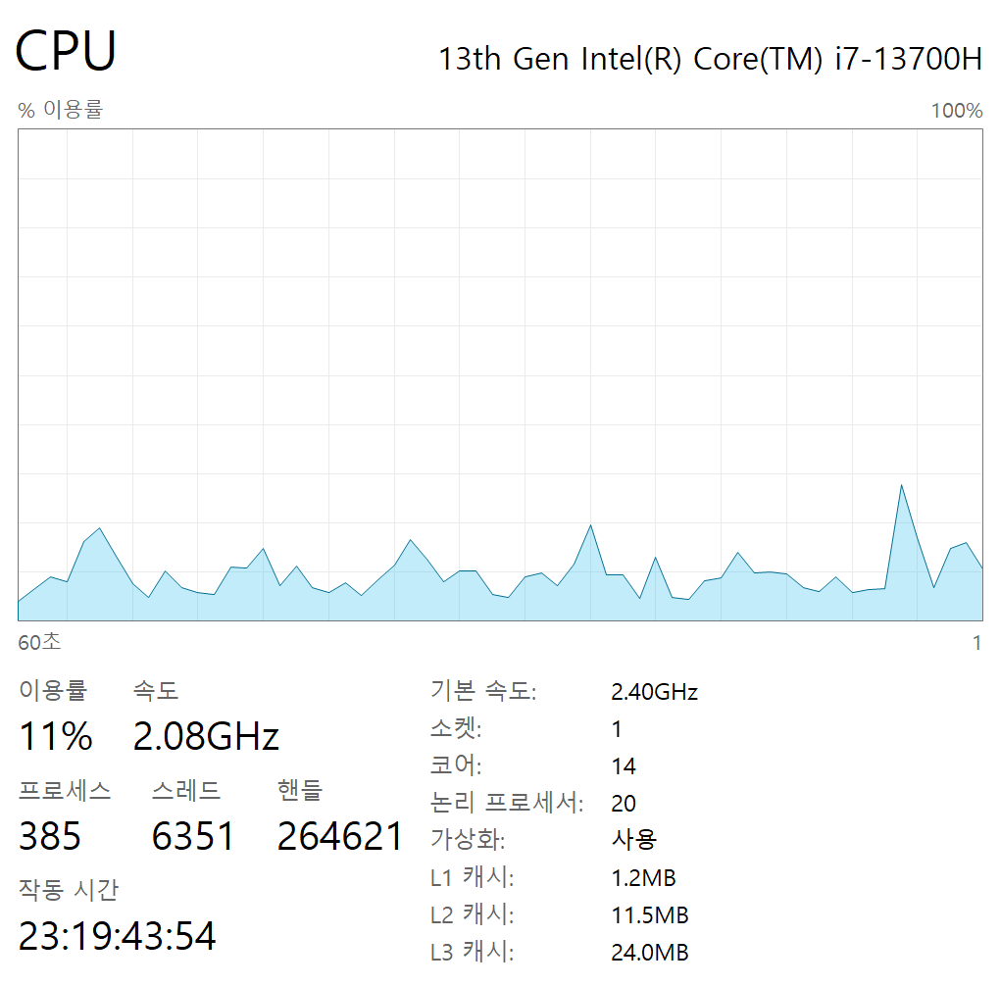
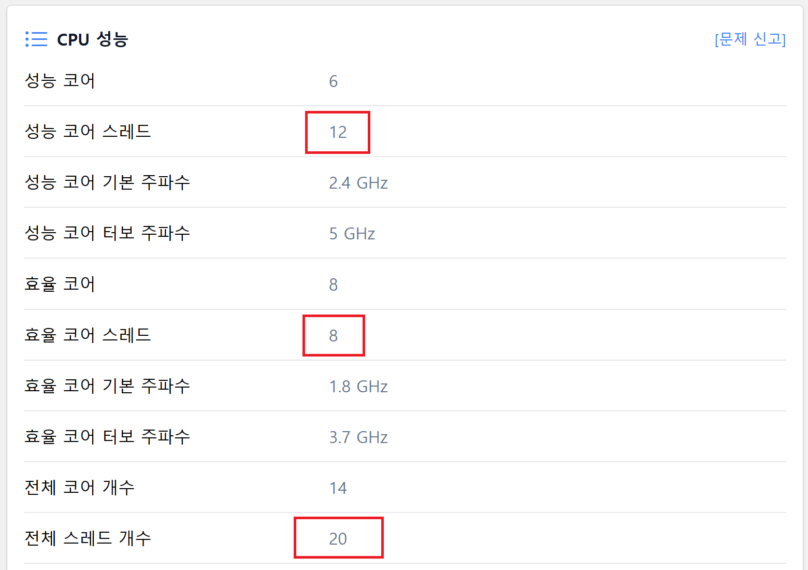
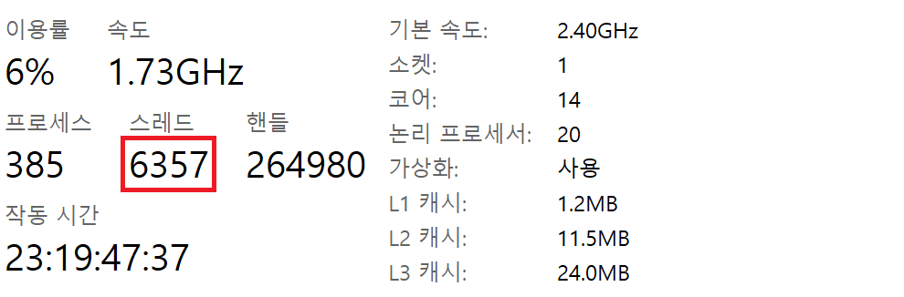

### 의문점

백엔드 개발자를 목표로 공부하면서, '스레드(Thread)'라는 단어를 지겹도록 마주한다. 멀티스레딩 프로그래밍, 톰캣의 스레드 풀, 비동기 처리... 분명 코드 레벨에서는 스레드를 생성하고 사용하는 법에 익숙해져 간다. 하지만 어느 날 문득, 근본적인 질문이 머릿속을 스쳤다.

> "내 노트북 CPU는 14코어 20스레드라고 하는데, 왜 윈도우 작업 관리자에는 수천 개의 스레드가 떠 있고, 내가 만든 스프링 애플리케이션(톰캣)은 스레드를 200개나 가질 수 있는 걸까? 이 스레드들은 대체 다 같은 스레드인가?"

이 질문에 명확히 설명하지 못하는 나 자신을 발견했을 때, 내가 쌓아온 지식이 모래성과 같을 수 있다는 위기감을 느꼈고, 전공자로서 부끄럽다는 생각이 들었다. 컨트롤러와 서비스 로직을 짜는 것을 넘어 내가 만든 웹 어플리케이션이 실제로 어떤 물리적 기반 위에서, 어떻게 운영체제와 상호작용하며 동작하는지 이해해야 한다고 생각했다.

이 글은 그 의문을 해결하기 위한 나의 여정을 기록한 것이다.

### 1단계: 물리적 한계 - 하드웨어 스레드 (논리 프로세서)


모든 연산의 근원, CPU에서부터 시작하자. '스레드'라는 단어가 가장 먼저 등장하는 곳이다.

#### CPU 코어와 하이퍼스레딩

* **코어(Core)** 는 연산을 수행하는 **'물리적인 뇌'** 다. 내 CPU의 14개 코어는, 비유하자면 **14명의 요리사** 가 주방에 있는 것과 같다.


* **하드웨어 스레드(Hardware Thread)** 는 이 물리적인 뇌를 더 효율적으로 쓰기 위한 기술이다. 인텔의 **하이퍼스레딩(Hyper-Threading)** 이 대표적이다. 이는 **요리사 한 명이 양손을 사용**해 하나의 물리 코어가 두 개의 논리 스레드를 처리하는 것처럼 보이게 한다. 물론 요리사의 뇌는 하나이므로 완벽한 2배 성능은 아니지만, 노는 자원을 활용해 약 15~30%의 성능 향상을 꾀할 수 있다.

내 노트북(`Intel i7-13700H`)의 스펙을 보자.



- 6개의 성능 코어(P-Core) → 하이퍼스레딩 적용 → **12 스레드**
- 8개의 효율 코어(E-Core) → 하이퍼스레딩 미적용 → **8 스레드**
- **총합: 20 하드웨어 스레드 (논리 프로세서)**

이 숫자 **'20'** 이 바로 내 컴퓨터가 물리적으로 **'진정한 의미의 병렬(Parallel)' 실행을 할 수 있는 최대 개수**다. 동시에 일할 수 있는 일꾼의 수는 정확히 20명이다.

### 2단계: 시스템의 관리자 - OS 스레드와 스케줄링



20명의 일꾼으로 어떻게 6,000개가 넘는 일을 처리할까? 그 비밀은 운영체제(OS)의 **'스케줄링'** 에 있다.

#### OS 스레드: 할 일 목록

OS는 물리적인 하드웨어 스레드를 추상화하여 **OS 스레드(커널 스레드)** 라는 개념을 제공한다. 이것이 바로 Windows 작업 관리자에서 보이는 수천 개의 스레드다.

- **프로세스(Process)**: 실행 중인 프로그램 인스턴스. (Chrome, VSCode, Tomcat...)
- **OS 스레드(Thread)**: 프로세스 내의 실제 작업 흐름.

6,700개의 OS 스레드는 '현재 시스템이 처리해야 할 작업 목록 전체'를 의미한다. OS는 이 6,700개의 일을 20명의 일꾼에게 아주 짧은 시간(Time Slice) 동안 번갈아 맡긴다. 이를 **컨텍스트 스위칭(Context Switching)** 이라 부른다.

#### I/O Bound vs. CPU Bound: 스케줄러가 영리하게 일하는 이유

수천 개의 스레드가 존재해도 시스템이 원활히 돌아가는 이유는 대부분의 스레드가 **I/O Bound** 작업이기 때문이다.

*   **I/O Bound (입출력 위주 작업)**: 스레드의 실행 시간 대부분을 데이터베이스 조회, 외부 API 호출, 파일 읽기/쓰기 등 **'대기'** 하는 데 사용하는 작업이다. CPU는 이때 놀고 있다.


*   **CPU Bound (연산 위주 작업)**: 복잡한 수학 계산, 데이터 암호화, 영상 인코딩처럼 스레드의 실행 시간 대부분을 **CPU를 사용**하는 데 쓰는 작업이다.

```java
// 전형적인 I/O Bound 작업인 웹 요청 처리
@GetMapping("/user/{id}")
public User getUser(@PathVariable Long id) {
    // 1. DB 쿼리 요청 후, 스레드는 DB 응답을 '대기' (I/O Wait)
    //    이때 OS 스케줄러는 CPU를 다른 스레드에게 할당한다.
    Optional<User> user = userRepository.findById(id); 

    // 2. 외부 API 호출 후, 스레드는 네트워크 응답을 '대기' (I/O Wait)
    String extraInfo = restTemplate.getForObject("...", String.class);
    
    // 3. 응답이 오면, 잠깐의 CPU 연산 후 결과를 반환한다.
    return user.get();
}
```

위와 같이 대부분의 웹 애플리케이션 요청은 I/O Bound다. 스레드가 DB나 네트워크를 기다리는 동안 CPU는 다른 스레드의 일을 처리할 수 있다. 이 때문에 20개의 물리 스레드로 수천 개의 OS 스레드를 '동시성(Concurrency)'으로 처리하는 것이 가능한 것이다.

### 3단계: 애플리케이션 레벨 - JVM 스레드와 톰캣

드디어 우리가 코드를 작성하는 애플리케이션 레벨에 도달했다.

Spring Boot 애플리케이션을 실행하면 JVM 프로세스에는 다양한 스레드들이 생성된다.

```
JVM 프로세스
├── main (메인 스레드)
├── http-nio-8080-exec-1~200 (Tomcat 워커 스레드들)
├── G1 Young RemSet Sampling (GC 스레드)
├── G1 Conc#0 (GC 스레드)  
├── VM Thread (JVM 내부)
├── Reference Handler (JVM 내부)
├── Finalizer (JVM 내부)
├── ForkJoinPool.commonPool-worker-1~15 (공통 스레드 풀)
└── ... (기타 JVM 시스템 스레드들)
```
작업 관리자에서 프로세스가 가진 스레드의 개수를 확인할 수 있다.


#### 자바 스레드와 OS 스레드의 1:1 매핑
현대의 JVM(HotSpot JVM)에서 우리가 new Thread()로 만드는 자바 스레드는 OS 스레드와 1:1로 매핑된다. 즉, 자바에서 스레드를 하나 만들면, JVM은 OS에게 "진짜 스레드 하나 만들어줘"라고 요청하는 것과 같다.

#### 톰캣의 스레드 풀: I/O Bound 작업에 대한 해답
스프링 부트의 내장 톰캣은 HTTP 요청을 처리하기 위해 스레드 풀을 사용한다. application.yml의 server.tomcat.threads.max 기본값은 200이다.

```yaml
server:
  tomcat:
    threads:
      max: 200 # 최대 200개의 요청을 '동시에' 처리하겠다.
```

이는 톰캣이 최대 200개의 OS 스레드를 만들어 사용하겠다는 의미다. 왜 물리 코어 수인 20개가 아닌 200개일까? 

바로 대부분의 요청이 I/O Bound 작업이기 때문이다. 200개의 요청이 동시에 들어와도, 대부분의 스레드는 DB나 외부 API를 기다리며 '대기' 상태일 것이다. 따라서 실제 CPU를 사용하려는 스레드는 20개보다 훨씬 적을 가능성이 높다. OS 스케줄러는 이 틈을 타 200개의 스레드를 20개의 물리 코어 위에서 효율적으로 돌려준다.

만약 모든 요청이 CPU Bound 작업이라면, 스레드 풀 크기는 물리 코어 수(20개)에 가깝게 설정하는 것이 컨텍스트 스위칭 비용을 줄여 오히려 더 효율적이다.

### 4단계: 더 나아가서 - CPU Bound 작업을 위한 쓰레드 풀
톰캣의 스레드 풀 외에도, JVM은 다른 목적을 위한 스레드 풀을 제공한다. 대표적인 것이 바로 **ForkJoinPool** 이다.

이 풀은 별도의 스레드풀을 사용하지 않느다면, CompletableFuture의 기본 비동기 작업이나 ParallelStream을 실행할 때 사용되며, CPU Bound 작업을 효율적으로 처리하기 위해 설계되었다. 그래서 스레드 개수도 CPU 코어 수에 가깝게 설정되어 있다.

CPU 집약적인 작업의 경우, 물리 코어 수보다 많은 스레드를 사용하면 오히려 성능이 저하되기 때문이다.
