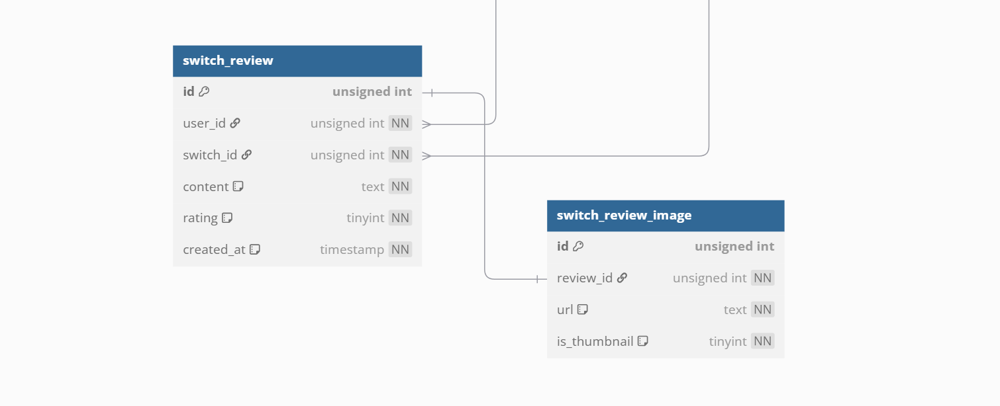
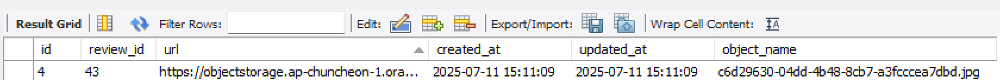
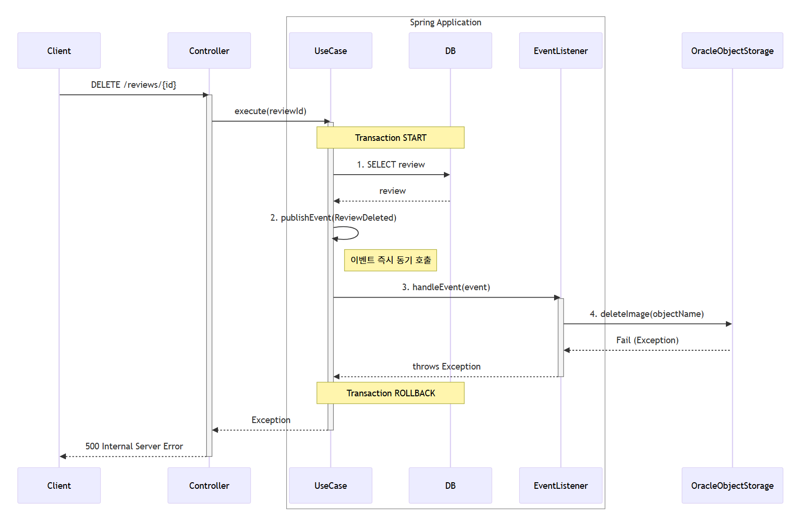
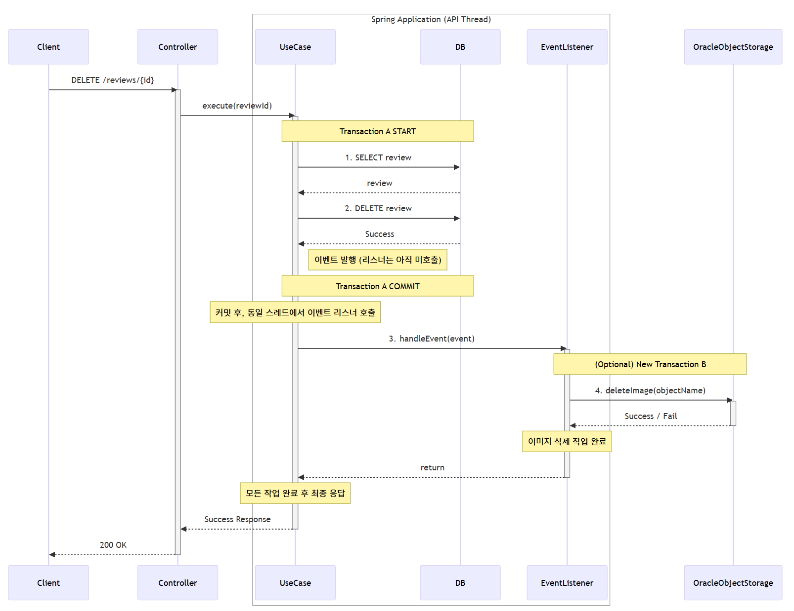

## 도입 배경




사용자가 등록한 리뷰 이미지는, 오라클 클라우드의 Object Storage에 저장되고 해당 파일의 경로가 DB 테이블에 삽입된다.

SwitchReview 와 SwitchReviewImage 는 CascadeType.ALL 로 서로 묶여 있는 상황이다.

```kotlin
// src/main/kotlin/wiki/devtab/switches/domain/review/model/SwitchReview.kt
@OneToOne(
    fetch = FetchType.LAZY, 
    cascade = [CascadeType.ALL], 
    mappedBy = "switchReview", 
    orphanRemoval = true
)
var reviewImage: SwitchReviewImage? = null
```

즉, SwitchReview 엔티티가 삭제되면 연관관계로 연결된 SwitchReviewImage 역시 삭제되는 구조다. 테이블 데이터는 Hard Delete로 관리되고 있으므로,  SwitchReviewImage가 바라보는 switch_review_image 의 데이터는 완전히 사라질 것이다.

그러나, 오라클 클라우드의 Object Storage에 저장된 이미지 파일은 별도의 처리가 없다면 삭제되지 않는다.

SwitchReviewImage가 삭제될 때, 클라우드의 Object Storage에 있는 파일 역시 같이 삭제하고 싶은데 이를 어떻게 구현해야 할까?

### 명시적 호출

```kotlin
@Service
class SwitchReviewDeleteUseCase (
    private val switchReviewRepository: SwitchReviewRepository,
    private val imageDeleteClient: ImageDeleteClient,
) {
    
    @Transactional
    fun execute(switchReviewId: Long, userId: Long) {
        val switchReview = switchReviewRepository.getByIdOrThrow(switchReviewId)
        switchReview.verifyOwnership(userId)
        
        try {
            imageDeleteClient.delete(switchReview.reviewImage.objectName)
        } catch (e: Exception) {
            //...
        } finally {
            switchReviewRepository.delete(switchReview)
        }
    }
}
```
위와 같이 응용 서비스 계층에서 직접 삭제 서비스를 호출할 수 있다. 이때 두 가지 문제가 발생가능하다. 

첫번째는 **이미지 삭제를 위해 호출한 서비스에서 오류가 발생한 경우, 트랜잭션 처리를 어떻게 해야 할지 애매하다**는 것이다. 클라우드에 등록되어 있는 이미지 삭제에 실패했으니 리뷰를 삭제하는 전체 트랜잭션을 롤백해야 할까?

리뷰 도메인의 관점에서 업로드된 이미지가 어떻게 저장되어 있는지는 주된 관심사가 아니다. 리뷰가 삭제되면 사용자는 더이상 이미지를 볼 수 없다. 실제 이미지가 저장된 서버에서 이미지가 삭제되었는지 여부는 도메인과 직접적인 관련이 없다. 따라서 이 경우 클라우드에서 이미지 삭제가 실패했더라도 전체 트랜잭션은 커밋되는 것이 맞는 것 같다. 이미지를 삭제하는 작업은 나중에 다시 시도하면 될 일이다.

두번째 문제는 **성능**이다. 호출한 이미지 삭제 서비스의 응답 시간이 길어진다면, API의 전체 응답 시간 또한 그만큼 증가한다. 앞서 언급했듯 클라우드에 업로드된 이미지 삭제 작업은 도메인의 중심 관심사와 관련 없는 작업이다. 따라서 이러한 작업 때문에 응답 시간이 늘어나는 것은 부적절하다.

이 문제는 결국, 리뷰 도메인과 인프라 도메인(?)이 강하게 결합되어 발생된 문제다. 이런 강한 결합을 없앨 수 있는 방법은 무엇일까?

### 이벤트 
이벤트는 **과거에 벌어진 어떤 것** 을 의미한다. 사용자가 리뷰를 삭제한 것은 '리뷰 삭제 이벤트'가 벌어졌다고 할 수 있다.

이벤트가 발생했다는 것은, 무언가의 상태가 변한것을 의미한다. 도메인의 상태가 변경되었을 때 어떤 행위를 해야 한다는 요구사항은 이벤트를 이용해서 구현할 수 있다.

리뷰가 삭제되었을 때, 클라우드 Object Storage에 저장된 리뷰 이미지 파일을 삭제해야 한다는 요구사항은 '리뷰 삭제됨' 이벤트를 이용하여 구현할 수 있다.

도메인 이벤트를 발행하기 위한 공통 컴포넌트를 정의했다.
```kotlin
interface DomainEvent {
    val occurredOn: java.time.LocalDateTime
        get() = java.time.LocalDateTime.now()
}

// src/main/kotlin/wiki/devtab/switches/_common/event/DomainEventPublisher.kt
@Component
class DomainEventPublisher(
    private val applicationEventPublisher: ApplicationEventPublisher
) {
    
    fun publish(event: DomainEvent) {
        applicationEventPublisher.publishEvent(event)
    }
}
```

이벤트는 발생한 이벤트에 대한 정보를 담는다. Object Storage와 연결된 클라이언트가 이미지를 삭제하기 위해선, UUID로 정의된 이미지의 이름이 필요하다.
```kotlin
// src/main/kotlin/wiki/devtab/switches/domain/review/event/SwitchReviewImageDeletedEvent.kt
data class SwitchReviewImageDeletedEvent(
    val imageUrl: String,
    val objectName: String,
    override val occurredOn: LocalDateTime = LocalDateTime.now()
) : DomainEvent {
}
```

도메인 이벤트 발행은 코틀린의 **확장 함수(Extension Function)** 를 통해 구현할 수 있다. 자바와 다른 코틀린의 재미있는 매력 중 하나인 것 같다.
```kotlin
fun SwitchReviewImage.deleted(): SwitchReviewImageDeletedEvent 
    = SwitchReviewImageDeletedEvent(this.url, this.objectName)
```

이제, 리뷰가 삭제되었을 때 이벤트를 발행해보자.

```kotlin
@Service
class SwitchReviewDeleteUseCase (
    private val switchReviewRepository: SwitchReviewRepository,
    private val domainEventPublisher: DomainEventPublisher
) {
    
    @Transactional
    fun execute(switchReviewId: Long, userId: Long) {
        val switchReview = switchReviewRepository.getByIdOrThrow(switchReviewId)
        switchReview.verifyOwnership(userId)
        
        switchReview.reviewImage?.let{ switchReviewImage ->
            domainEventPublisher.publish(switchReviewImage.deleted())
        }
        
        switchReviewRepository.delete(switchReview)
    }
}
```
SwitchReview 엔티티에 domainEventPublisher 를 주입해서 이벤트를 발행하도록 하면 더 객체지향스럽겠지만, 일단 서비스에서 명시적으로 이벤트를 발행하는 방식으로 구현했다.

이제 이벤트를 핸들링 하는 이벤트 리스너를 구현해야 한다. 그 전에, 집고 넘어가야 할 것이 있다.

- 클라우드에서 이미지를 삭제하는 작업이 실패한 경우 -> 리뷰 삭제 요청 전체가 실패해야 할까?

리뷰 삭제 이벤트가 `@EventListener`를 이용하여 처리된다면, 리뷰 삭제 트랜잭션이 커밋 되기 전에 이벤트 리스너에서 이벤트가 처리될 것이고, 만약 클라우드에서 이미지를 삭제하는 외부 작업이 실패한다면 SwitchReviewDeleteUseCase.execute 의 전체 트랜잭션이 롤백된다. 즉, `switchReviewRepository.delete(switchReview)` 는 실행되지 않고, 리뷰 삭제 요청은 실패 응답을 반환할 것이다.



앞서 언급했듯이 이건 내가 원하는 동작이 아니다. 리뷰 도메인 입장에서, 클라우드에 업로드된 실제 리뷰 이미지가 삭제되고 말고는 도메인의 주된 관심사가 아니므로, 이 삭제 작업이 실패하든 말든 DB에 리뷰 데이터 삭제가 반영되기만 한다면 성공 응답을 반환해야 한다.

이를 구현하기 위해서 리뷰 삭제 이벤트를 `@TransactionalEventListener`로 처리 했다.

```kotlin
// src/main/kotlin/wiki/devtab/switches/domain/review/service/business/SwitchReviewImageEventListener.kt
@Component
class SwitchReviewImageEventListener (
    private val imageDeleteClient: ImageDeleteClient
) {

    @Async
    @TransactionalEventListener(phase = TransactionPhase.AFTER_COMMIT)
    fun handleReviewImageDeleted(event: SwitchReviewImageDeletedEvent) {
        try {
            imageDeleteClient.deleteImage(event.objectName)
        } catch (e: Exception) {
            // ???
        }
    }
}
```

`@TransactionalEventListener` 를 사용하면, `SwitchReviewDeleteUseCase.execute()` 의 작업이 성공적으로 커밋 된 이후에 이벤트가 처리된다. 일단 DB에 저장된 리뷰 정보와 리뷰 이미지 url이 포함된 데이터가 삭제된 뒤, 클라우드에 저장된 실제 이미지를 삭제하는 것이다.

리뷰가 존재하지 않거나, 삭제 작업을 DB에 커밋하는 과정에서 오류가 발생하여 트랜잭션이 롤백된 경우 이벤트는 처리되지 않는다.

`@Async`는 이벤트를 비동기적으로 처리하는 역할을 한다. `@Async`를 사용하지 않는다면 `SwitchReviewDeleteUseCase.execute()` 작업이 커밋된 후, 이벤트 리스너에서 이미지 삭제 요청 결과를 반환할 때 까지 요청을 처리하는 스레드가 대기하게 된다.



`@Async`와 `@TransactionalEventListener` 를 같이 사용하면 이벤트를 비동기적으로 처리할 수 있다.


이벤트 리스너의 처리가 기존 요청을 처리한 스레드와 별도의 스레드에서 진행되기 때문에 사용자는 이미지 삭제 요청이 진행되는 것을 기다리지 않고 `SwitchReviewDeleteUseCase.execute()` 트랜잭션이 커밋되자 마자 응답을 받을 수 있다.

(`@Async` 어노테이션을 사용하기 위해선 `TaskExecutor` 빈 설정이 필요함)

클라우드 이미지 삭제 작업이 실패한 경우의 처리 방법도 고민해봐야 한다.
```kotlin
    @Async
    @TransactionalEventListener(phase = TransactionPhase.AFTER_COMMIT)
    fun handleReviewImageDeleted(event: SwitchReviewImageDeletedEvent) {
        try {
            imageDeleteClient.deleteImage(event.objectName)
        } catch (e: Exception) {
            // Dead Letter Queue 발행 or 재시도 로직 or ...
        }
    }
```
당장 생각나는건 몇번 재시도 한 뒤 슬랙이나 디스코드 웹훅으로 알림을 전송하고, Dead Letter Queue에 이벤트를 넣어서 나중에 배치로 처리하는 방법이 있을 것 같다. 

Object Storage에 저장된 이미지 삭제 작업 실패는 별로 큰일이 아니다. 만약 이 방식으로 처리해야 하는 비즈니스 로직이 중요하다면 실패 처리도 정교하게 설계해야 할 것이다.
