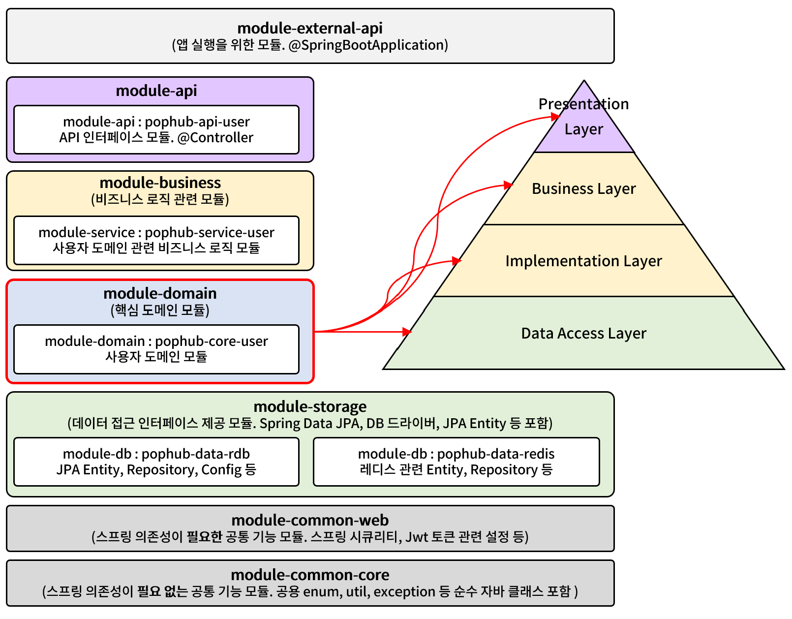
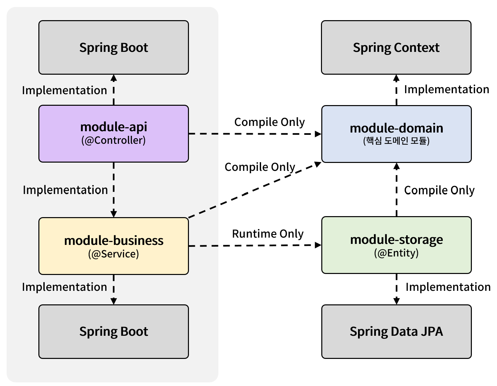
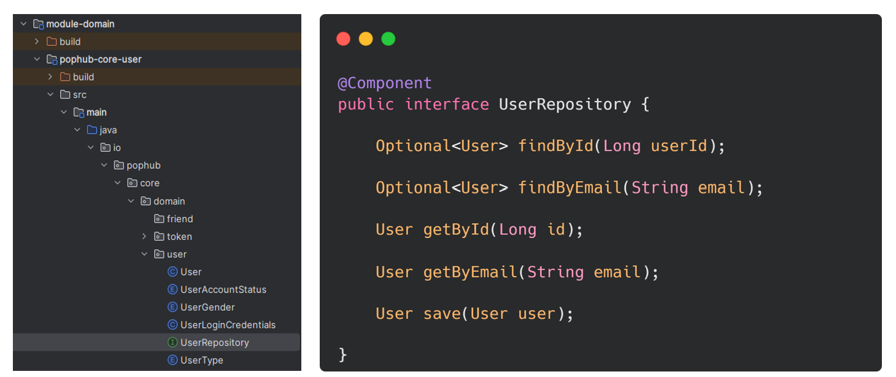
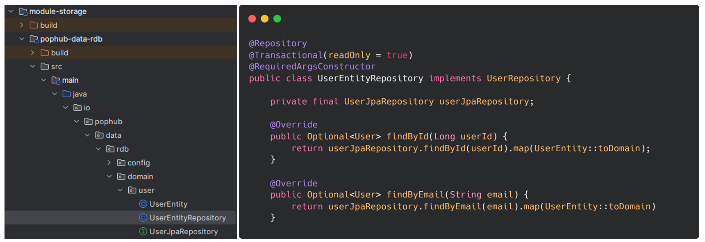
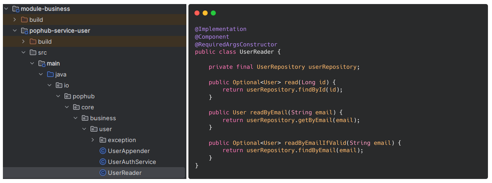

멀티 모듈은 규모가 큰 프로젝트에서 지속 가능한 코드를 추구하기 위한 수단 중 하나다. 그러나 잘못 설계된 멀티 모듈은 오히려 응집도를 낮추고 유지보수를 어렵게 할 수 있다.

단순히 코드를 모듈로 분리하는 것을 넘어 각 모듈의 명확한 경계와 책임, 그리고 모듈 간 의존성의 적절한 관리가 필요하다.

각 모듈은 독립적인 애플리케이션으로서의 완결성을 가져야 한다. 이는 단순한 코드의 물리적 분리를 넘어, 비즈니스 관점에서의 논리적 응집도를 의미한다. 하나의 모듈이 비대해지거나 다른 모듈과의 경계가 모호해진다면 이는 모듈 설계의 재검토가 필요한 신호다.


Gradle은 모듈간 의존 관계를 정의하는 다양한 방법을 지원한다. 이를 통한 모듈 간 의존성 정의는 단순한 기술적으로 접근하는 것이 아니라 아키텍쳐적인 관점에서 접근해야 한다. 모듈이 다른 모듈을 참조할 때 어떤 관계가 있는지 파악하여 적절히게 정의해야 한다. 

모듈 간 상호작용은 객체지향의 확장선상에 있다.  SOLID 원칙이 객체 수준에서 적용되듯 모듈 수준에서도 동일한 원칙이 적용된다고 생각한다.

현재 내가 진행하고 있는 프로젝트의 멀티 모듈 설계 결과다. 각 모듈을 나타낸 색은 레이어 구조와 연관되어 있다.



멀티 모듈과 아키텍쳐는 별도의 개념이고 항상 상관 관계가 있는건 아니라고 한다. [참고](https://www.youtube.com/watch?v=86uKu7xRoAE) 

이번 프로젝트에선 내가 가장 익숙한 레이어드 아키텍쳐를 투영하여 각 모듈의 역할과 책임을 나눴다.

- **module-api** : Presentation Layer의 역할을 가진 모듈. 외부 인터페이스를 담당한다. 도메인 모듈을 통해 비즈니스 계층과의 통신한다.


- **module-business** : 핵심 비즈니스 로직이 자리잡은 Business Layer와 비즈니스 로직의 상세 구현 계층인 Implement Layer의 역할을 가진다. **module-api**에 대한 별도의 의존성을 가지지 않는다. Presentation Layer와 정보 교환은 도메인 모듈의 객체를 통해 진행한다.


- **module-storage** : 데이터 저장소 인터페이스 모듈. Spring Data JPA을 의존하며 Entity 객체들이 위치한다. 도메인 모듈의 Repository 명세에 따른 구현체를 제공한다.


- **module-domain** : 핵심 도메인 모듈, 모듈 간 협력의 매개체. Java Class 로 표현된 도메인 모델과 스토리지 모듈의 Repository 명세를 제공한다. 이를 위해 Spring Context를 의존한다. 각 모듈은 도메인 모듈을 Compile Only로 의존한다. 



각 도메인 간의 의존 관계를 도식화하여 나타냈다. 아직 공부하고 있어 완벽한 건 아니다. 분명 걷어내거나 의존의 강도를 낮출 수 있을 것이다. 공부하면서 더 알아가는 것을 적어볼 예정이다.


## 비즈니스 모듈과 스토리지 모듈 간 Runtime Only 관계 구현

도메인 모듈(module-domain)에서 Repository에 대한 명세를 작성하고 빈으로 만든다.



스토리지 모듈(module-storage)에서 도메인 모듈의 Repository에 명세를 구현한 구현체를 작성한다.



비즈니스 모듈(module-business) 은 스토리지 모듈의 구현체를 직접 참조하지 않고 런타임에만 간접적으로 참조한다.



위와 같은 구조에서 비즈니스 모듈의 스토리지 모듈에 대한 컴파일 타임 의존성이 제거된다. 비즈니스 모듈은 스토리지 모듈의 구체적인 구현을 알 필요가 없다.

이러한 설계를 통해 테스트 용이성이 증가하며 스토리지 구현체를 JPA가 아닌 다른 구현으로 쉽게 교체 가능하므로 인프라스트럭처 변경에 대한 유연성을 확보할 수 있다.

각 모듈은 자신의 책임에만 집중할 수 있고 모듈 간 의존 방향을 명확하게 제어할 수 있다.

```gradle
// module-api
dependencies {
    /* Spring Core */
    implementation("org.springframework.boot:spring-boot-starter-web")
    implementation("org.springdoc:springdoc-openapi-starter-webmvc-ui:2.5.0")

    /* Security */
    implementation("org.springframework.boot:spring-boot-starter-security:3.2.4")

    /* Swagger */
    implementation('org.springdoc:springdoc-openapi-starter-webmvc-ui:2.4.0')

    implementation(project(":module-business:pophub-service-user"))
    compileOnly(project(":module-domain:pophub-core-user"))

    implementation(project(":module-common-web"))
    compileOnly(project(":module-common-core"))
    
}

// module-business
dependencies {
    implementation("org.springframework.boot:spring-boot-starter-web")

    compileOnly(project(":module-domain:pophub-core-user"))

    runtimeOnly(project(":module-storage:pophub-data-rdb"))

    implementation(project(":module-common-web"))
    compileOnly(project(":module-common-core"))
}

// module-storage
dependencies {
    implementation("org.springframework.boot:spring-boot-starter-web")
    implementation("org.springframework.boot:spring-boot-starter-data-jpa")
    implementation("org.postgresql:postgresql")

    compileOnly(project(":module-domain:pophub-core-user"))
    
    compileOnly(project(":module-common-core"))
}

// module-domain
dependencies {
    implementation('org.springframework:spring-context')
    
    compileOnly(project(":module-common-core"))
}
```
