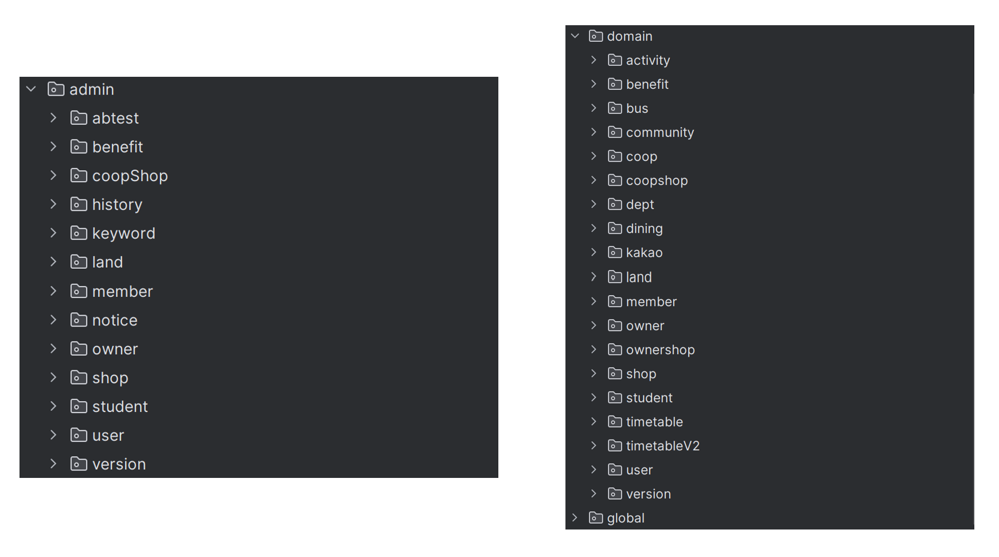
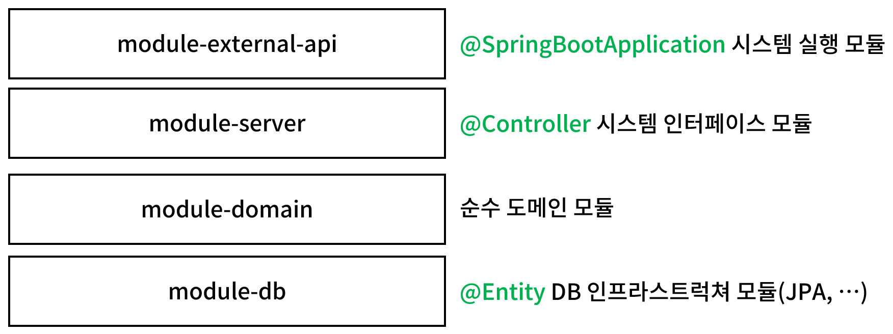
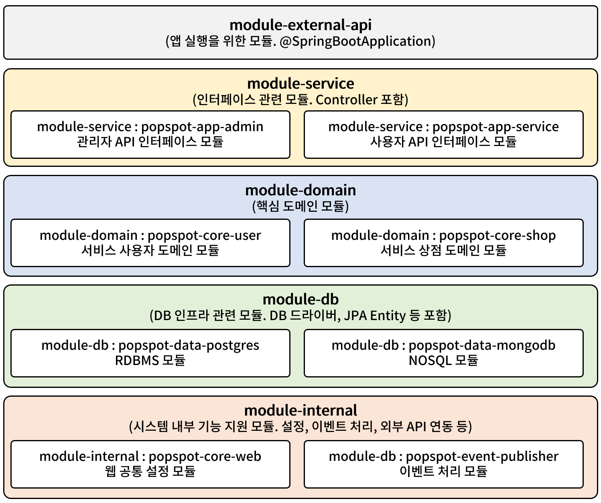
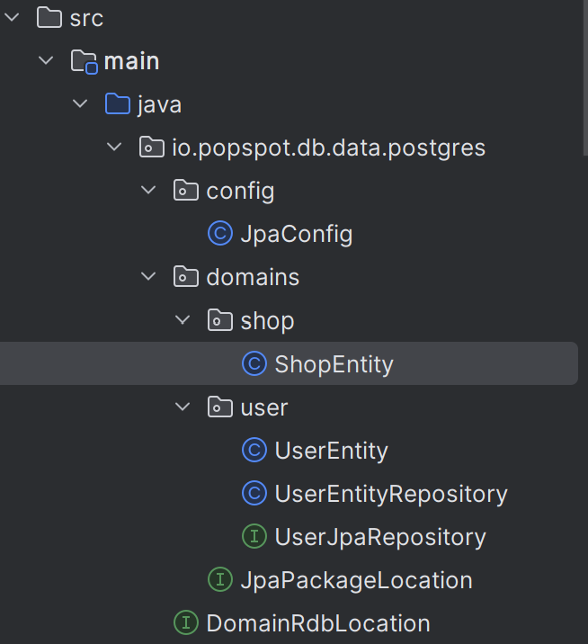

# 자바 모듈 시스템
Java 9이전에는 패키지만으로 코드를 조직하고 관리했다. 자바 애플리케이션이 점점 커지고 복잡해 지면서 패키지만으로 코드를 관리하는데 한계가 드러나기 시작했다.

패키지 간의 의존성을 명확하게 정의하기 어려웠고 불필요한 클래스가 포함된 빌드파일로 인해 애플리케이션의 크기가 커지는 문제가 발생했다.

이런 문제점을 해결하기 위해 Java9부터 모듈 시스템([Java 9 Platform Module System](https://www.oracle.com/kr/corporate/features/understanding-java-9-modules.html))을 도입했다.

모듈 시스템은 애플리케이션을 작은 단위로 분리하여 각 모듈별로 의존성을 관리하는 방법을 제공했으며 성능과 보안을 강화하는 데 기여했다.


# 스프링 멀티 모듈 프로젝트
## 왜 멀티 모듈을 사용할까?


멀티 모듈 프로젝트는 단일 프로젝트가 가진 문제를 해결하고 유지보수성과 확장성을 높이기 위해 도입된다. 

단일 프로젝트에서는 모든 코드가 한곳에 집중되다 보니 프로젝트가 커질수록 패기지가 늘어나고 의존성 관리와 변경 관리가 어렵다. 얽혀있는 의존성 때문에 변경 범위가 명확하지 않아 코드 수정과 추가에 의한 의도하지 않은 사이드 이펙트가 발생하기 쉽다.

멀티모듈을 통해 얻을 수 있는 장점은 무엇이 있을까?
- **중복 제거와 일관성 확보** : 중심 도메인을 모듈로 분리함으로써 여러 애플리케이션에서 동일한 구조와 규칙을 공유할 수 있다. 
- **책임 분리** : 시스템을 구성하는 각 모듈은 독립적인 역할과 책임을 가지며, 필요에 따라 분리된 방식으로 개발 및 테스트할 수 있다.
- **변경 관리 용이** : 특정 모듈에서 변경이 발생해도 다른 모듈에 영향을 최소화할 수 있다. 
- **효율적인 개발 프로세스** : 공통으로 사용하는 코드를 하나의 모듈로 집중 관리함으로써 개발자들이 중복 작업을 줄이고, 시스템 전반에 걸쳐 코드를 재사용할 수 있게 된다.

그러나 잘못된 멀티 모듈 설계는 오히려 문제를 악화시킬 수 있다. 멀티 모듈에 대한 개발자분들의 발표를 들어보면 공통적으로 언급하시는 부분이 공통 모듈(common 모듈)을 주의해야 한다는 것이다.

멀티 모듈 구조를 단순히 “공통 코드를 한 곳에 모은다”는 관점에서 접근할 경우 공통 모듈에 지나치게 많은 책임이 부여되게 되고, 오히려 문제가 악화될 수 있다.

따라서, 우리 프로젝트에서 "왜" 멀티 모듈을 사용하는지 명확히 이해하고, 올바른 설계 기준을 세우는 것이 중요하다.

## 멀티 모듈 설계


멀티 모듈 설계엔 정답이 없다. 멀티 모듈은 시스템을 개발하면서 겪게 되는 문제를 해결하는 방법 중 하나다. 따라서 구체적인 설계나 구현은 각각이 처한 상황에 따라 크게 달라질 것이다. 

설계에 관해 참고할 글과 영상을 아래에 정리해서 모아보았다.

난 진행하는 프로젝트를 다음과 같은 구조로 나눠서 진행했다.




## 멀티 모듈 구현
### gradle 의존성 선언 방식
멀티 모듈 프로젝트를 구성할 때 적절한 의존성 관리는 프로젝트의 성능과 유지보수성에 큰 영향을 미친다.

#### implementation
implementation은 Gradle에서 가장 일반적으로 사용되는 의존성 선언 방식이다. 이 방식은 컴파일 타임과 런타임 모두에서 의존성을 사용할 수 있게 한다.

```gradle
dependencies {
    implementation 'org.springframework.boot:spring-boot-starter-web'
}
```

- 의존성이 변경되면 해당 모듈까지만 재컴파일한다
- 모듈의 변경이 다른 모듈에 영향을 덜 주므로 빌드 시간이 단축된다
- 내부적으로 사용하는 의존성을 캡슐화할 수 있다

#### api
api는 의존성을 전이시키는 방식으로, 해당 라이브러리가 API의 일부로 외부에 공개된다.

```gradle
dependencies {
    api 'com.google.guava:guava:30.1-jre'
}
```

- 의존성이 변경되면 이를 의존하는 모든 모듈을 재컴파일해야 한다
- 하위 모듈이 상위 모듈의 API를 직접 접근할 수 있다
- 빌드 시간이 길어질 수 있으나 API를 명시적으로 공개할 때 유용하다

#### compileOnly
compileOnly는 컴파일 시에만 필요하고 런타임에는 필요 없는 의존성을 선언할 때 사용한다.

```gradle
dependencies {
    compileOnly 'org.projectlombok:lombok'
}
```

- 컴파일 시에만 사용되고 최종 아티팩트에는 포함되지 않는다
- jar 파일의 크기를 줄일 수 있다
- 주로 Lombok과 같은 어노테이션 프로세서에 사용된다

#### runtimeOnly
runtimeOnly는 런타임에만 필요한 의존성을 선언할 때 사용한다.

```gradle
dependencies {
    runtimeOnly 'com.h2database:h2'
}
```

- 컴파일 시에는 사용되지 않고 실행 시에만 필요한 라이브러리를 지정한다
- 데이터베이스 드라이버가 대표적인 예시다
- 컴파일 타임 의존성을 줄여 빌드 성능을 향상시킬 수 있다

#### 정리
- 일반적인 모듈 의존성: implementation
- 공개 API로 사용할 모듈: api
- 컴파일 시에만 필요한 모듈: compileOnly
- 런타임에만 필요한 모듈: runtimeOnly

### gradle.properties 를 이용해서 의존성 버전 관리하기

멀티 모듈 프로젝트는 여러개의 `build.gradle` 파일이 생성된다. 각 모듈별 버전 정보들이 파편화 되어 있으면 관리가 어려워질 것이다.

`gradle.properties` 파일을 통해 의존성 버전을 한곳에서 정의할 수 있다.

**gradle.properties**
```
applicationVersion = 0.0.1

projectGroup = com.devtab

springBootVersion = 3.4.1
springDependencyManagementVersion = 1.1.7
```

**settings.gradle**
```
pluginManagement {
    String springBootVersion = settings.springBootVersion
    String springDependencyManagementVersion = settings.springDependencyManagementVersion

    resolutionStrategy {
        eachPlugin {
            if (requested.id.id == 'org.springframework.boot') {
                useVersion(springBootVersion)
            }
            if (requested.id.id == 'io.spring.dependency-management') {
                useVersion(springDependencyManagementVersion)
            }
        }
    }
}
```

`settings.gradle` 파일에서 플러그인 버전을 관리할 수 있다. `pluginManagement` 블록 내에서 플러그인의 버전을 동적으로 설정하거나, 원격 저장소에서 플러그인을 검색하도록 구성할 수 있다.

**build.gradle**
```
plugins {
	id 'java'
	id 'org.springframework.boot'
	id 'io.spring.dependency-management'
}

allprojects {
	group = "${projectGroup}"
	version = "${applicationVersion}"
}
```

`gradle.properties` 파일에 정의된 변수는 `build.gradle` 파일에서 **"${변수명}"** 형식으로 참조 가능하다.

플러그인 버전에 대해선 `settings.gradle`에 정의된 값을 자동으로 불러오게 된다. `settings.gradle`을 사용하지 않는다면 다음과 설정하면 된다.
```
plugins {
	id 'java'
	id 'org.springframework.boot' version "${springBootVersion}"
	id 'io.spring.dependency-management' version "${springDependencyManagementVersion}"
}
```

## 트러블 슈팅
### JPA 관련 컴포넌트 스캔 문제

애플리케이션 실행 시 아래와 같은 오류가 발생

```
Parameter 0 of constructor in io.popspot.db.data.postgres.user.UserEntityRepository required a bean of type 'io.popspot.db.data.postgres.user.UserJpaRepository' that could not be found.
```

- 프로젝트는 멀티모듈 형태로 구성되어 있으며, DB와의 연결을 담당하는 모듈(db 모듈)과 애플리케이션을 실행하는 메인 모듈이 분리되어 있음.
- UserJpaRepository와 UserEntityRepository는 db 모듈 내부에 같이 정의되어 있었음.

**원인 예측**
1. 스프링 부트는 프로젝트 실행 시 컴포넌트 스캔을 통해 @Repository, @Service, @Controller, @Component 등과 같은 Bean을 스프링 컨텍스트애 등혹한다. 이때 기본 설정은 애플리케이션 실행 클레스가 위치한 패키지를 기준으로 하위 경로만 스캔하는데 모듈이 서로 분리되어 있어 스캔 대상에서 누락되었을 가능성이 있다.

```
@SpringBootApplication(scanBasePackages = "io.popspot")
public class PopSpotApplication {
    public static void main(String[] args) {
        SpringApplication.run(PopSpotApplication.class, args);
    }
}
```

2. JPA는 @EntityScan 및 @EnableJpaRepositories를 통해 각각 엔티티와 레포지토리의 위치를 명시적으로 지정할 수 있다. 멀티 모듈 프로젝트에서 지정 없이 기본 설정을 사용하면 서로 다른 모듈에 있는 엔티티와 리포지토리를 인식하지 못할 수 있다.


3. db 모듈이 메인 애플리케이션 모듈에 의존성이 명시적으로 추가되어 있어야 한다.

```
implementation(project(":module-db"))
implementation(project(":module-db:popspot-data-postgres"))
```

**해결 방법**
db 모듈에 `JpaConfig` 파일을 추가했다.

```java
package io.popspot.db.data.postgres.config;

import org.springframework.boot.autoconfigure.domain.EntityScan;
import org.springframework.context.annotation.Configuration;
import org.springframework.data.jpa.repository.config.EnableJpaAuditing;
import org.springframework.data.jpa.repository.config.EnableJpaRepositories;

import io.popspot.db.data.postgres.DomainRdbLocation;
import io.popspot.db.data.postgres.domains.JpaPackageLocation;

@Configuration
@EnableJpaAuditing
@EntityScan(basePackageClasses = DomainRdbLocation.class)
@EnableJpaRepositories(basePackageClasses = JpaPackageLocation.class)
public class JpaConfig {

}
```

- DomainRdbLocation : 엔티티가 위치한 패키지 상위에 위치
```
package io.popspot.db.data.postgres;

public interface DomainRdbLocation {
}
```

- JpaPackageLocation : JPA Repository가 위치한 패키지 상위에 위치.
```
package io.popspot.db.data.postgres.domains;

public interface JpaPackageLocation {

}
```




`EntityScam`과 `EnableJpaRepositories`를 사용하여 엔티티와 레포지토리의 위치를 스프링이 명확히 인식하도록 했다.

기존에는 Spring Boot의 기본 스캔 범위 설정이 db 모듈에 위치한 엔티티와 레포지토리를 인식하지 못했으나 명시적으로 범위를 지정함으로써 문제가 해결됬다.


- 애플리케이션 모듈이 사용하는 모든 엔티티와 레포지토리가 스캔 대상에 포함되었는지 확인.

- @EntityScan과 @EnableJpaRepositories를 사용해 경로를 명시적으로 지정.

- 모듈 간 의존성을 명확히 정의하고 실행 시점의 컨텍스트 로딩 과정을 검토.


## 참고
**멀티 모듈 설계**
- [멀티모듈 설계 이야기 with Spring, Gradle, 권용근](https://techblog.woowahan.com/2637/)
- [우아한 멀티 모듈 by 우아한형제들 권용근님](https://www.youtube.com/watch?v=nH382BcycHc)
- [우아한 멀티 모듈 세미나 정리](https://hyeon9mak.github.io/woowahan-multi-module/)
- [실전! 멀티 모듈 프로젝트 구조와 설계 | 인프콘 2022](https://www.youtube.com/watch?v=ipDzLJK-7Kc)
- [우리는 이렇게 모듈을 나눴어요: 멀티 모듈을 설계하는 또 다른 관점 | 인프콘2023](https://www.youtube.com/watch?v=uvG-amw2u2s&t=762s)
- [멀티 모듈을 설계하는 관점과 고려사항 with Spring & Gradle | 조민규님](https://mangkyu.tistory.com/304)
- [왜 프로젝트를 멀티 모듈로 구성할까](https://www.youtube.com/watch?v=VPzg61njKxw&t=29s)
- [멀티모듈 쓰지 말자 | 멀티모듈 오용 사례와 모듈링 접근법](https://www.youtube.com/watch?v=6FiNarz3pOA)

**멀티 모듈 적용**
- [Creating a Multi Module Project, Spring 문서](https://spring.io/guides/gs/multi-module)
- [Java 9 Modules 이해하기, 오라클 문서](https://www.oracle.com/kr/corporate/features/understanding-java-9-modules.html)
- [멀티 모듈 적용하기 with Gradle](https://tecoble.techcourse.co.kr/post/2021-09-06-multi-module/)
- [SpringBoot + Kotlin 멀티 모듈 구성 - 단일모듈에서 멀티모듈로 변경해보기 #1](https://www.youtube.com/watch?v=PdofVTuM-tE)
- [SpringBoot + Kotlin 멀티 모듈 구성 - 의존성 버전 관리 + 로깅 모듈 추가하기 #2](https://www.youtube.com/watch?v=rE89ppAmf_Y&t=59s)
- [SpringBoot + Kotlin 멀티 모듈 구성 - DB 모듈 추가하기 #3](https://www.youtube.com/watch?v=ODSFmLdecX0&t=7s)
- [SpringBoot + Kotlin 멀티 모듈 구성 - 도메인 모듈 분리 #4](https://www.youtube.com/watch?v=p5ZMF2bpE6A)
- [도메인 모듈 분리 시 Transaction + JPA 활용 방안](https://www.youtube.com/watch?v=18C2A56ialY)
- [Gradle 멀티모듈 네이밍 컨벤션, 공식문서](https://docs.gradle.org/current/userguide/multi_project_builds.html#naming_recommendations)

**멀티 모듈을 적용한 프로젝트 사례**
- [CollaBu/pennyway](https://github.com/CollaBu/pennyway-was)
- [Team-Smeme/Smeme](https://github.com/Team-Smeme/Smeme-server-renewal)