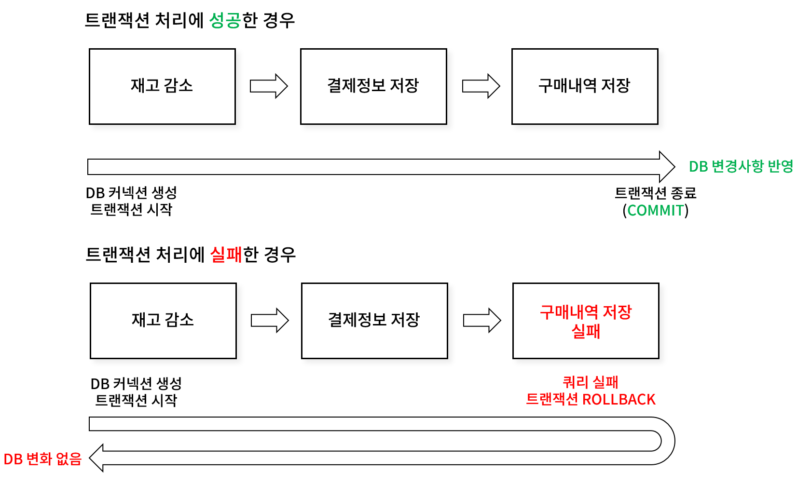
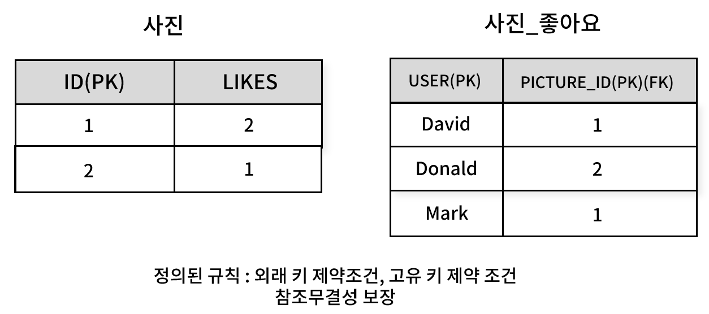
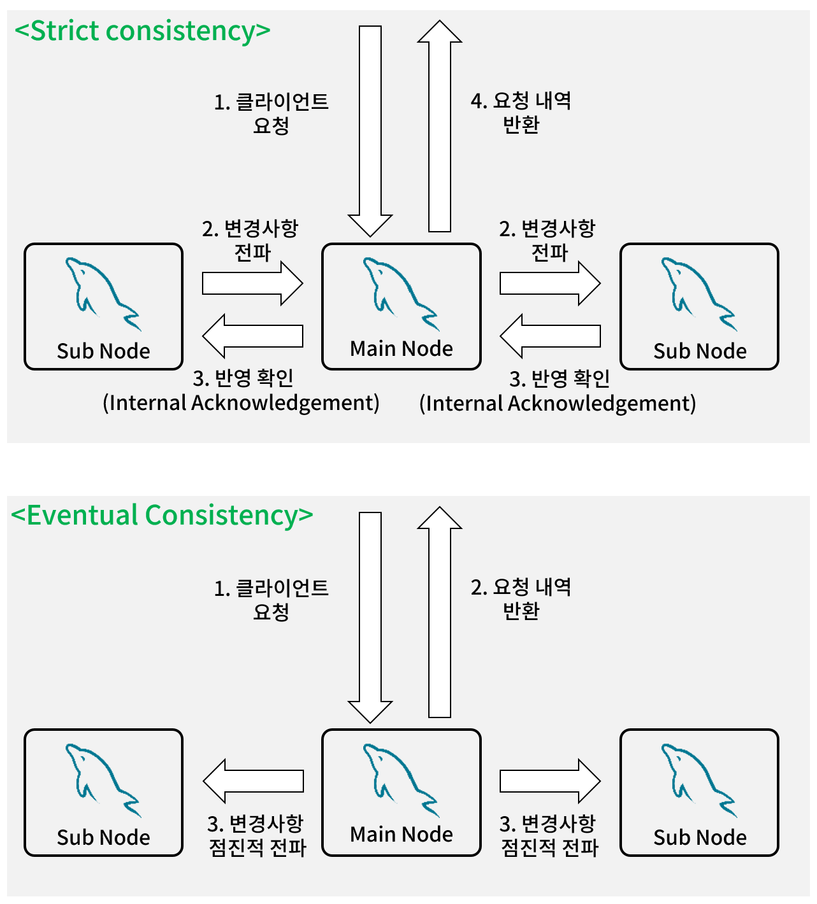

## ACID
> ACID(원자성, 일관성, 독립성, 지속성)는 데이터베이스 트랜잭션이 안전하게 수행된다는 것을 보장하기 위한 성질을 가리키는 약어다. (출처 : 위키 백과)

데이터베이스는 오류와 장애, 동시성 문제로부터 안전해야 한다. 

ACID는 데이터베이스의 **신뢰성을 높이고**, 사용자나 시스템이 **데이터의 손상이나 무결성 손실 없이 데이터를 안전하게 다룰 수 있도록 보장**하는 트랜잭션 처리 시스템의 기본 원칙이다.

각 데이터베이스 시스템은 이 원칙을 보장하기 위해 설계 되어 있다.

## ACID - 원자성(Atomicity)
원자성을 따르는 DBMS는 트랜잭션 내의 모든 쿼리들이 반드시 모두 성공하거나 실패해야 한다는 것을 보장한다.

트랜잭션에 포함된 쿼리 중 단 하나라도 실패하면, 이미 실행된 모든 쿼리가 롤백(Rollback)되어 데이터베이스는 트랜잭션 이전 상태로 복구된다.

데이터베이스가 트랜잭션 진행 중 오류로 인해 종료된 경우 시스템 재시작 이후에도 트랜잭션의 중간 상태를 정리하여 데이터 일관성을 유지해야 한다.

## ACID - 일관성(Consistency)
일관성은 크게 데이터의 일관성(Consistency in Data)과 읽기 작업의 일관성(Consistency in Reads)으로 나눌 수 있다. 두 개념은 서로 다른 맥락에서 일관성에 대해 설명하는 개념이다.

### 데이터의 일관성(Consistency in Data)
데이터의 일관성은 데이터베이스가 항상 유효한 상태를 유지하도록 하는 것을 의미한다. 트랜잭션 전후에 데이터베이스는 사전에 정의된 제약 조건과 규칙을 만족해야 한다.

외래 키 제약 조건, 고유 키 제약 조건 등 사용자가 사전에 정의한 규칙에 따라 항상 유효한 상태를 유지하도록 한다.

데이터의 일관성은 ACID 속성 중 원자성(Atomicity)과 고립성(Isolation)에 의해 보장된다. 두 원칙은 트랜잭션 중 일부 작업만 반영되거나, 다른 트랜잭션 간 간섭이 발생하지 않도록 보장하여 일관성을 유지한다.

### 읽기 작업의 일관성(Consistency in Reads)

읽기 작업의 일관성은 커밋된 변경 사항이 다른 트랜잭션에 얼마나 빠르게 반영되는지를 의미한다. 

이 개념은 시스템의 동작 방식에 영향을 미치며, **즉시 일관성(Strict Consistency)** 과 **점진적 일관성(Eventual Consistency)** 으로 나눌 수 있다.
두 개념은 데이터베이스 뿐만 아니라 더 넒은 분산 시스템 아키텍쳐 개념을 설명할 때 주로 언급되는 내용이다.

읽기 작업의 일관성은 하나의 트랜잭션이 커밋한 변경 사항을 **새로운 트랜잭션이 즉시 읽을 수 있는지** 여부와 관련되어 있다. 시스템의 동시성 처리와 분산 아키텍쳐 구조에 따라 일관성의 수준이 달라진다. 분산 시스템에선 모든 노드가 데이터의 일관성을 가지기까지 시간이 걸릴 수 있다.

- 즉시 일관성: A 사용자가 데이터 변경 후 커밋하면, B 사용자가 즉시 동일 데이터를 조회할 때 변경된 값이 반영됨.
- 점진적 일관성: 분산된 NoSQL 데이터베이스에서는 데이터가 여러 노드에 복제되기까지 시간이 소요될 수 있음.

