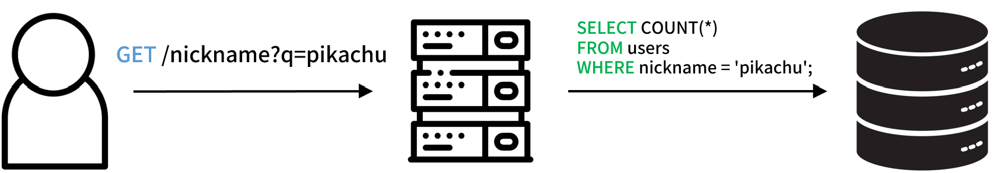
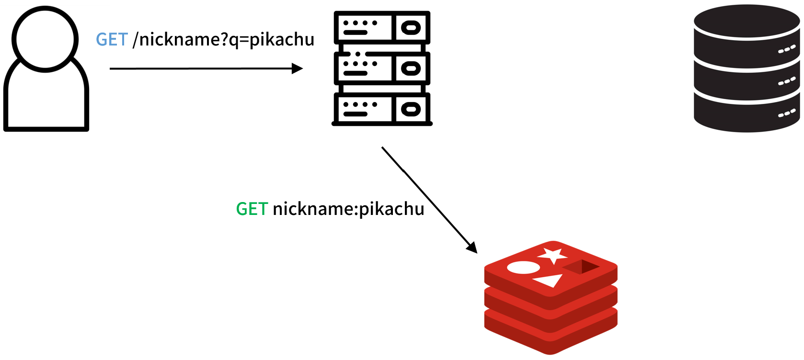
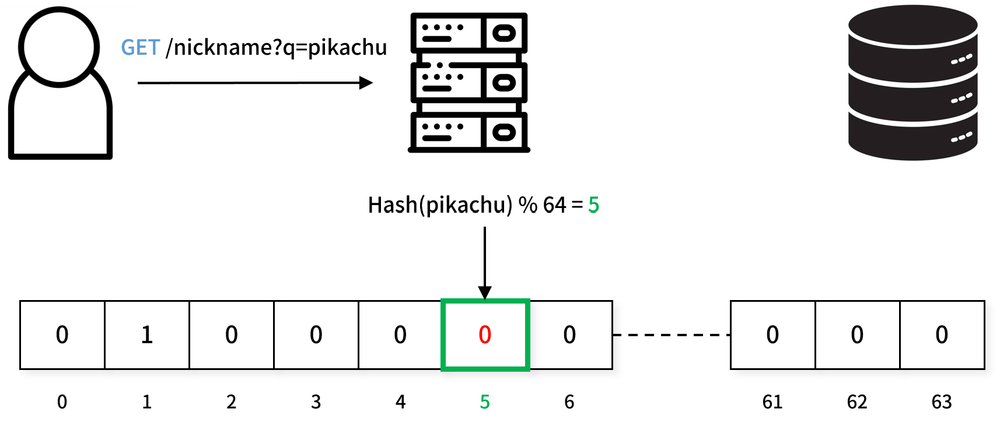
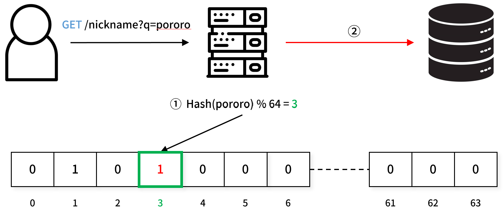
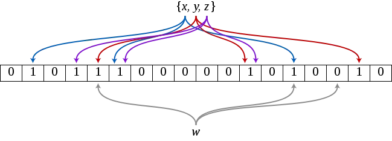

## 블룸 필터

사용자의 닉네임은 중복되지 않아야 한다는 정책을 가진 서비스가 있다고 가정해보자. 닉네임을 설정할 때, 사용자는 중복 여부를 확인하는 과정을 거친다.

클라이언트에서 중복 확인 버튼을 누르면, 서버에 해당 닉네임의 중복 여부를 확인하는 요청이 전달된다. 서버는 데이터베이스에 쿼리를 날려 해당 닉네임을 가진 컬럼이 존재하는지 확인한다.

이 방식은 단순하고 직관적이다. 사용자가 많지 않은 서비스라면 별 문제가 발생하지 않을 것 같다.

하지만 대규모 트래픽이 발생하는 서비스라면 상황이 달라진다. DB I/O는 상대적으로 느리기 때문에 다수의 사용자가 닉네임 중복 확인 요청을 보낼 경우 성능에 부정적인 영향을 줄 수 있다.

다음과 같이 인메모리 데이터베이스를 이용하여 등록된 닉네임들을 캐싱해 두는 전략을 사용할 수 있을 것 같다. 

인메모리 데이터베이스를 사용하여 등록된 닉네임을 캐싱하면 데이터베이스의 부하를 줄일 수 있다. 닉네임 확인 시 레디스에서 먼저 확인하고 데이터베이스 조회는 필요한 경우에만 수행한다.

이 방식은 성능 개선에 효과적이지만 몇 가지 단점이 있다. 예를 들어, 레디스와 데이터베이스 간의 데이터 동기화 문제가 발생할 수 있다. 또한 단순히 닉네임 중복 확인 기능을 위해 레디스를 도입하는 것이 과도한 선택처럼 보일 수 있다.

이 문제를 해결하기 위해 사용할 수 있는 것이 **블룸 필터(bloom filter)** 다.

블룸 필터는 해시 기반의 공간 효율적인 데이터 구조다.

64비트의 공간을 사용하는 블룸 필터가 있다고 가정하자. 사용자가 중복 확인을 요청한 닉네임 "pikachu"를 해싱한 다음 64로 나누면 0부터 63까지의 수가 나오게 된다.

해당 주소의 공간이 비어있다면 그 닉네임은 사용된 적이 없는 닉네임으로 판단할 수 있다. 데이터베이스에 쿼리를 날릴 필요가 없다.

비트가 설정되어 있다면 닉네임이 사용된 적이 있을 가능성이 있다. 이때는 데이터베이스에 쿼리를 보내 정확히 확인한다.

블룸 필터는 해시함수를 사용하기 때문에 해시 충돌이 발생한다는 단점이 있다. 때문에 공간이 채워져 있다고 해서 항상 닉네임이 중복된다고 판단할 수는 없다.

블룸필터는 완벽하진 않지만 불필요한 쿼리를 줄이는 데에는 분명 도움이 된다. 

