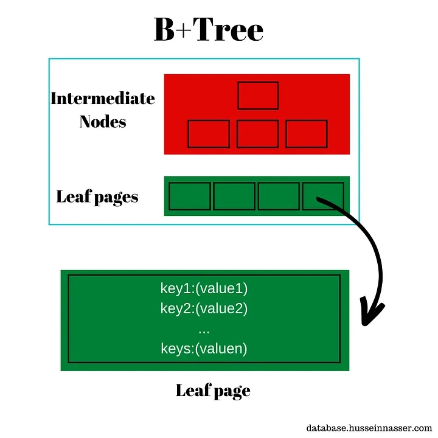
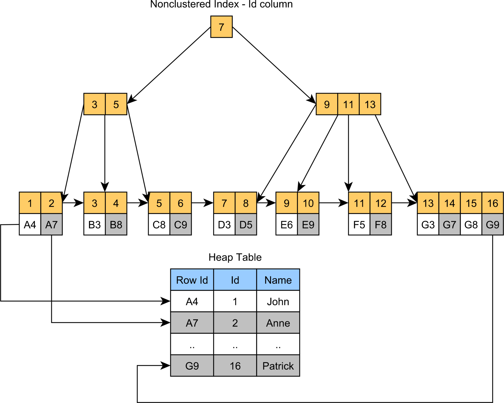
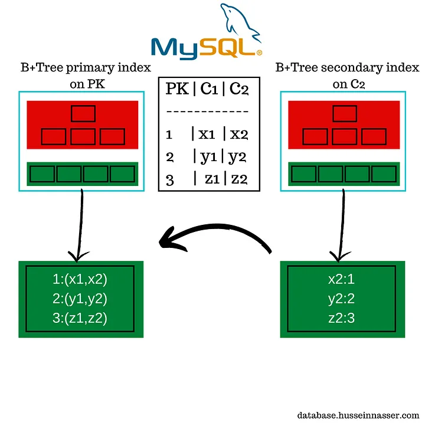
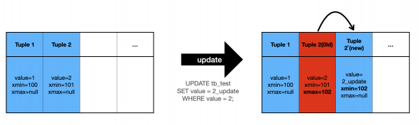

2016년 우버 엔지니어링 블로그에 흥미로운 글이 게시된다.

https://www.uber.com/en-KR/blog/postgres-to-mysql-migration/

그들이 초기부터 사용했던 postgres에서 MySQL로 이관한 이유에 대해 설명하는 글이었다.

오늘은 이 내용 가운데 '쓰기 성능의 비효율성(Inefficient architecture for writes)' 에 대해서 정리하려고 한다.

우선 Postgres와 MySQL의 가장 큰 차이점 중 하나는 B+ 트리 인덱스 구현 방식이다. 두 데이터베이스 모두 B+ 트리를 사용하지만, 보조 인덱스가 실제 데이터를 참조하는 방식이 다르다.

Postgres의 경우 보조 인덱스의 리프 노드가 데이터 튜플을 직접 가리킨다. 즉, 인덱스에서 원하는 데이터를 찾으면 해당 데이터의 물리적 주소로 바로 이동할 수 있다. 

반면 MySQL InnoDB는 보조 인덱스의 리프 노드가 기본 키를 가리키며 실제 데이터에 접근하기 위해서는 먼저 기본 키 값을 얻은 후 클러스터형 인덱스를 한번 더 탐색해야 한다.

이러한 차이는 언뜻 Postgres가 더 효율적으로 보일 수 있다. 하지만 실제로는 그렇지 않다. 그 이유를 이해하기 위해서는 먼저 MVCC(Multi-Version Concurrency Control)에 대해 알아야 한다.

MVCC는 대부분의 현대 DBMS가 채택하고 있는 동시성 제어 방식이다. 원본의 데이터와 변경중인 데이터를 동시에 유지하는 방식으로, 원본 데이터에 대한 Snapshot을 백업하여 보관한다.

이는 여러 트랜잭션이 동시에 실행될 때 각 트랜잭션이 시작된 시점의 스냅샷을 이용하여 일관된 데이터를 볼 수 있도록 보장한다. 이를 통해 읽기 작업과 쓰기 작업 간의 충돌을 방지하고 불필요한 락을 줄여 전반적인 성능을 향상시킬 수 있다. MVCC의 핵심 원리는 각 트랜잭션이 자신의 시작 시점보다 이전에 커밋된 데이터만을 볼 수 있게 하는 것이다.

Postgres는 이러한 MVCC를 구현하기 위해 독특한 방식을 사용한다. 데이터가 업데이트될 때마다 새로운 튜플을 생성하고 이전 버전의 튜플은 그대로 페이지에 남겨둔다. 각 튜플에는 xmin(생성 시점의 트랜잭션 ID)과 xmax(삭제/업데이트 시점의 트랜잭션 ID)라는 메타데이터가 포함되어 있어 트랜잭션마다 자신이 볼 수 있는 적절한 버전의 데이터를 찾아 읽게 된다.

다음과 같은 데이터가 있다고 가정해보자

xmin  | xmax  |  value
-------|-------|-----
2010 | 2020  | AAA
2012 | 0     | BBB
2014 | 2030  | CCC
2020 | 0     | ZZZ

트랜잭션 2015에서는 'AAA', 'BBB', 'CCC'는 볼 수 있지만, 'ZZZ'는 볼 수 없다. 왜냐하면 'ZZZ'는 xmin이 2020으로, 해당 트랜잭션의 시점(2015)보다 미래에 생성된 데이터이기 때문이다. 반면 트랜잭션 2031에서는 'BBB'와 'ZZZ'만 볼 수 있다. 'AAA'와 'CCC'는 각각 2020과 2030에 삭제되었기 때문이다.

이러한 방식은 읽기 성능과 동시성 측면에서는 장점이 있지만 쓰기 성능에는 치명적인 단점이 된다. 매 업데이트마다 새로운 튜플이 생성되어 저장 공간을 차지하고 이는 결국 인덱스 크기의 증가로 이어진다. 게다가 보조 인덱스가 실제 튜플의 물리적 위치를 직접 가리키는 방식 때문에 데이터가 업데이트될 때마다 모든 관련 인덱스도 함께 업데이트해야 한다.

반면 MySQL의 경우 클러스터형 인덱스를 사용하여 데이터를 기본 키 순서대로 저장하고 보조 인덱스는 기본 키만을 참조한다. 이러한 구조 덕분에 데이터 업데이트 시 보조 인덱스의 수정이 최소화되며 전반적인 쓰기 성능이 더 우수하다.

우버와 같이 데이터 쓰기가 빈번한 서비스에서는 Postgres의 느린 쓰기 성능이 심각한 성능 저하를 초래할 수 있었고, 그들이 MySQL로 데이터베이스를 전환한 이유중 하나가 되었다.