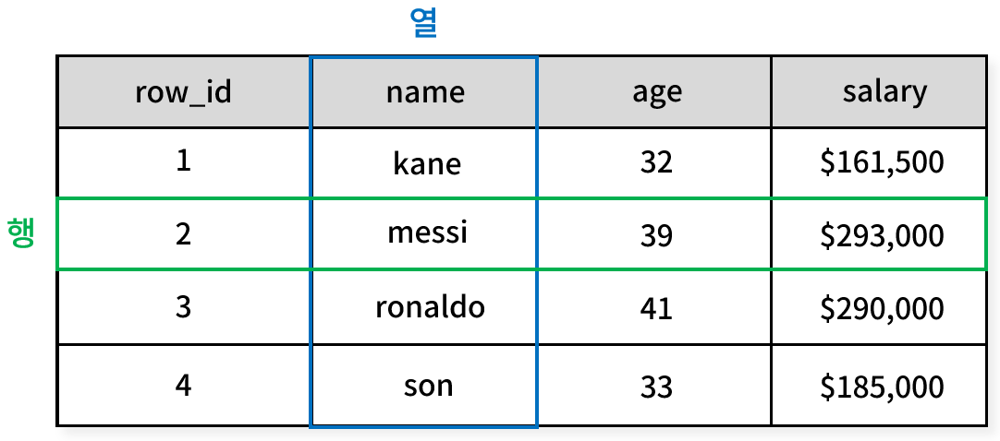
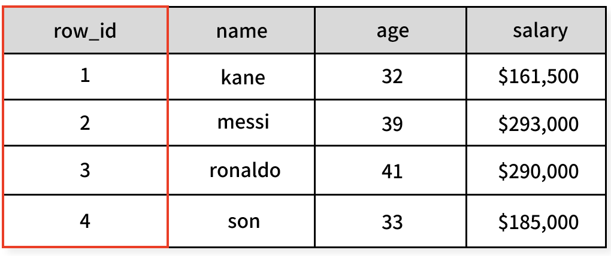
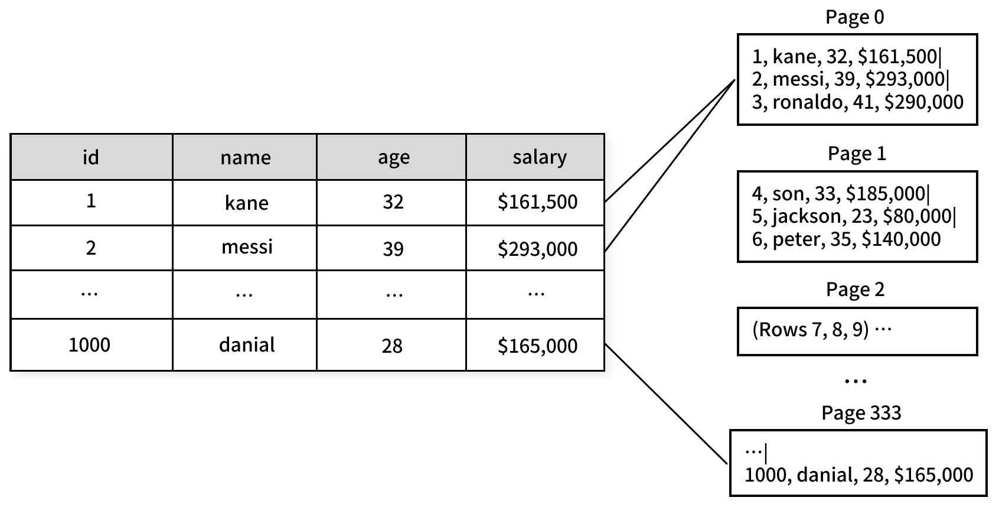
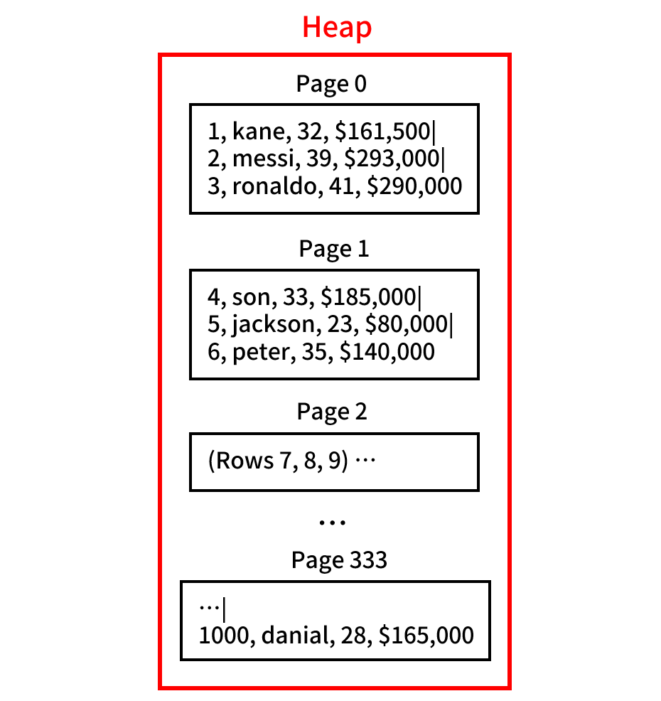
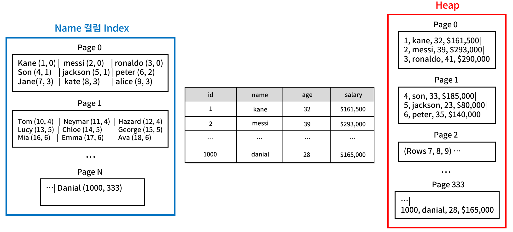
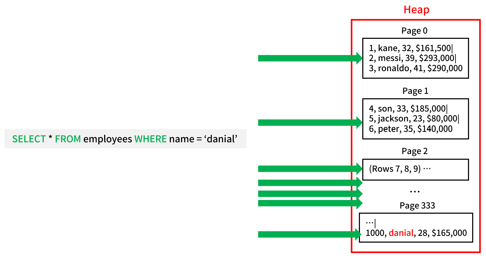
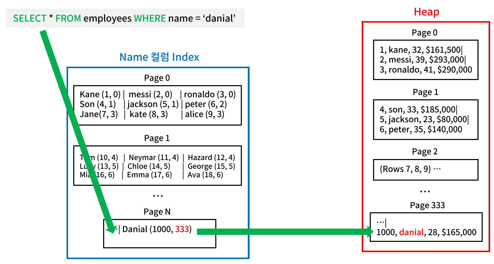

관계형 데이터베이스는 테이블과 인덱스를 디스크에 어떻게 저장할까?

## 테이블과 RowID


**테이블**은 데이터베이스의 기본 데이터 저장 단위로 **행(Row)** 과 **열(Column)** 로 구성된다. 각각의 행은 데이터의 단일 레코드를 나타내며, 열은 레코드의 **속성(Attribute)** 를 정의한다.

테이블의 물리적 저장 방식은 데이터베이스 시스템에 따라 다를 수 있다. 일반적으로 테이블은 디스크에 저장되는 논리적 **페이지** 들로 관리된다.




Row ID는 데이터베이스 시스템이 각 행을 고유하게 식별하기 위해 사용하는 속성이다.

InnoDB 엔진을 사용하는 MySQL의 경우 Row ID는 기본 키(Primary Key)와 동일한 역할을 하며 별도의 Row ID를 생성하지 않는다.

postgreSQL의 경우 `ctid`라 불리는 시스템 컬럼을 사용한다. 테이블을 생성하고 데이터를 삽입하면 새로운 Row ID(`ctid`)가 생성된다. CTID는 페이지 번호와 행 번호로 구성되며 데이터의 물리적 위치를 나타낸다.

오라클 DB에선 `ROWID` 라고 불린다. 이 값은 `PSEUDOCOLUMN`으로 사용자가 임의로 변경하거나 삭제할 수 없다.

## 페이지


**페이지**는 데이터가 저장되는 기본적인 물리적 단위다. 데이터베이스는 **단일 행이 아닌 페이지 단위로 데이터를 읽는다**.

스토리지 모델에 따라 행 단위로 데이터를 저장할 수도 있고, 열 단위로 데이터를 저장할 수도 있다. 각 페이지는 DBMS마다 다른 크기를 가진다. 각 행의 크기와 페이지에 용량에 따라 한 페이지에 저장될 수 있는 행의 크기가 달라진다.

데이터베이스는 단일 IO로 하나 이상의 페이지를 읽는다.

```sql
SELECT * FROM employees WHERE id=2;
```

쿼리를 처리할 때 id가 2인 행 하나만 가져오는 것이 아니라, 페이지 단위로 저장되어 있는 전체 영역을 스캔하여 id가 2인 행이 포함된 페이지를 찾아 가져온다. 

디스크 파티션 상태에 따라 다르지만 단일 쿼리로 한 개 이상의 페이지를 가져오는 것이다. 

쿼리의 성능에 대해 이야기하기 위해선 내가 짠 쿼리가 **얼마나 많은 페이지를 가지고 오는지, 얼마나 많은 IO를 실행해야 하는지**에 대한 이해가 필요하다.

## IO
IO는 디스크에서 데이터를 읽고 쓰는 작업을 의미한다. IO는 데이터베이스의 성능에 중요한 영향을 미친다. IO 요청을 줄일수록 쿼리가 더 빨라진다. 이를 최소화 하는 것이 데이터베이스 성능 최적화의 핵심 목표중 하나다.

앞선 예시에서 봤듯 데이터베이스는 데이터를 페이지 단위로 읽고 쓴다. **개별 레코드만을 읽는 것이 아니라 해당 레코드가 포함된 전체 페이지를 메모리로 로드한다.**

```sql
SELECT * FROM employees WHERE id=2;
SELECT name, age FROM employees WHERE id=2;
```

위 쿼리의 경우 모두 동일한 페이지를 읽어야 하므로 **IO 측면에선** 동일한 비용이 발생한다.

데이터베이스의 IO가 항상 디스크를 향하는 것은 아니다. 성능 개선을 위해 여러 계층의 캐시를 활용한다.

1. 데이터베이스의 자체 버퍼 풀/캐시를 확인
2. 데이터베이스 캐시에 없다면 운영체제의 페이지 캐시 확인 
3. 운영체제 캐시에도 없는 경우에만 실제 디스크 IO가 발생

PostgreSQL은 운영체제의 페이지 캐시를 적극적으로 활용하는 구조다. 반면 MySQL(InnoDB)는 자체 버퍼 풀에 더 의존하는 설계를 가지고 있다. 어느 쪽이든 디스크 IO를 최소화하기 위해 다중 계층의 캐시 전략을 사용한다.

## 힙(Heap)


힘은 테이블 데이터를 저장하기 위한 기본 구조로, **모든 페이지가 순차적으로 저장된다.**

힙에서 데이터를 찾으려면 많은 양의 데이터를 읽어야 한다. 이런 용을 줄이기 위해 **인덱스**를 사용한다.

인덱스를 사용하면 특정 데이터가 저장된 힙의 페이지를 빠르게 식별하여 필요한 데이터가 포함된 페이지만 읽을 수 있다.

## 인덱스(Index)


인덱스는 힙과는 별도로 존재하는 데이터 구조다. 힙에 대한 **포인터** 를 포함하여 데이터를 빠르게 검색할 수 있도록 돕는다.

실제와는 조금 다르지만 위 예시처럼 인덱스는 필요한 데이터의 일부를 포함하고 있다. `kane (1, 0)` 에서 kane은 인덱스로 지정한 컬럼 데이터를 의미하고, 괄호 속 첫번째 값은 ROWID, 두번째 값은 페이지 위치를 나타낸다.

인덱스는 하나의 열 뿐만 아니라 여러 열을 기준으로 생성할 수 있다.



인덱스가 없는 경우 힙의 모든 페이지를 순차적으로 읽어야 한다.



인덱스는 힙의 모든 페이지를 탐색하는 대신, 힙의 어떤 정확히 어떤 페이지를 확인해야 하는지 알려준다.

인덱스 역시 페이지 구조로 저장되어 있으며 이를 읽는 데 IO 비용이 발생한다. 인덱스 크기가 작을수록 더 많은 부분이 메모리에 적재될 수 있으므로 검색 속도가 빨라진다.

가장 일반적으로 사용되는 인덱스 구조는 B-Tree로, 정렬된 데이터 저장 및 검색에 효과적이다.

### 클러스터 인덱스(Clustered Index)
힙 테이블이 단일 인덱스를 중심으로 구성된 경우 이를 클러스터형 인덱스 또는 Index-Organized Table(오라클 DB)라 한다.


별도 지정이 없는 한 기본 키(Primary Key)가 클러스터 인덱스가 된다. 위 예시는 name 속성을 인덱스로 지정한 경우다. 이와 같이 다른 인덱스는 기본키 값을 참조한다.

MySQL(InnoDB)는 항상 기본 키를 클러스터 인덱스로 사용하며 PostgreSQL은 클러스터 인덱스 대신 보조 인덱스(Secondary Index)만 지원한다. PostgreSQL에서 모든 인덱스는 힙에 저장된 Row ID를 직접 참조한다.

클러스터 인덱스를 사용하는 경우 힙 테이블이 해당 클러스터 인덱스를 기준으로 물리적으로 정렬되어 구성된다. 만약 클러스터 인덱스가 UUID와 같은 랜덤한 값을 가지는 속성이라면 힙 테이블은 이 랜덤한 값을 기준으로 정렬되어야 한다. 이는 다음과 같은 문제를 야기한다.

1. 데이터 삽입 시 랜덤한 위치에 레코드를 저장해야 하므로 페이지 분할이 자주 발생한다.
2. 연속된 데이터를 읽을 때 성능이 저하된다.
3. 페이지 분할로 인한 단편화가 심해질 수 있다.

따라서 클러스터 인덱스는 단조 증가하는 정수나 타임스탬프처럼 순차적인 값을 사용하는 것이 바람직하다.