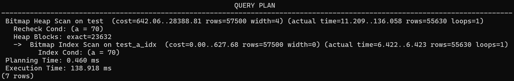
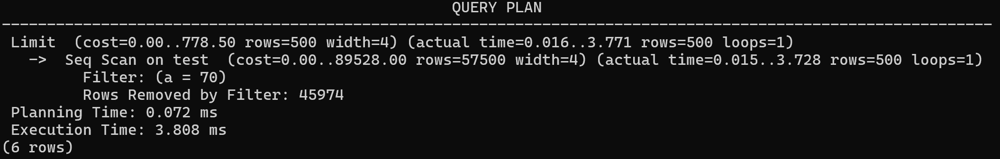
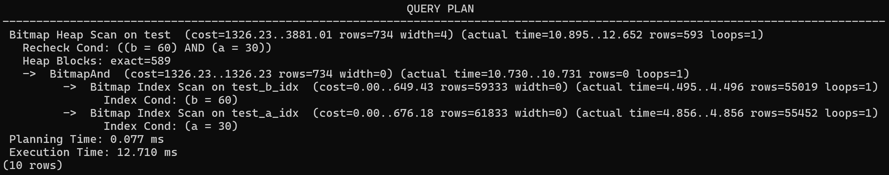
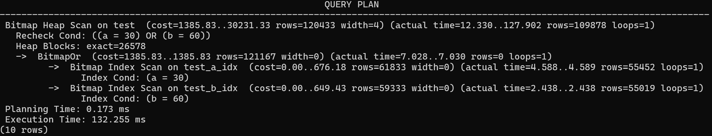
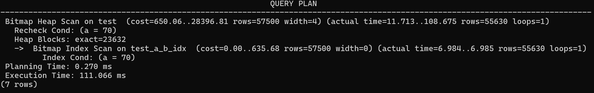
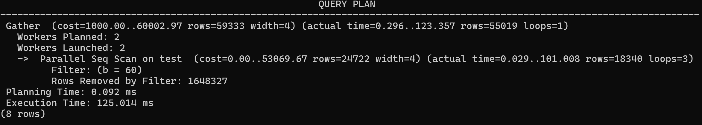
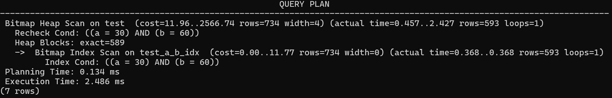
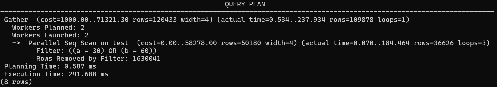
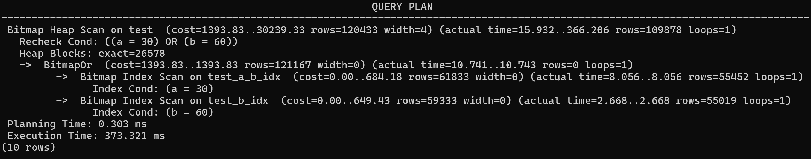

먼저 테스트에 사용할 데이터베이스 테이블을 생성한다. DBMS는 postgres를 사용했다.

```sql
create table test(a int, b int, c int);
```

테이블에 500만개의 더미 데이터를 삽입한다. 트랜잭션을 이용해서 대량의 데이터를 효과적으로 삽입할 수 있다.

```sql
BEGIN;

INSERT INTO test (a, b, c)
SELECT
    (floor(random() * 90) + 10)::int AS a,
    (floor(random() * 90) + 10)::int AS b,
    (floor(random() * 90) + 10)::int AS c
FROM generate_series(1, 5000000);

COMMIT;
```

```sql
select count(*) from test;

  count
---------
 5000000
(1 row)
```

데이터가 잘 삽입되었다. 먼저 a열과 b열에 인덱스를 생성해보자.

```sql
create index on test(a);
create index on test(b);
```

```sql
postgres=# \d test;
                Table "public.test"
 Column |  Type   | Collation | Nullable | Default
--------+---------+-----------+----------+---------
 a      | integer |           |          |
 b      | integer |           |          |
 c      | integer |           |          |
Indexes:
    "test_a_idx" btree (a)
    "test_b_idx" btree (b)
```
두 열에 대한 B-Tree 인덱스가 생성되었다.

이제 where 절로 a 열에 대한 제한 조건을 준 쿼리의 실행 계획을 분석해보자.

```sql
explain analyze select c from where a = 70;
```



- **Bitmap Index Scan on test_a_idx** : a열에 대한 조건을 검사하기 위해 인덱스 스캔을 진행했다. 조회 대상이 많기 때문에 비트맵 인덱스 스캔을 사용한 것으로 보인다.


- **Bitmap Heap Scan on test** : 테이블에 대한 스캔이 진행되었다. c열 데이터는 인덱스에 포함되어 있지 않기 때문에 인덱스를 통해 추려낸 데이터를 가지고 힙 테이블에서 c 값을 가져와야 한다.

Bitmap Index Scan은 중간 크기의 결과 집합을 처리할 때 효율적이다. 일반 인덱스 스캔과 순차 스캔의 중간 형태로 먼저 인덱스에서 조건을 만족하는 레코드들의 위치를 비트맵으로 생성한 후, 이를 사용해 실제 테이블 접근을 최적화한다.

조회 결과를 제한하면 어떻게 될까?

```sql
explain analyze select c from where a = 70 limit 500;
```



- **Seq Scan on test** : postgres는 인덱스를 사용하지 않고 테이블에 대한 순차 스캔을 진행한다. 데이터베이스 옵티마이저가 순차 스캔의 성능이 더 좋다고 판단한 것이다.

LIMIT 절이 있는 경우 순차 스캔은 필요한 수의 레코드를 찾는 즉시 스캔을 중단할 수 있다. 반면 인덱스 스캔은 인덱스 -> 테이블 순으로 랜덤 I/O가 발생하므로 적은 수의 레코드만 필요할 때는 순차 스캔이 더 효율적일 수 있는 것이다.

이번엔 a와 b열을 대상으로 쿼리해보자.

```sql
explain analyze select c from test where a = 30 and b = 60;
```



- **BitmapAnd** : 인덱스가 존재하는 두 열을 대상으로 병렬 Bitmap Index Scan 연산이 수행된다.
- 0.012초가 소요된다.

```sql
explain analyze select c from test where a = 30 or b = 60;
```



- **BitmapOr** : 병렬 OR 연산이 수행된다.


- 0.123초가 소요되었는데 결과로 가져오는 데이터가 AND 연산보다 많기 때문에 힙테이블에 더 많은 I/O 작업이 수행되기 때문이다.

두 연산 모두 각 인덱스에 대한 인덱스 스캔을 진행한 뒤 논리연산을 진행하고, 테이블에 I/O 작업을 수행하여 결과를 반환한다.

이번엔 단일 인덱스들을 삭제하고 **복합 인덱스**를 생성해보자.

```sql
drop index test_a_idx, test_b_idx;
create index on test (a, b);
```

단일 인덱스를 생성할 때 보다 더 많은 시간이 소요된다.

**복합 인덱스**는 포함된 모든 컬럼을 사용하는 쿼리에서 가장 효율적이다.

```sql
expalin analyze select c from where a = 70;
```


- **Bitmap Index Scan on test_a_b_idx** : a열 만을 사용하는 쿼리임에도 복합 인덱스를 사용한 인덱스 스캔이 수행되었다.


- 복합 인덱스는 인덱스 생성 시의 컬럼의 순서가 중요하다. 인덱스를 생성했을 때 왼쪽에 위치하는 것이 a열 이므로 이를 사용할 수 있는 것이다.

그럼 오른쪽에 위치한 b열을 조건으로 사용한 쿼리는 인덱스 스캔이 수행되지 않을까?

```sql
expalin analyze select c from where b = 30;
```


- **Parallel Seq Scan on test** : 전체 테이블을 대상으로 한 병렬 테이블 스캔이 수행되었다.

복합 인덱스엔 분명 b열이 들어가 있지만 leading(leftmost) columns가 아니기 때문에 이를 사용할 수 없다.
필터를 사용할 때 복합 인덱스를 사용할 수 없으므로 테이블 스캔이 수행된다.

```sql
explain analyze select c from test where a = 30 and b = 60;
```


-  **Bitmap Index Scan on test_a_b_idx** : 복합 인덱스를 사용한 비트맵 인덱스 스캔이 수행되었다.
- 단일 인덱스 2개를 사용할 때 보다 쿼리 수행 시간이 6배 정도 단축되었다. 수행 시간은 시스템에 따라 유동적이지만, 테이블 스캔의 양 또한 유의미하게 감소하였다. 테이블 IO가 줄어든 것이다.

```sql
explain analyze select c from test where a = 30 or b = 60;
```

- **Parallel Seq Scan on test** : 전체 테이블 스캔이 수행된다. OR 연산을 수행할 때에는 복합 인덱스를 사용하지 않는다.

OR 쿼리를 수행할 때 복합인덱스 하나만 존재할 경우, 단일 인덱스 2개를 사용할 때보다 더 많은 시간이 소요된다. 이 문제는 간단하게 B열에 대한 단일 인덱스를 생성해서 해결할 수 있다.

```sql
create index on test(b);
explain analyze select c from test where a = 30 or b = 60;
```


- **BitmapOr** : a열은 복합 인덱스를 사용하고 b열은 b열에 대한 단일 인덱스를 사용하여 병렬 인덱스 스캔을 수행한다.


- 위 결과보다 수행시간이 더 늘어났다. PostgreSQL은 자주 사용되는 인덱스와 데이터를 shared_buffers와 운영체제의 페이지 캐시에 저장한다. 새로 생성된 인덱스는 아직 캐시되지 않은 상태이므로 첫 실행에서는 디스크 I/O가 발생하여 실행 시간이 더 길어질 수 있다. 이후 동일 쿼리를 실행하면 캐시된 데이터를 사용하므로 성능이 향상된다. 

쿼리를 수행할 때 가장 효율적인 방법으로 수행할 수 있는 방법을 찾아주는 역할은 데이터베이스 옵티마이저가 담당한다. 때문에 개발자가 어떤 스캔 방식을 사용할 지 결정할 필요는 없지만, 각 테이블과 비즈니스 로직에 맞는 적합한 인덱스를 설계하고 어떤 결과가 나올 것인지 예측하는 능력을 가져야 할 것이다.   