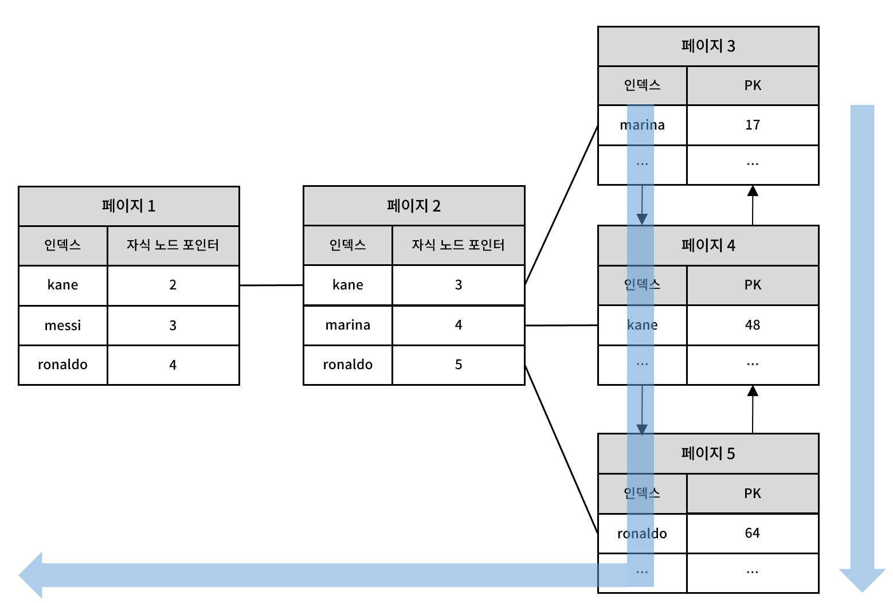

## 인덱스의 역할
데이터베이스 테이블에서 특정 데이터를 찾을 때 인덱스가 없다면 테이블의 모든 데이터를 처음부터 끝까지 스캔하는 풀 데이터 스캔을 수행해야 한다.
실행하는 쿼리가 어떤식으로 동작하는지 알아보기 위해선 실행계획을 출력하는 explain 명령어를 사용할 수 있다.

```sql
create table test(
    id int(11) not null AUTO_INCREMENT, 
    name VARCHAR(100) not null, 
    age smallint null, 
    constraint test_pk PRIMARY KEY(id)
);

insert into test(name, age) values("홍길동", 11);
insert into test(name, age) values("제임즈", 30);
insert into test(name, age) values("히히힣", 12);
insert into test(name, age) values("김민수", 20);

explain select * from test where name = "히히힣";
```

```sql
+----+-------------+-------+------------+------+---------------+------+---------+------+------+----------+-------------+
| id | select_type | table | partitions | type | possible_keys | key  | key_len | ref  | rows | filtered | Extra       |
+----+-------------+-------+------------+------+---------------+------+---------+------+------+----------+-------------+
|  1 | SIMPLE      | test  | NULL       | ALL  | NULL          | NULL | NULL    | NULL |    4 |    25.00 | Using where |
+----+-------------+-------+------------+------+---------------+------+---------+------+------+----------+-------------+
```


type 부분을 보면 된다. ALL은 테이블 전체를 스캔했다는 것을 의미한다.

**type의 종류**
- system: 테이블에 단 하나의 행만 존재하는 경우로, const의 특별한 형태. 가장 빠른 형태이며 드물게 사용됨.

- const: 하나의 행만 매치되는 경우로, 상수처럼 간주되어 한 번만 읽어 매우 빠름.

- eq_ref: 조인에서 각 테이블에서 하나의 행만 읽혀지는 경우로, PRIMARY KEY 또는 UNIQUE KEY 기반의 가장 효율적인 조인 타입.

- ref: 동등 비교로 여러 행이 일치하는 경우로, 유니크 컬럼이 아닌 인덱스나 왼쪽 접두사 사용 시 나타남.

- range: 인덱스를 사용해 범위 조건(BETWEEN, <, > 등)에 맞는 행을 검색하며 효율적임.

- index: 인덱스 전체를 스캔하는 경우로, 데이터 파일 대신 인덱스 파일을 읽어 ALL보다 빠름.

- ALL: 테이블의 모든 행을 풀 스캔하는 경우로, 가장 비효율적인 타입.

이제 name 컬럼에 인덱스를 추가해보자.

```sql
CREATE INDEX index_name ON test(name);
explain select * from test where name = "히히힣";
```
```sql
+----+-------------+-------+------------+------+---------------+------------+---------+-------+------+----------+-------+
| id | select_type | table | partitions | type | possible_keys | key        | key_len | ref   | rows | filtered | Extra |
+----+-------------+-------+------------+------+---------------+------------+---------+-------+------+----------+-------+
|  1 | SIMPLE      | test  | NULL       | ref  | index_name    | index_name | 302     | const |    1 |   100.00 | NULL  |
+----+-------------+-------+------------+------+---------------+------------+---------+-------+------+----------+-------+
```

type이 ref로 바뀌었다. 쿼리를 수행할 때 전체 테이블을 스캔한 것이 아니라 인덱스를 사용했다는 사실을 알 수 있다. ref는 인덱스를 사용한 동등(=) 조건 검색을 의미하며, 하나의 인덱스에서 여러 개의 레코드가 일치할 수 있는 경우를 나타낸다.

인덱스가 존재한다고 해서 무조건 인덱스를 사용하는 건 아니다. 인덱스를 통해 테이블의 레코드를 읽는 것은 인덱스를 커치지 않고 바로 테이블의 레코드를 읽는 것보다 높은 비용이 드는 작업이다. 인덱스를 이용한 읽기의 손익 분기점이 얼마인지 판단할 필요가 있다.

일반적인 DBMS의 옵티마이저에선 인덱스를 통해 레코드 1건을 읽는 것이 테이블에서 직접 레코드 1건을 읽는 것보다 4-5배 더 많은 비용이 드는 작업인 것으로 예측한다. 인덱스를 통해 읽어야 할 레코드의 건수가 전체 테이블 레코드의 20-25%를 넘어서면 인덱스를 이용하지 않고 테이블을 모두 직접 읽어서 필요한 레코드만 가려내는 방식으로 처리한다.

인덱스로 적합한 컬럼은 무엇일까? 인덱스의 카디널리티(기수성)은 인덱스가 가지는 중복되지 않은 값의 수를 뜻한다. 만약 어떤 컬럼이 저장하는 데이터의 종류가 3가지라면, 이 컬럼을 인덱스를 생성한 경우 카디널리티는 3이 된다. 컬럼의 카디널리티가 높을수록(중복도가 낮을수록) 인덱스의 효율이 높아진다. 성별과 같이 카디널리티가 낮은 컬럼은 인덱스로 적합하지 않다.


## 인덱스와 B-Tree


B-Tree는 데이터베이스 시스템에서 인덱싱 기능을 구현하기 위해 가장 일반적으로 사용되는 알고리즘이다. B(balanced)-Tree는 트리 구조의 최상위 노드에 하나의 루트 노드가 존재하며 그 하위에 여러개의 자식 노드가 붙어 있는 형태다.

MySQL의 InnoDB 스토리지 엔진은 B+Tree 구조를 사용한다. B+Tree는 B-Tree의 변형으로, 모든 데이터를 리프 노드에만 저장하고 브랜치 노드에는 키만 저장하는 구조다.

## 인덱스 레인지 스캔


인덱스 레인지 스캔은 검색해야 할 인덱스의 범위가 결정됐을 때 사용하는 방식이다. 루트 노드에서부터 비교를 시작해 브랜치 노드를 거치고 최종적으로 리프 노드까지 찾아 들어가야만 비로소 필요한 레코드의 시작 지점을 알 수 있다. 이처럼 차례대로 읽는 것을 스캔이라고 표현 한다.

스캔하다가 리프 노드의 끝까지 읽으면 리프 노드 간의 링크를 이용해 다음 리프 노드를 찾아서 다시 스캔한다. 최종적으로 스캔을 멈춰야 할 위치에 다다르면 지금까지 읽은 레코드를 사용자에게 반환하고 쿼리를 끝낸다.

인덱스의 리프 노드에서 검색 조건에 일치하는 건들에 대해 데이터 파일에서 레코드를 읽어오는 과정이 필요하다. 이 때 리프 노드에 저장된 레코드의 주소(PK)로 데이터 파일의 레코드를 읽어오는데, 이 과정에서 레코드 한 건 한 건 단위로 랜덤 I/O가 일어난다. 때문에 인덱스를 통해 레코드를 읽는 작업은 비용이 많이 드는 작업으로 분류된다.

**인덱스를 통해 읽어야 할 데이터 레코드가 약 30%(MySQL8.0 기준)를 넘으면 인덱스를 통한 읽기보다 테이블의 데이터를 읽는 것이 더 효율적인 방법이다**. 구체적인 수치는 테이블의 크기, 시스템 설정, 하드웨어 성능 등 여러 요소에 따라 달라질수 있다고 한다.
```sql
mysql> explain select * from test where name in ("홍길동", "제임즈", "히히힣");

+----+-------------+-------+------------+-------+---------------+------------+---------+------+------+----------+-----------------------+
| id | select_type | table | partitions | type  | possible_keys | key        | key_len | ref  | rows | filtered | Extra                 |
+----+-------------+-------+------------+-------+---------------+------------+---------+------+------+----------+-----------------------+
|  1 | SIMPLE      | test  | NULL       | range | index_name    | index_name | 302     | NULL |    4 |   100.00 | Using index condition |
+----+-------------+-------+------------+-------+---------------+------------+---------+------+------+----------+-----------------------+
```

**인덱스 레인지 스캔 과정**
1. 인덱스에서 조건을 만족하는 값이 저장된 위치를 찾는다. 이 과정을 인덱스 탐색이라고 한다.
2. 1번에서 탐색된 위치부터 필요한 만큼 인덱스를 차례로 쭉 읽는다. 이 과정을 인덱스 스캔이라고 한다.
3. 2번에서 읽어 들인 인덱스 키와 레코드 주소를 이용해 레코드가 저장된 페이지를 가져오고, 최종 레코드를 읽어온다.

## 인덱스 풀 스캔


인덱스를 사용하지만 인덱스 레인지 스캔과는 달리 인덱스의 처음부터 끝까지를 모두 읽는 방식을 인덱스 풀 스캔이라고 한다. 

쿼리의 조건절로 사용된 컬럼이 인덱스의 첫 번째 컬럼이 아닌 경우 인덱스 풀 스캔 방식이 사용된다. 예를 들어 인덱스는 (A, B, C) 컬럼의 순서로 만들어져 있지만 쿼리의 조건절은 B나 C 컬럼으로 검색하는 경우다.

## 커버링 인덱스 스캔(Index Only Scan)
Index Only Scan은 테이블 데이터를 전혀 읽지 않고 인덱스만으로 쿼리 처리가 가능한 경우 수행된다. 쿼리를 충족시키는데 필요한 모든 데이터를 갖고 있는 인덱스를 **커버링 인덱스**라고 한다.

``` 
mysql> explain select name from test where name = "홍길동";
+----+-------------+-------+------------+------+---------------+------------+---------+-------+------+----------+-------------+
| id | select_type | table | partitions | type | possible_keys | key        | key_len | ref   | rows | filtered | Extra       |
+----+-------------+-------+------------+------+---------------+------------+---------+-------+------+----------+-------------+
|  1 | SIMPLE      | test  | NULL       | ref  | index_name    | index_name | 302     | const |    1 |   100.00 | Using index |
+----+-------------+-------+------------+------+---------------+------------+---------+-------+------+----------+-------------+

결과 >
type: ref
key: index_name
Extra: Using index
```
name 컬럼을 기준으로 생성된 인덱스는 name 값을 가져오기 위해 힙테이블에 IO를 진행 할 필요가 없다. 테이블 접근 없이 인덱스의 데이터만으로 쿼리를 수행하는 것이다.

아래처럼 name 컬럼 말고 다른 컬럼을 가져와야 하는 경우 어떻게 될까?

```
mysql> explain select * from test where name = "홍길동";
+----+-------------+-------+------------+------+---------------+------------+---------+-------+------+----------+-------+
| id | select_type | table | partitions | type | possible_keys | key        | key_len | ref   | rows | filtered | Extra |
+----+-------------+-------+------------+------+---------------+------------+---------+-------+------+----------+-------+
|  1 | SIMPLE      | test  | NULL       | ref  | index_name    | index_name | 302     | const |    1 |   100.00 | NULL  |
+----+-------------+-------+------------+------+---------------+------------+---------+-------+------+----------+-------+

결과 >
type: ref
key: index_name
Extra: NULL
```
where 절의 조건이 index를 사용하였으며 Extra 가 null 이므로 일반적인 인덱스 스캔을 수행한다는 것을 알 수 있다.

## 인덱스 스킵 스캔
인덱스 스킵 스캔은 여러 칼럼으로 구성된 복합 인덱스(composite index)에서 일부 칼럼을 생략하고 검색하는 최적화 기법이다. 일반적인 인덱스 스캔이 인덱스의 첫 번째 칼럼을 기준으로 검색을 시작한다면 인덱스 스킵 스캔은 첫 번째 칼럼 값을 완전히 고려하지 않고 필요한 데이터만 효율적으로 조회한다.

MySQL 8.0부터 추가된 기능이며 사용하기 위해 optimizer_switch 시스템 변수에서 skip_scan 옵션이 true로 설정되어 있어야 한다.

(A, B, C) 순서로 정의된 복합 인덱스를 사용하여 다음과 같은 쿼리를 수행한다고 하자.

```sql
SELECT * FROM test WHERE B = 10 AND C = 20;
```

위 쿼리는 첫 번째 칼럼 A를 조건으로 사용하지 않으므로 일반적인 인덱스 레인지 스캔을 사용할 수 없다. 이때 인덱스 스킵 스캔이 활용된다.

**스킵 스캔 동작 원리**
1. 첫 번째 칼럼의 각 고유 값에 대해 별도로 스캔 수행을 수행한다. 위 예시의 경우 복합 인덱스의 첫 번째 칼럼 A 값이 무엇이든 나머지 칼럼 B, C 조건을 만족하는 데이터만을 검색한다.
2. 각 A 값에 대해 B = 10 AND C = 20 조건을 충족하는 레코드가 있는 경우 해당 레코드를 반환하고 다음 고유 A 값으로 넘어간다.
3. 필요한 레코드를 반환한다.

인덱스 스킵 스캔은 복합 인덱스를 유연하게 활용하여 검색 효율성을 높이는 데 유용한 방법이다.

참고 : 백은빈, 『Real MySQL 8.0』, 위키북스, 214-281