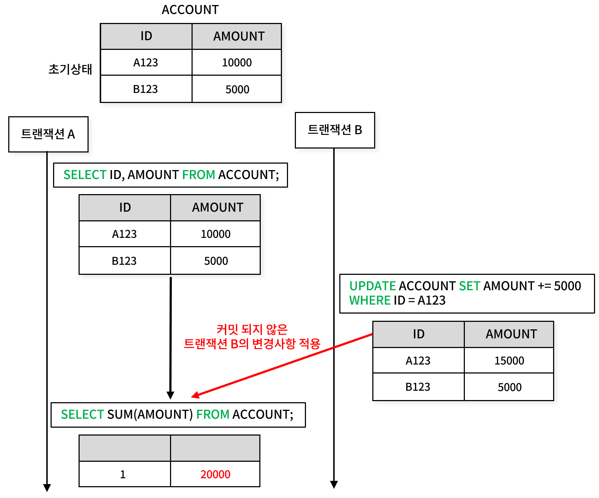
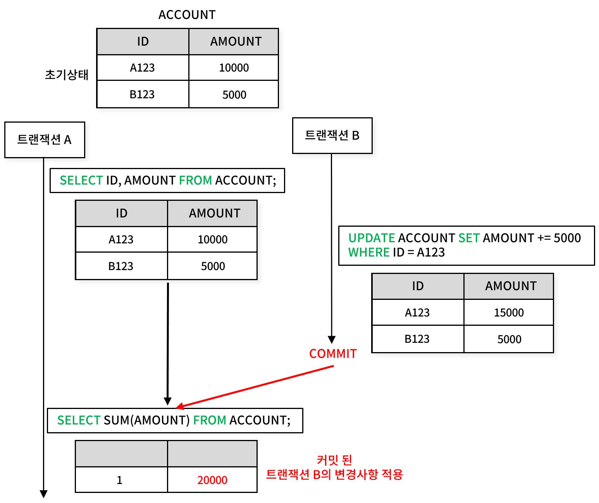
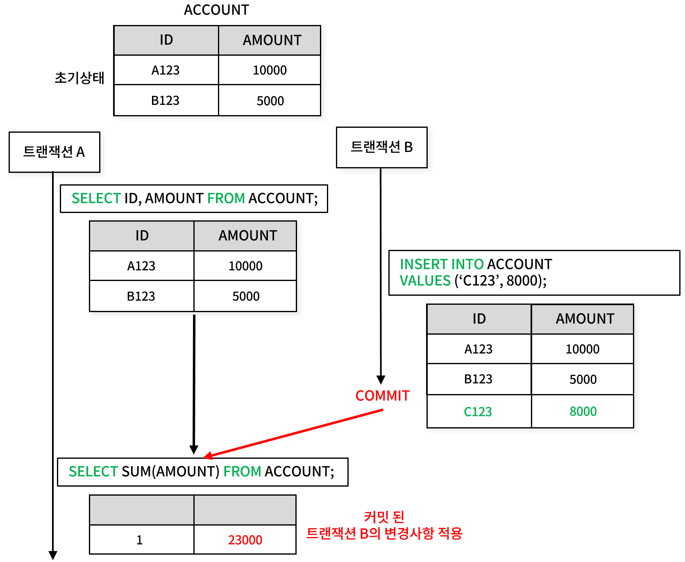
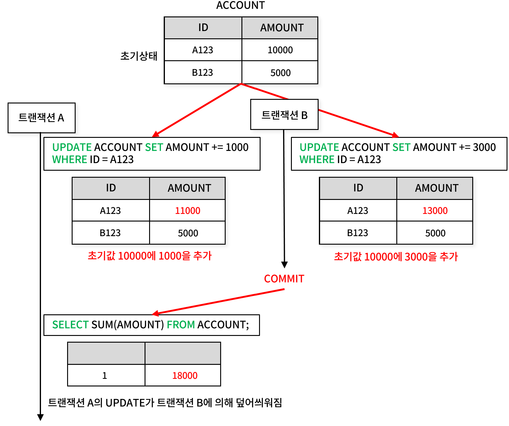

## ACID - 고립성(Isolation)
데이터베이스엔 수많은 연결이 존재하고 각 연결들은 수많은 트랜잭션을 발생시킨다. 여러 트랜잭션이 동시에 동일한 데이터를 사용하려고 할 때 동시성 문제가 발생할 수 있다.

현재 진행중인 내 트랜잭션이 진행중인 다른 트랜잭션에서 발생한 변경 사항을 볼 수 있을까? 이미 완료된 트랜잭션의 결과는 어떨까? 트랜잭션이 읽기 작업을 진행하는 동안 다른 트랜잭션이 변경을 커밋한 경우, 내 트랜잭션에서 변경이 반영되어야 할까?

## 읽기 현상(Read Phenomena, 동시성 문제)
**읽기 이상 현상** : 트랜잭션을 사용할 때 발생할 수 있는 이상 현상

### Dirty Reads
Dirty Reads 현상은 현재 실행중인 트랜잭션이 **아직 커밋되지 않은** 다른 트랜잭션의 변경사항을 읽어들이는 것을 말한다.

트랜잭션 A와 B는 병렬로 실행된다. 트랜잭션 A에서 SELECT 쿼리로 데이터를 읽어온다. 트랜잭션 B는 ACCOUNT 테이블의 값을 변경하는 UPDATE 쿼리를 수행한다.

트랜잭션 B의 UPDATE 쿼리 이후 커밋된 사항이 없었음에도 불구하고 트랜잭션 A의 두번째 쿼리(SUM)가 트랜잭션 B의 변경사항에 그대로 영향을 받는 모습이다.

트랜잭션 A의 두 쿼리만 보면 첫번째 SELECT 쿼리 결과와 두번째 SELECT 쿼리 결과가 일치하지 않는다. 만약 트랜잭션 B의 UPDATE 쿼리가 ROLLBACK 될 경우 Dirty Reads로 불러온 정보가 사라져 **일관성**과 **신뢰성**을 완전히 잃게 된다.

Dirty Reads는 트랜잭션을 사용하는 시스템에서 반드시 막아야 하는 현상이다.

### Non-repeatable read

Non-repeatable Read 현상은 한 트랜잭션 내에서 동일한 데이터를 두 번 읽을 때, 중간에 다른 트랜잭션이 해당 데이터를 수정 및 커밋함으로써 데이터가 달라지는 현상을 의미한다. 즉, 첫 번째 조회 시의 데이터와 두 번째 조회 시의 데이터가 일치하지 않는 경우를 말한다.

Dirty Reads 사례와의 차이점은 트랜잭션 B가 UPDATE 쿼리를 실행한 이후 이를 COMMIT 했다는 것이다. 트랜잭션 A의 두번째 쿼리(SUM)에 커밋된 값이 반영되고 이전에 읽었던 데이터와 일치하지 않는 데이터를 읽게 되어 데이터의 일관성이 깨지게 된다.

Dirty Reads 현상과는 달리 생각할 지점이 있어 보인다. Non-repeatable read는 무조건 막아야 할까?

데이터의 일관성을 보장하기 위해 막아야 하는 경우도 있지만 트랜잭션이 항상 처음과 동일한 값을 읽도록 보장해주는 건 **큰 비용**이 든다. 각 데이터베이스들은 테이블의 이전 상태를 저장하기 위해 UNDO 로그를 사용하거나(MySQL, SQLServer), MVCC를 통해 변경된 행에 대한 원본 데이터를 유지(Postgres)한다고 한다.

### Phantom read

Phantom Read 현상은 한 트랜잭션 내에서 동일한 조건으로 두 번 이상 쿼리를 실행했을 때, 중간에 다른 트랜잭션이 데이터를 삽입, 삭제, 수정하여 결과 집합의 "행 수"가 달라지는 현상을 의미한다.

Non-repeatable read와 유사한 사례처럼 보이지만 다르다. 트랜잭션 A의 첫번째 쿼리에 대상에 포함되어 있지 않았던 새로운 행('C123')이 두번째 쿼리의 결과에 포함되었다.

트랜잭션 A의 관점에서 결과 집합에 새로운 "행"이 나타나게 되어 데이터 일관성이 손상된 것이다.

- Non-repeatable Read: 같은 데이터를 두 번 읽을 때 데이터가 변경되었음을 확인하는 현상.
- Phantom Read: 동일한 쿼리를 두 번 실행했을 때, 결과 집합에 행의 추가/삭제로 인해 데이터의 개수가 달라지는 현상.

Phantom read 현상 역시 완벽히 방지하기 위해선 상당한 시스템 성능 저하를 감수해야 한다.

### Lost Updates

Lost Update 현상은 두 개 이상의 트랜잭션이 동일한 데이터를 갱신하려고 할 때, 하나의 트랜잭션에서 수행한 갱신이 다른 트랜잭션에 의해 덮어써져 최종적으로 갱신 내용이 손실되는 현상을 의미한다.

트랜잭션 A와 B가 동일한 행을 동시에 업데이트 한다. 이후 트랜잭션 B가 커밋된다.

이 과정에서 트랜잭션 A의 UPDATE가 트랜잭션 B에 의해 덮어써지게 된다. 트랜잭션 A의 관점에서 두번째 쿼리의 결과는 16000이 되어야 하지만 이 데이터가 사라져 버리게 된다.

Lost Update는 데이터 무결성과 비즈니스 로직의 신뢰성을 훼손할 가능성이 크기 때문에 Dirty Reads 현상처럼 반드시 방지해야 한다. 각 DBMS는 잠금을 이용해서 이 현상을 방지한다.

## 격리 수준
데이터베이스는 트랜잭션 간의 동시성을 처리하면서도 데이터 무결성을 유지하기 위해 격리 수준(Isolation Level)을 제공한다. 격리 수준은 위의 읽기 현상과 같은 동시성 문제를 완화하거나 방지해준다.

신뢰성과 일관성을 위해 무조건 높은 수준을 지정하면 좋겠지만 문제는 더 높은 격리수준일수록 **더 큰 시스템 성능 저하**를 감수해야 한다.
따라서 격리 수준은 성능과 일관성 사이 균형을 잘 저울질하여 선택해야 한다.

### Read uncommited
|격리수준| Dirty Reads | Lost updates | Non-repeatable reads | Phantom read |
|-|------------|--------------|----------------------|--------------|
|Read uncommited| 가능         | 가능           | 가능                   | 가능           |

Read Uncommitted는 가장 낮은 격리 수준으로 트랜잭션이 **다른 트랜잭션의 커밋되지 않은 변경사항**도 읽을 수 있도록 허용한다. Dirty Reads 현상이 발생하는 것이다.

격리 수준 중 성능이 가장 뛰어나지만 데이터의 무결성을 보장해주지 않는다. 일관성이 필요없는 시스템에 사용되는 것이 적합하다.

### Read commited
|격리수준| Dirty Reads | Lost updates | Non-repeatable reads | Phantom read |
|-|-------------|--------------|----------------------|--------------|
|Read commited| 불가능         | 가능           | 가능                   | 가능           |

Read Committed는 트랜잭션이 커밋된 데이터만 읽을 수 있도록 보장하는 격리 수준이다. Dirty Read는 방지되지만 다른 트랜잭션에서 커밋된 데이터는 읽을 수 있기 때문에 Non-repeatable Read와 Phantom Read 현상이 발생한다.

대부분의 데이터베이스에서 기본값으로 사용되는 격리수준이다.

### Repeatable Read
|격리수준| Dirty Reads | Lost updates | Non-repeatable reads | Phantom read |
|-|-------------|--------------|----------------------|--------------|
|Repeatable Read| 불가능         | 불가능          | 불가능                  | 가능           |

Repeatable Read는 한 트랜잭션 내에서 동일 데이터를 여러 번 읽을 때 항상 같은 값을 반환하도록 보장하는 격리 수준이다. Non-repeatable Read를 방지할 수 있지만 Phantom Read는 여전히 발생할 수 있다.

위에서 언급했듯 각 데이터베이스는 이를 구현하기 위해 Undo log나 변경된 행에 대한 원본 데이터를 유지한다.

### Snapshot
|격리수준| Dirty Reads | Lost updates | Non-repeatable reads | Phantom read |
|-|-------------|--------------|----------------------|--------------|
|Snapshot| 불가능         | 불가능          | 불가능                  | 불가능          |

Snapshot 격리수준은 postgreSQL에서 제공하는 격리방식으로 트랜잭션이 데이터 스냅샷을 사용하여 데이터를 읽는다.

트랜잭션이 시작될 그 당시의 데이터베이스의 버전을 가지고 와서 그 트랜잭션 동안 그 스냅샷을 활용하는 것이다. 때문에 다른 트랜잭션의 변경사항이 영향을 미치지 않는다.

### Serializable
|격리수준| Dirty Reads | Lost updates | Non-repeatable reads | Phantom read |
|-|-------------|--------------|----------------------|--------------|
|Serializable| 불가능         | 불가능          | 불가능                  | 불가능          |

Serializable은 가장 높은 격리 수준으로, 트랜잭션이 순차적으로 실행된 것처럼 보이도록 보장한다.

모든 동시성 문제를 해결할 수 있지만 사실상 트랜잭션들이 선형적으로 실행되기 때문에 성능이 떨어지고 잡금 경합이 발생할 수 있다. 시스템의 최우선 고려 요소가 데이터 일관성인 경우 사용할 수 있다.
