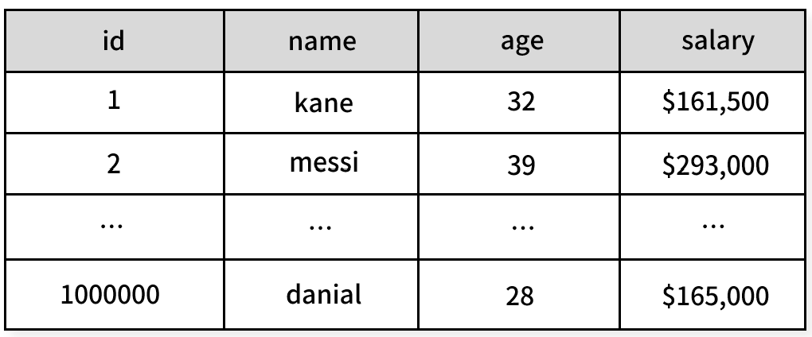
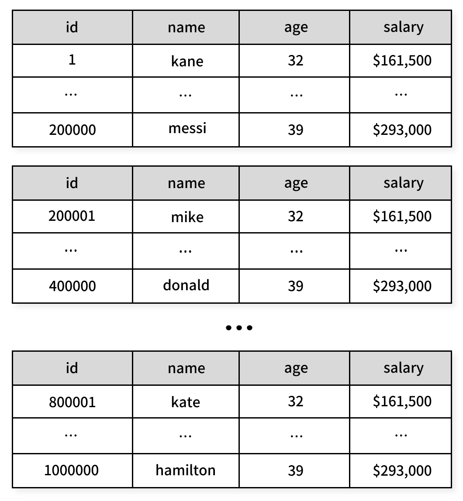

## 파티셔닝?


100만개의 행이 저장된 거대한 테이블이 있다. ID가 80000인 직원의 데이터를 불러오려고 한다.
```sql
SELECT name FROM employees_table WHERE ID = 800000;
```

인덱스가 존재한다면 인덱스 스캔을, 없다면 최악의 경우 ID 1번부터 80만번까지 순차 스캔을 진행할 것이다. 

어느 쪽이든 테이블에 많은 데이터가 포함될 수록 쿼리 성능은 떨어진다.

**데이터베이스 파티셔닝(Database Partitioning)** 은 거대한 테이블을 여러개의 테이블로 분할하고, 데이터베이스가 WHERE 절에 따라 어떤 테이블 또는 파티션에 접근할 지 결정하는 기술이다.



## 수직 파티셔닝과 수평 파티셔닝
수평 분할은 테이블을 행 단위로 분할하는 것이다. 수직 분할은 특정 열을 기준으로 테이블을 분리하는 방법이다. 자주 사용하지 않는 컬럼을 별도의 테이블로 분할하여 쿼리의 효율을 높일 수 있다.

## 파티셔닝 유형
### 범위 파티셔닝 (Range Partitioning)
특정 범위를 기준으로 데이터를 분할한다. 주로 날짜나 숫자 기반으로 분할할 때 사용한다. 예를 들어 주문 데이터를 월별로 파티셔닝하거나, 고객 ID를 1-1000, 1001-2000과 같이 범위로 나누어 분할할 수 있다.

### 리스트 파티셔닝 (List Partitioning)
특정 값을 기준으로 데이터를 분할한다. 예를 들어 지역별로 데이터를 분할하고 싶다면 서울/경기/인천은 partition_1에, 부산/울산/경남은 partition_2에 저장하는 식이다.

### 해시 파티셔닝 (Hash Partitioning)
해시 함수를 사용하여 데이터를 분산 저장한다. 파티션 키의 값을 해시 함수에 입력하여 나온 결과값을 기준으로 데이터를 분할한다. 이 방식은 데이터를 균등하게 분산시키는 데 효과적이다. 아파치 카산드라 등의 고성능 데이터베이스에서 적극적으로 사용한다.

### 복합 파티셔닝 (Composite Partitioning)
두 가지 이상의 파티셔닝 방식을 조합하여 사용한다. 예를 들어 범위 파티셔닝으로 연도별 분할을 한 후, 각 연도 내에서 다시 해시 파티셔닝을 적용하여 데이터를 더 세밀하게 분산시킬 수 있다.

## 파티셔닝과 샤딩의 차이점
앞서 수평 파티셔닝과 샤딩은 유사한 개념이지만 차이점들이 있다.

### 수평 파티셔닝
수평 파티셔닝은 하나의 데이터베이스 안에서 큰 테이블을 여러 개의 작은 테이블로 분할한다. 예를 들어 `orders` 테이블이 `orders_2023`, `orders_2024`와 같이 분할되는 것이다. 클라이언트는 이러한 분할을 인식할 필요가 없다. 데이터베이스 시스템이 알아서 적절한 테이블에 접근하여 데이터를 가져온다.

### 샤딩
반면 샤딩은 여러 데이터베이스 서버에 걸쳐 테이블을 분산시키는 것이다. 테이블의 구조는 동일하게 유지되지만, 데이터가 물리적으로 다른 서버에 저장된다. 예를 들어 같은 `orders` 테이블이 서버 A, 서버 B, 서버 C에 분산되어 있을 수 있다.

수평 파티셔닝은 동일한 데이터베이스 내에서 이루어지지만, 샤딩은 여러 데이터베이스 서버에 걸치는 개념이다. 샤딩의 경우 테이블의 이름과 구조가 모든 서버에서 동일하게 유지되지만 수평 파티셔님의 경우 테이블 이름이나 구조가 변경될 수 있다.

샤딩은 여러 서버를 관리해야 하므로 수평 파티셔닝보다 구현과 관리가 더 복잡하다. 그러나 서버를 추가하여 더 많은 데이터를 처리할 수 있으므로 수평 파티셔닝보다 확장성이 뛰어나다.

## 파티셔닝 장단점
### 장점

- **쿼리 성능 향상** : 단일 파티션에 접근할 때 쿼리 성능이 크게 향상된다. 전체 테이블을 순차적으로 스캔하는 대신 필요한 파티션만 검색하면 되기 때문이다. 2024년 입사자의 데이터만 필요하다면 전체 사원 테이블이 아닌 2024년 파티션만 검색하면 된다.


- **효율적인 대용량 데이터 적재** : 파티션 단위로 데이터를 적재할 수 있어 대용량 데이터 처리가 용이하다. 새로운 파티션을 생성하고 데이터를 한 번에 적재하는 것이 가능하다.


- **데이터 보관 최적화** : 오래된 데이터나 거의 접근하지 않는 데이터를 저렴한 스토리지로 이동시킬 수 있다. 더이상 사용하지 않는 오래된 데이터는 별도의 저장소로 이동시켜 비용을 절감할 수 있다.

### 단점

- **데이터 이동의 어려움** : 파티션 간 데이터 이동이 필요한 업데이트 작업은 성능이 느리거나 실패할 수 있고 비효율적이다.


- **비효율적인 쿼리 발생 가능** : 잘못 작성된 쿼리 때문에 모든 파티션을 검색할 경우 오히려 성능이 떨어진다. 파티션 키를 제대로 활용하지 않는 쿼리는 전체 테이블 스캔보다 더 나쁜 성능을 보일 수 있다.


- **스키마 변경의 어려움** : 파티션된 테이블의 스키마를 변경하는 경우 모든 파티션에 대해 동일한 변경을 적용해야 하기 때문에 까다롭다. 최신 데이터베이스 관리 시스템들은 이런 작업을 자동으로 처리해주는 기능을 제공한다.

