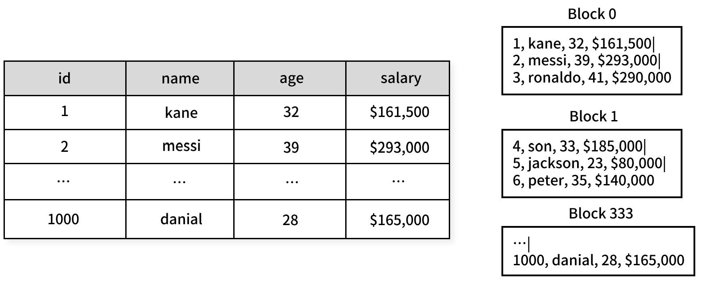

## 행 기반 데이터베이스


행 기반 데이터베이스에서 테이블은 데이터를 디스크에 행 단위로 저장한다. 관계형 데이터베이스에서 일반적으로 사용되는 mySQL, PostgresDB, ORACLE DB 등은 행 기반 데이터베이스에 해당한다.

행 기반 데이터베이스는 열 기반 데이터베이스에 비해 입출력 IO에 효과적이다. 다음 예시를 살펴보자.

```sql
SELECT * FROM employees WHERE id = 245;
```

인덱스가 없다고 가정하면, 행 기반 데이터베이스는 id가 240인 행을 찾기 위해 디스크에 접근하여 첫번째 블록부터 가져오기 시작할 것이다.

이 때 id가 245인 행 하나만 가져오는 것이 아니라 여러 행이 포함된 블록을 통째로 가져온다.


```sql
SELECT name, age FROM employees WHERE id = 245;
```
위와 같이 특정 컬럼만 쿼리한 경우에도 행 기반 데이터베이스는 컬럼만 가져오지 않는다. 디스크에서 블록에 포함된 모든 컬럼을 통째로 가져온다.

행 기반 데이터베이스는 집계 함수를 사용할 때 비효율적이다.

```sql
SELECT sum(salary) FROM employees;
```


위 쿼리의 경우 모든 블록을 대상으로 IO가 진행된다. 데이터베이스는 요청을 비동기적으로 보내며 여러 블록을 한번에 읽을 수 있지만, 디스크에 접근하는 것은 본질적으로 오버헤드를 유발한다.

## 열 기반 데이터베이스(컬럼 지향 데이터베이스)


열 기반 데이터베이스는 테이블의 데이터를 열 단위로 저장한다.

이 방식은 데이터를 조회하는 대부분의 상황에서 행 기반 데이터베이스보다 비효율적이다.

**조회 쿼리**
```sql
SELECT salary FROM employees WHERE name = 'Ronaldo'
```


```sql
SELECT * FROM employees WHERE name = 'Ronaldo'
```

또한 조회 결과로 모든 컬럼을 불러오는 경우 컬럼 단위로 저장된 모든 블록에 대한 IO가 필요하기 때문에 더 많은 자원이 소모된다.

**분석 쿼리**

```sql
SELECT sum(salary) FROM employees;
```


분석쿼리는 보통 많은 열 중 일부 열만 읽는다. 열 기반 스토리지는 필요한 열만 디스크에서 읽어오므로 행 기반에 비해 I/O 성능이 향상된다.

또한 같은 열에 있는 데이터는 데이터 유형이 동일한 경우가 많아 압축률이 높다. 이는 저장 공간을 절약하고 I/O 부담을 줄이는 데 도움이 된다.

**종류** : MariaDB ColumnStore, ClickHouse, ...

## 뭘 사용할까?

행 기반 데이터베이스는 읽기/쓰기가 빠르고 트랜잭션 처리(OLTP)에 유리하다. 또한 다중 컬럼 쿼리에 효과적이다.

열 기반 데이터베이스는 대규모 데이터 분석 쿼리에 효과적이다. 그러나 트랜잭션 처리가 어렵고 일반 조회 쿼리에 불리하다. 다중 컬럼 쿼리에도 취약하다.

대부분의 웹 비즈니스 환경에서 관계형 DB를 사용하는 경우 행 기반 데이터베이스를 사용하는 것이 적합하다. 

데이터베이스를 이용하여 실시간으로 대량의 데이터 분석 작업을 진행하는 경우 열 기반 데이터베이스나 데이터 웨어하우스 솔루션을 사용하는 것이 좋다.

