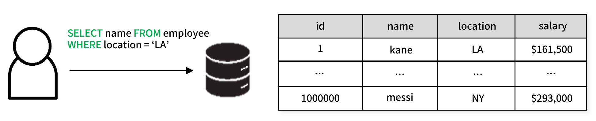
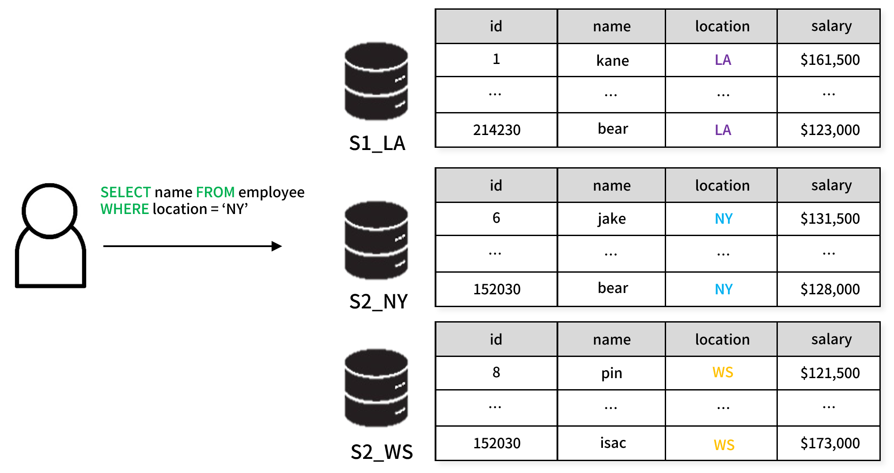
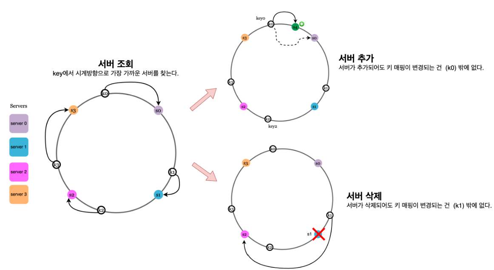
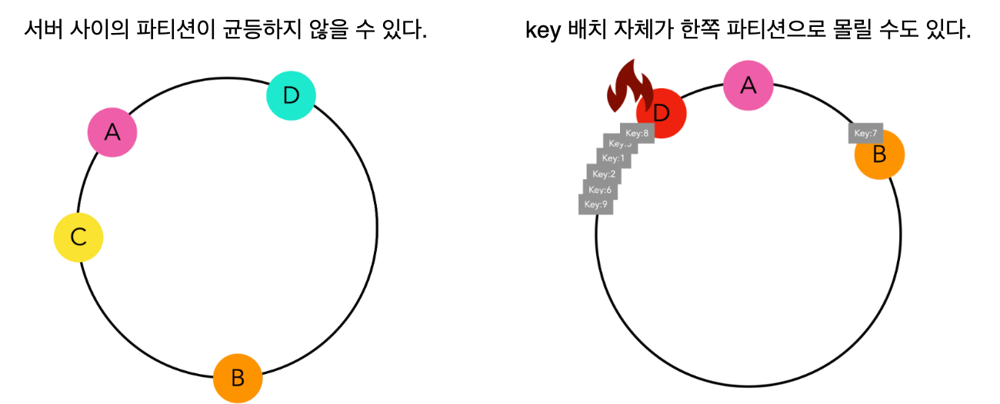

**데이터베이스 샤딩(Database Sharding)** 은 데이터를 여러 데이터베이스 인스터스에 분산하여 파티션으로 세분화하는 프로세스다. 시스템의 쿼리 속도를 높이고 확장성을 갖추기 위해서 사용된다.

## 해싱
샤딩을 구현할 때 가장 중요한 것은 데이터를 어떻게 분산시킬 것인가 하는 문제다. 

위의 예시의 경우 location 이라는 값을 기준으로 샤드를 나누는 형태지만 항상 이런 명확한 기준이 존재하는 것은 아니다. 데이터가 어떤 샤드에 저장되어야 하는지 결정하는 데이터가 어떤 샤드에 저장될지 결정하는 알고리즘이 필요하며, 해싱 기법이 주로 사용된다

샤딩 과정에서 해시 계산이 빈번하게 일어나기 때문에 해시 함수는 빠른 실행 속도를 보장해야 한다. 또한 데이터가 각 샤드에 고르게 분배되어야 하므로 해시값이 고르게 분포되도록 하는 해시 함수가 필요하다.

## 모듈로 기반 샤딩
해시값에 모듈로 연산을 적용하는 모듈로 기반 샤딩은 간단하게 다음과 같은 과정을 거친다.

1. 입력값으로 문자열 형태의 샤딩 키(특정 컬럼의 값)를 받는다.
2. 해시 함수를 사용해 이 키를 입력값을 고정 길이의 해시값으로 변환한다.
3. 해시값에 모듈로 연산(해시값 % 샤드 수)을 적용하여 해당 데이터가 저장될 샤드를 결정한다.
4. 슬롯과 샤드 간의 매핑 정보는 클라이언트 또는 중간 계층에서 관리된다.

이 방식은 샤드의 수가 변경될 경우 모든 데이터를 재분배해야 하므로 확장성이 낮다.

대부분의 데이터베이스들은 노드의 추가/삭제 시 재분배되는 데이터의 양을 줄이기 위해 일관된 해싱(Consistent Hashing)을 사용한다.

## 일관된 해싱
일관된 해싱은 다음 과정을 거친다.

1. 각 데이터베이스 노드는 해시 함수를 통해 링 모양의 해시 공간(0에서 2³²-1 범위) 내 특정 위치에 배치된다.
2. 데이터 역시 동일한 해시 함수로 해시값을 계산하여 해시 링에서 위치를 결정한다.
3. 데이터는 링을 시계 방향으로 탐색하여 만나는 가장 가까운 노드에 저장된다.

이 방식을 사용할 경우 노드의 추가/삭제 시 데이터의 이동을 최소화 시킬 수 있다.

### 가상 노드

일관된 해싱을 사용하더라도 데이터가 항상 균등하게 분포되는 것은 아니다. 각 노드들이 해시 링 위에 군집화되어 있거나 키의 배치가 균등하지 않을 수 있다.

데이터의 균등성을 더욱 더 보장하기 위해 가상 노드를 추가적으로 활용한다. 실제 노드 1개에 대응하는 여러개의 가상 노드를 만들어 해시 링에 배치한다. 이를 통해 키의 분포를 더 균들하게 만들 수 있다.

성능이 좋은 노드의 경우 더 많은 가상 노드를 가지게 하는 등의 성능 최적화 기법을 사용할 수 있다.

## 샤딩의 장단점
### 장점
**확장성**
- 데이터 확장: 데이터가 여러 서버에 분산되므로 단일 서버의 저장 용량 한계를 극복할 수 있다.
- 메모리 활용: 각 샤드는 자신의 데이터만 메모리에 올리므로 메모리 사용이 효율적이다.

**보안성** : 특정 사용자나 애플리케이션이 특정 샤드에만 접근하도록 제한할 수 있다. 이를 통해 데이터 접근을 더 세밀하게 제어할 수 있다.

**인덱스 최적화** : 각 샤드는 자신의 데이터에 대해서만 인덱스를 유지하므로 인덱스 크기가 작고 검색 성능이 향상된다.

### 단점

**복잡한 클라이언트 구현** : 클라이언트는 데이터가 어느 샤드에 있는지 알고 있어야 한다. 이는 애플리케이션 로직을 복잡하게 만든다.

**트랜잭션 처리의 어려움** : 여러 샤드에 걸친 트랜잭션 처리가 매우 복잡하며 각 노드간 롤백 처리도 까다롭다.

**스키마 변경의 어려움** : 모든 샤드의 스키마를 동시에 변경해야 하므로 스키마 변경 작업이 복잡하다.

**조인 연산의 제약** : 서로 다른 샤드에 있는 테이블 간의 조인이 어렵거나 불가능할 수 있다.

**쿼리 제약** : 샤드 키를 포함하지 않는 쿼리는 모든 샤드를 검색해야 할 수 있어 성능이 저하된다. 따라서 쿼리 작성 시 샤드 키를 반드시 고려해야 한다.

자료 출처 : https://jiwondev.tistory.com/299