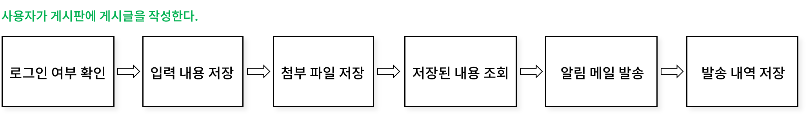
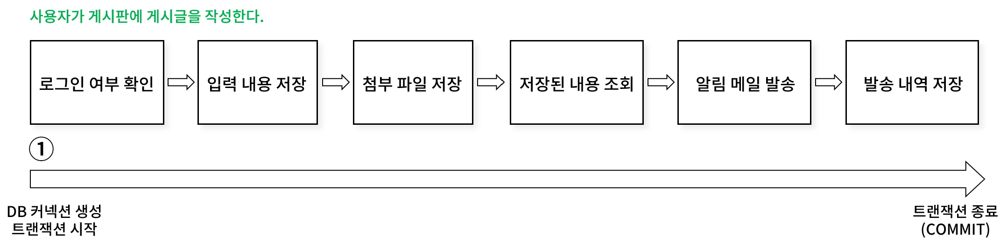
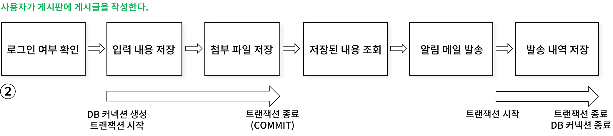

## 트랜잭션

**컴퓨터 과학에서의 트랜잭션** : 더이상 분할이 불가능한 업무처리의 단위

**데이터베이스 트랜잭션** : 하나의 작업 단위로 취급하는 SQL 쿼리들의 모음

데이터베이스 트랜잭션이란 데이터베이스에서 데이터의 일관성(Consistency)을 유지하면서 작업을 수행하기 위해 정의된 연산의 논리적 단위를 의미한다.

트랜잭션은 여러 작업 단위를 묶어 하나의 논리적 작업 단위로 간주하는데, DB에서의 작업 단위는 쿼리 하나로 볼 수 있으므로 쉽게 말해 여러개의 쿼리를 한 몸으로 간주하는 개념인 것이다.

## 트랜잭션 설계
다음과 같은 작업 단위가 있다고 가정해보자.



사용자가 게시글을 작성하면
1. 서버에서 사용자의 로그인 여부를 확인한다.
2. DBMS에 사용자의 입력 내용을 저장한다.
3. DBMS에 사용자의 첨부파일 정보를 저장한다.
4. 저장된 내용을 DBMS에서 조회한다.
5. 게시글 등록에 대한 알림 내용을 발송한다.
6. DBMS에 알림 발송 내역을 저장한다.

데이터베이스 트랜잭션은 이러한 일련의 작업을 하나의 단위로 처리할 수 있도록 해준다. 트랜잭션의 범위는 어떻게 지정해야 할까?



**첫번째 방법**은 위 일련의 작업 단위를 모두 하나의 트랜잭션으로 묶어서 처리하는 것이다. 작업 단위를 "사용자 게시글 저장" 이라고 보면 위 작업들은 모두 하나로 취급하여 묶을 수 있을 것이다.

그러나 위와 같은 방법은 여러가지 문제점을 야기한다.

### 트랜잭션이 필요한 작업인가?

- 실제로 DBMS에 데이터를 저장하는 작업은 2번부터 시작된다.

데이터베이스 커넥션은 개수가 제한적이라서 각 단위 프로그램이 트랜젝션을 소유하는 시간이 길어질수록 사용 가능한 커넥션의 개수는 줄어든다. 커넥션이 모두 소진되는 최악의 경우, 커넥션 획득을 위해 대기하는 시간이 발생할 수 있다. 때문에 **트랜잭션은 그것이 필요한 작업의 단위에서 시작해야 한다.**

### 트랜잭션 내부에 외부 통신이 포함되어 있는가?

- 트랜잭션 내부에 5번과 같은 외부 서버 통신 작업이 포함되어 있다.

트랜잭션이 실행하는 동안 외부 서버에 장애가 발생하면 어떻게 될까? DBMS에 잠금(Lock)이 장시간 유지되어 웹 서버는 물론 DBMS 서버까지 장애가 전파될 위험이 있다. **DBMS의 트랜잭션 내에선 네트워크를 통해 원격 서버와 통신하는 작업은 제거되어야 한다.**

### 조회 작업은 트랜잭션에 포함되어야 할까?

- 단순 조회 작업이 트랜잭션에 포함되어있다.

트랜잭션을 사용하는 근본적인 이유는 데이터의 일관성(무결성)을 유지하기 위함이다. **데이터의 상태에 영향을 주지 않는 단순 조회작업은 트랜잭션에 포함 될 이유가 없다.**

위 내용을 적용한 **두번째 방법**은 다음과 같다.



- 실제 DBMS에 데이터 저장을 시작하는 2번 절차에서부터 트랜잭션을 시작한다.
- 사용자가 입력한 정보를 저장하는 2번과 3번 작업을 하나의 트랜잭션 단위로 묶는다.
- 저장된 데이터를 단순 확인 및 조회하는 4번 작업을 트랜잭션에서 제외한다.
- 외부 서버와 통신하는 5번 작업을 트랜잭션에서 제외한다.

트랜잭션의 작업 단위는 업무의 특성에 따라 크게 달라질 수 있지만
- 프로그램의 코드가 **데이터베이스 커넥션을 가지고 있는 범위**와 **트랜잭션이 활성화되어 있는 프로그램의 범위**를 **최소화** 해야 하며
- **네트워크 작업이 포함되어 있는 경우 반드시 트랜잭션에세 배제**해야 한다.

## 스프링과 트랜잭션
```sql
try {
    START TRANSACTION;
    INSERT INTO ...
    UPDATE ...
    COMMIT;
} catch(exception) {
    ROLLBACK;
}
```

백엔드 개발을 배우는 학생 신분으로 아직 여러 프로젝트를 해보진 않았지만, 위와 같이 SQL 쿼리로 직접 트랜잭션을 생성하는 코드를 직접 작성한 경험은 아직 없다.

```java
@Service
@RequiredArgsConstructor
public class PostService {

    private final UserService userService;        // 로그인 여부 확인
    private final PostRepository postRepository; // 게시글 저장
    private final FileRepository fileRepository; // 첨부파일 저장
    private final NotificationService notificationService; // 알림 발송

    // 트랜잭션 외부에서 로그인 확인
    public void savePost(PostRequestDto request) {
        // 1. 로그인 여부 확인
        if (!userService.isLoggedIn(request.getUserId())) {
            throw new IllegalArgumentException("..");
        }

        // 2~3. 트랜잭션 내부에서 데이터 저장
        Long postId = savePostWithTransaction(request);
        
        // 4. 트랜잭션 외부에서 저장된 게시글 확인
        Post savedPost = getPost(postId);
        
        // 5~6. 트랜잭션 외부에서 게시글 알림 발송
        notifyPostCreation(savedPost);
    }

    // 트랜잭션 내부 작업 - 데이터 변경 작업만 포함, 하나의 작업 단위로 묶기
    @Transactional
    public Long savePostWithTransaction(PostRequestDto request) {
        // 2. 게시글 저장 - 스프링 데이터 JPA의 모든 메소드는 @Transactional을 포함한다.
        Post post = postRepository.save(request.toPostEntity());

        // 3. 첨부파일 저장 - 스프링 데이터 JPA의 모든 메소드는 @Transactional을 포함한다.
        if (request.hasAttachments()) {
            fileRepository.saveAll(request.toFileEntities(post));
        }
        
        return post.getId();
    }
    
    // 4번 저장된 내용 조회 : 트랜잭션 외부에서 실행
    public void Post getPost(Long id) {
        return postRepository.get(id);
    }

    // 5번과 6번: 트랜잭션 외부에서 실행
    private void notifyPostCreation(Post post) {
        // 5. 알림 발송 (외부 서버 통신)
        notificationService.sendPostNotification(post);

        // 6. 트랜잭션 내부에서 알림 발송 내역 저장
        notificationService.saveNotificationLog(post);
    }
}
```

나에게 더 친숙한 것은 스프링의 `@Transactional` 어노테이션이다. 스프링과 JPA는 트랜잭션을 어떤 방식으로 처리할까?

### 영속성 컨텍스트
JPA는 **영속성 컨텍스트(Persistence Context)** 라는 메모리 공간에서 엔티티 상태를 관리한다. 트랜잭션이 활성화되면, 엔티티 매니저(가 데이터 변경 사항을 관리하고 트랜잭션 종료 시점에 flush를 통해 변경 사항을 DB에 반영한다.

```java
@Transactional
public Long savePostWithTransaction(PostRequestDto request) {
    // save 호출 => 영속성 컨텍스트 보관
    Post post = postRepository.save(request.toPostEntity());

    // save 호출 => 영속성 컨텍스트 보관
    if (request.hasAttachments()) {
            fileRepository.saveAll(request.toFileEntities(post));
    }
    
    // 트랜잭션 종료, commit 시행 => 변경사항이 DB에 반영 
    return post.getId(); 
}
```

- save 호출 : 즉시 데이터베이스에 반영되지 않고 영속성 컨텍스트에 보관.
- commit 시행 : 영속성 컨텍스트의 변경 사항이 데이터베이스로 동기화.

### 더 공부해야 할 것
- @Transactional의 AOP와 프록시 객체를 이용한 내부 구현 원리
- 스프링의 트랜잭션 추상화 기술
- 트랜잭션 전파, 격리수준, 제한 시간, 읽기 속성