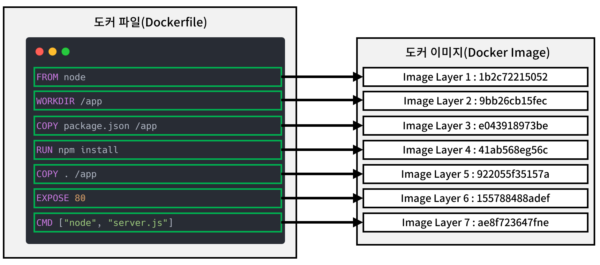
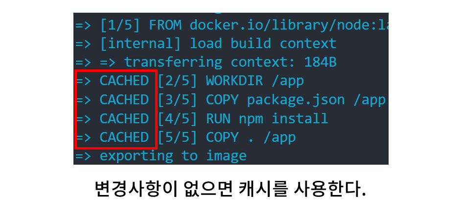
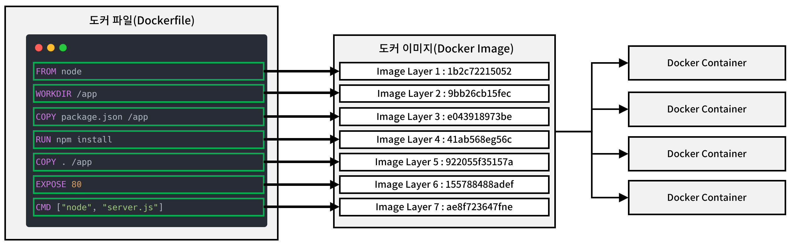
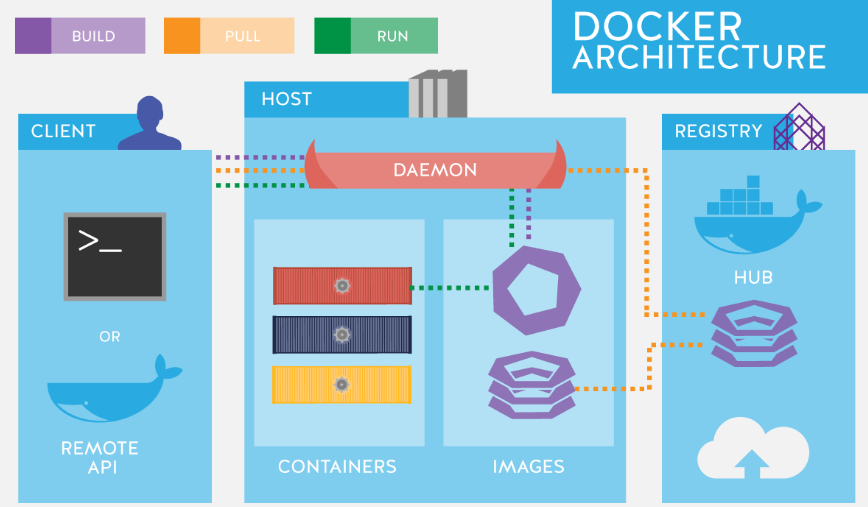

## 도커 이미지
이미지는 컨테이너를 생성할 때 필요한 요소이며, 가상 머신을 생성할 때 사용되는 iso 파일과 비슷한 개념이다. 이미지에는 컨테이너 실행에 필요한 파일과 설정값 등이 포함되어 있다.

이미지는 여러 개의 계층으로 된 바이너리 파일로 존재하고, 컨테이너를 생성하고 실행할 때 **읽기 전용**으로 사용된다. 컨테이너가 실행될 때는 이미지 레이어 위에 쓰기 가능한 레이어가 추가되어 컨테이너의 변경 사항을 저장할 수 있다.

이미지는 Dockerfile 이라는 도커 설정 파일을 이용하여 생성할 수 있다. 이 때 docker 파일의 각 명령 구문 하나하나가 이미지의 레이어로 취급된다. 

이러한 계층형 구조를 사용하는 이유는 크게 두 가지다.

첫째, 이미지 파일을 다시 빌드할 때, 도커는 변경 사항을 감지하고 변경사항이 없는 경우 캐시된 결과를 사용하여 빠르게 이미지를 생성한다. 일부만 변경된 경우 변경되지 않은 부분은 캐시를 사용하고 변경된 부분만 다시 빌드한다. 

둘째, 여러 이미지가 공통된 레이어를 공유할 수 있어 디스크 공간을 절약하고 이미지 다운로드 시간을 단축할 수 있다.

대부분의 이미지는 도커 허브에서 공식적으로 제공하거나 다른 사람들이 도커 허브에 올려놓은 경우가 대부분이라서 애플리케이션 이미지를 직접 만들지 않아도 된다는 장점이 있다. 도커 허브 외에도 개인이나 기업이 운영하는 프라이빗 레지스트리를 통해 이미지를 공유하고 관리할 수 있다.

## 도커 컨테이너

도커 이미지로 컨테이너를 생성하면 해당 이미지에 맞는 파일이 들어 있는 파일 시스템과 격리된 시스템 자원 및 네트워크를 사용할 수 있는 독립적인 공간이 생성되는데, 이것이 바로 도커 컨테이너다. 컨테이너는 호스트 OS의 커널을 공유하면서도 프로세스, 네트워크, 파일 시스템을 격리된 상태로 실행할 수 있다.

컨테이너는 이미지를 읽기 전용으로 사용하되 이미지에서 변경된 사항만 컨테이너 계층에 저장하므로 **컨테이너에서 무엇을 하든 원래 이미지는 영향을 받지 않는다**. 이를 Copy-on-Write(CoW) 방식이라고 하며 이 방식을 통해 효율적으로 저장 공간을 활용할 수 있다.

또한 생성된 각 컨테이너는 각기 독립된 파일 시스템을 제공받으며 호스트와 분리돼 있으므로 특정 컨테이너에서 어떤 애플리케이션을 설치하거나 삭제해도 다른 컨테이너나 호스트는 변화가 없다.

중요한건 각 도커 컨테이너는 이미지에서 코드나 환경을 컨테이너로 복사하지 않는다는 것이다. 컨테이너는 이미지에 저장된 환경을 사용한다. 그 위에 쓰기 가능한 부가 레이어를 올려 리소스와 메모리를 할당하고 컨테이너의 변경 사항을 이미지와 독립적으로 저장할 수 있도록 한다.

컨테이너는 실행 중인 상태일 때도 있고 정지된 상태일 때도 있다. 컨테이너가 삭제되면 컨테이너 계층에 저장된 데이터도 함께 삭제되므로, 영구적으로 보존해야 하는 데이터는 볼륨(Volume)이나 바인드 마운트(Bind Mount)를 사용하여 관리해야 한다.

참조 : 용찬호, 시작하세요! 도커/쿠버네티스, 위키북스, P.22-23, P.88-89