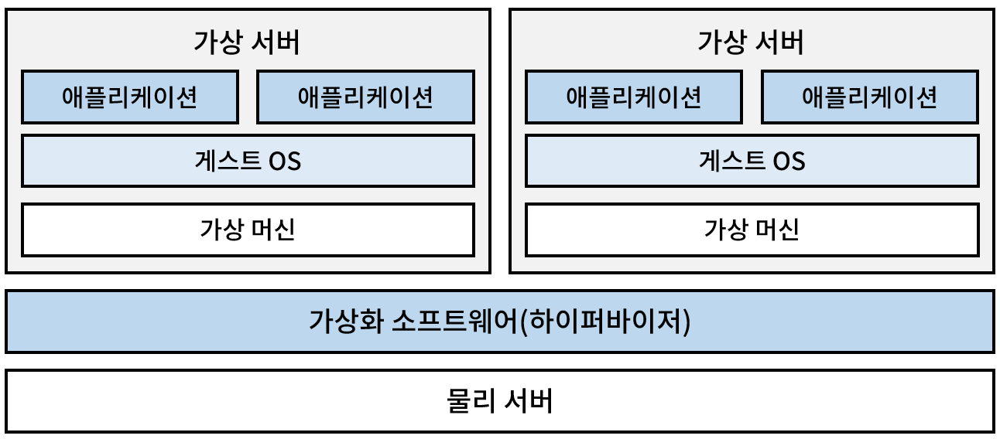

**가상화**란 실체가 없는 것을 존재하는 것 처럼 보이게 하는 기술을 의미한다. 이 기술을 서버에 적용하면 물리서버 한 대로 여러 개의 가상 서버를 구축할 수 있다. 실제 서버를 늘리지 않아도 필요에 따라 서버를 늘리거나 줄일 수 있는 것이다.

서버의 성능을 높이기 위해 서버 자체의 스펙을 높이는 것을 **스케일 업(scale up)**, 서버의 수를 늘리는 것을 **스케일 아웃(scale out)**, 서버의 수를 줄이는 것을 **스케일 인(scale in)** 이라고 한다. 서버 가상화는 스케일 아웃과 스케일 인을 유연하게 시행할 수 있다.

## 서버 가상화란?

서버 가상화는 물리 서버를 가상화 하는 것이다. 가상 서버는 호스트 OS와 다른 OS를 동시에 구축할 수 있다. 물리서버의 사양이 높을수록 여러 가상 서버를 동시에 실행할 수 있으며, 이들은 네트워크를 통해 서로 상호작용한다.

서버 가상화엔 여러가지 종류가 있다. 위 그림은 **호스트 OS형 가상화** 의 경우다. 이 외에도 **하이퍼바이저형 가상화**와 **컨테이너형 가상화**가 있다.

서버 가상화의 장점은 물리 서버의 자원을 효율적으로 활용할 수 있다는 점이다. 예를 들어 하나의 물리 서버가 CPU를 20%만 사용하고 있다면, 나머지 80%는 낭비되고 있는 것이다. 하지만 가상화를 통해 여러 개의 가상 서버를 운영하면 남은 자원을 다른 서버가 활용할 수 있다.

또한 서버 가상화는 장애 대응에도 유리하다. 가상 서버에 문제가 생기더라도 다른 가상 서버에는 영향을 미치지 않으며, 문제가 있는 가상 서버만 재시작하거나 복구하면 된다.

### 서버 가상화 - 호스트 OS형

호스트 OS형 가상화는 물리 서버에 설치된 호스트 OS에서 가상 서버를 가동한다. 

윈도우 PC 에서 가상화 소프트웨어로 새로운 윈도우 OS나 리눅스를 실행하거나, 인텔 맥 OS에서 패러렐즈 프로그램을 통해 윈도우 OS를 실행하는 것 등이 호스트 OS형 가상화의 예시다.

### 서버 가상화 - 하이퍼바이저형

하이퍼바이저형 가상화는 물리 서버에 OS를 설치할 필요가 없는 대신 하이퍼바이저라는 가상 환경을 관리하는 소프트웨어를 물리 서버에 설치한다. 물리 서버에 OS가 필요 없으므로 OS에 대한 라이선스 요금이 들지 않는다.

일반적으로 하이퍼바이저형 가상화는 비교적 규모가 큰 가상 환경을 구축하는 데 사용한다. 또한, 호스트 OS 없이 게스트 OS를 직접 제어하기 때문에 컴퓨터의 리소스를 효율적으로 활용하기에 유리하다.

이미 서비스 중인 물리 서버가 있는 경우에는 그 위에 가상 환경을 구축해 호스트 OS형 가상화를 선택하는 경우가 많지만 처음부터 가상 환경을 구축해야 한다면 하이퍼바이저형 가상화를 선택하는 경우가 많다.

### 서버 가상화 - 컨테이너형

**컨테이너**는 애플리케이션과 그 실행에 필요한 모든 종속성(라이브러리, 환경 변수 등)을 패키징한 격리된 환경이다. 컨테이너는 운영 체제의 커널을 공유하지만, 다른 컨테이너와는 격리되어 실행되므로 자원 충돌을 방지하고 이식성을 높인다.

컨테이너형 가상화는 **컨테이너** 기술을 이용하여 애플리케이션과 실행 환경을 같이 분리하는 방식으로 OS 단위가 아닌 애플리케이션 단위로 가상화하는 기술이다. 

컨테이너형 가상화는 게스트 OS를 사용하지 않고 호스트 OS에 컨테이너형 가상화 소프트웨어를 설치한다. 이를 지원하기 위해 OS는 컨테이너를 지원하는 기능을 내장하고 있다. 윈도우의 WSL2나 리눅스 커널의 내장 기능인 namespaces와 cgroups가 그 예이다.

유명한 컨테이터형 가상화 소프트웨어엔 **도커**가 있다. 도커 엔진을 통해 컨테이너를 실행시킬 수 있다.  

## Windows의 WSL2와 가상화 기술

윈도우에서 리눅스를 실행하기 위한 WSL2(Windows Subsystem for Linux 2)는 하이퍼바이저형 가상화와 컨테이녀형 가상화를 모두 활용한다.

WSL2는 마이크로소프트의 하이퍼바이저 기술인 Hyper-V를 기반으로 경량화된 가상 머신(lightweight utility VM)을 생성한다.

이 가상 머신 안에서 완전한 리눅스 커널이 실행되며, 이 커널 위에서 리눅스 배포판이 독립적으로 실행된다. 각 배포판은 리눅스 커널을 공유하면서 서로 독립된 사용자 환경(usermode)을 제공한다.

이러한 구조 덕분에 WSL2는 완벽한 리눅스 시스템 호출 호환성을 제공하면서도, 도커와 같은 컨테이너를 네이티브로 실행할 수 있다.

- **Hyper-V 사용**: **하이퍼바이저형 가상화**를 사용하여 리눅스 커널을 실행.
- **리눅스 배포판 실행** : **컨테이너형 가상화**를 사용하여 리눅스 배포판을 실행.
